# 유저 초대/관리

!!! note "목차"

    유저 초대하기

    유저 그룹 설정

    Q&A

## 1. 스페이스 유저 초대하기

- 스페이스 테마 설정 단계를 완료하셨다면 [유저 관리 > 유저 설정]에 접속하여 유저를 초대해 보세요.
- [+유저 초대하기] 버튼을 눌러주세요.

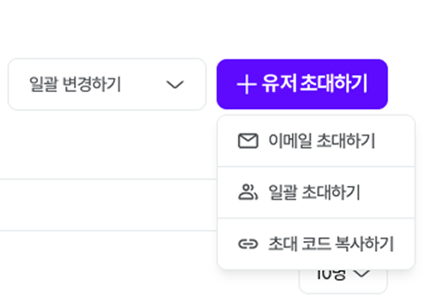

멤버 초대 방법은 3가지 중 선택할 수 있어요.

## 1-1. 이메일 초대(개별 이메일 입력)

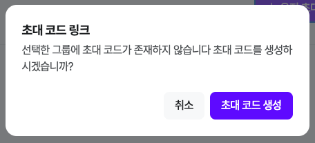

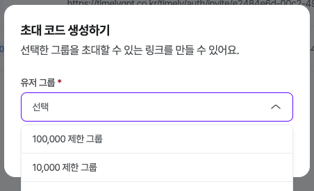

초대하고 싶은 그룹명 클릭

이메일 계정 입력 후, 해당 그룹 한 번 더 선택!

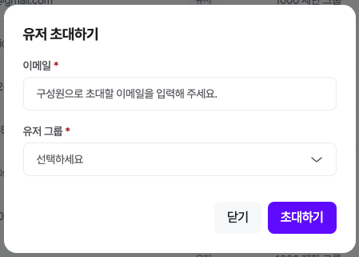

!!! note "❓"

    유저 그룹 만드는 방법

## 1-2. 일괄 초대(다수의 이메일 입력)

[양식 다운로드] 클릭 후, 입력 > [파일 업로드] > [유저 그룹] 선택 > [초대하기]

## 1-3. 초대 코드 복사(배포 링크)

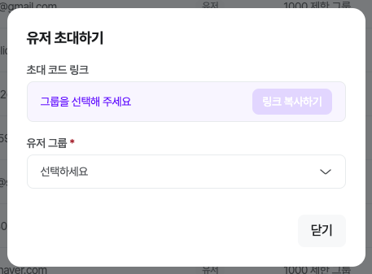

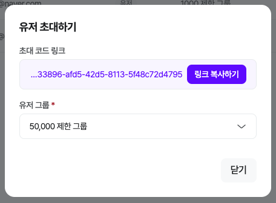

- 특정 [유저 그룹] 선택 시 위에 링크가 생성돼요!

## 2. 유저 그룹 설정

유저를 그룹에 지정, 그룹에 필요한 프롬프트를 각각 설정해 줄 수 있어요.

## 2-1. 유저 그룹 추가

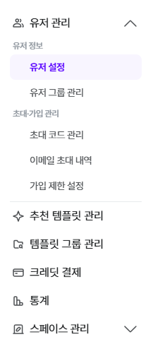

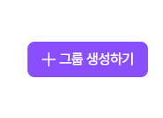

원하는 그룹이 없다면, [유저 그룹 관리]-[생성하기] 클릭

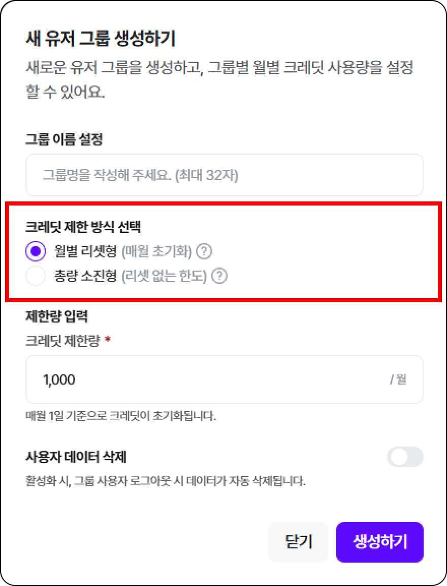

- 새로운 유저 그룹의 이름을 설정해요.

- [크레딧 제한 방식 선택] 을 통해 크레딧 제한에 대한 방식을 설정할 수 있어요.

- 월별 리셋형 : 매월 1일 00시 사용 가능한 크레딧 제한량이 초기화돼요!
- 총량 소진형 : 최초 설정한 크레딧 제한량을 모두 소진할때까지 누적되며, 초기화 되지 않아요!

- [사용자 데이터 삭제] 기능을 활성화하면, 해당 유저그룹의 사용자가 로그아웃할때 이용했던 데이터가 자동으로 삭제돼요!
- 로그인시 기존 이용 내역이 초기화 된 상태로 스페이스를 이용

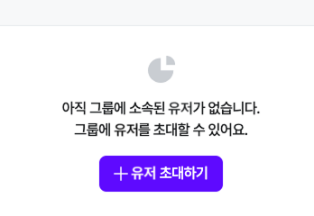

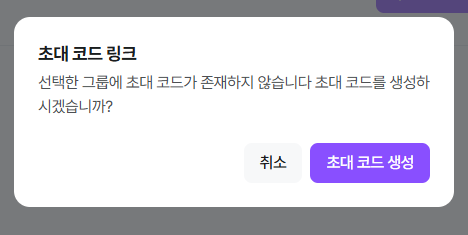

- NEW 유저 초대 방법은 위와 동일

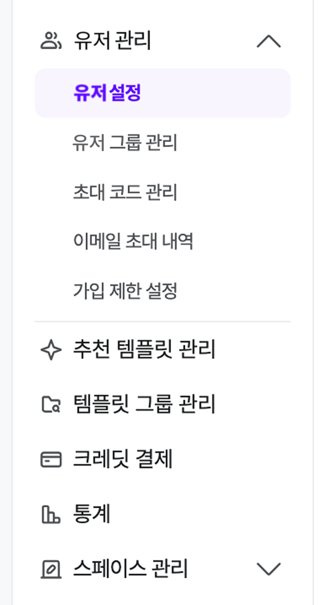

- 기존 유저를 이동하고 싶다면, [유저 관리] > [유저 설정]

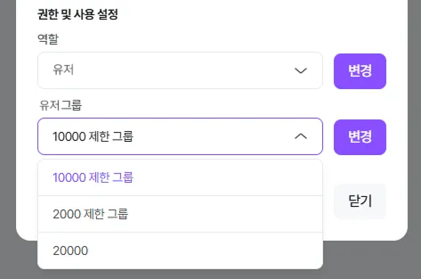

- 해당 유저 클릭 후, [유저 그룹] 변경

## 3. 가입 제한 설정

- 어드민이 정한 조건에 맞춰 가입할 수 있도록 설정할 수 있어요.

## 3-1. 이메일 주소 제한

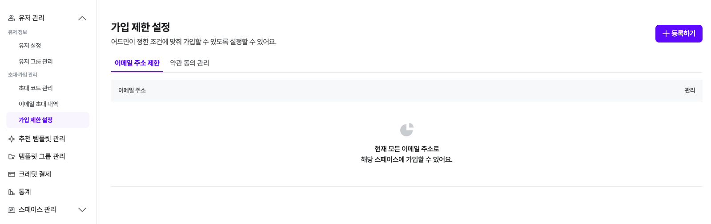

- 이메일 주소 제한을 설정하지 않은 스페이스는 모든 이메일로 이용이 가능해요.

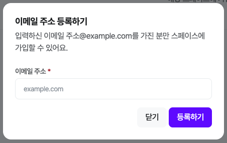

- 특정 이메일 주소를 등록하여, 특정 유저만 스페이스에 가입하게 할 수 있어요.
- 이메일 주소는 ‘@’ 뒷 부분만 입력하면 돼요!

## 3-2. 약관 동의 관리

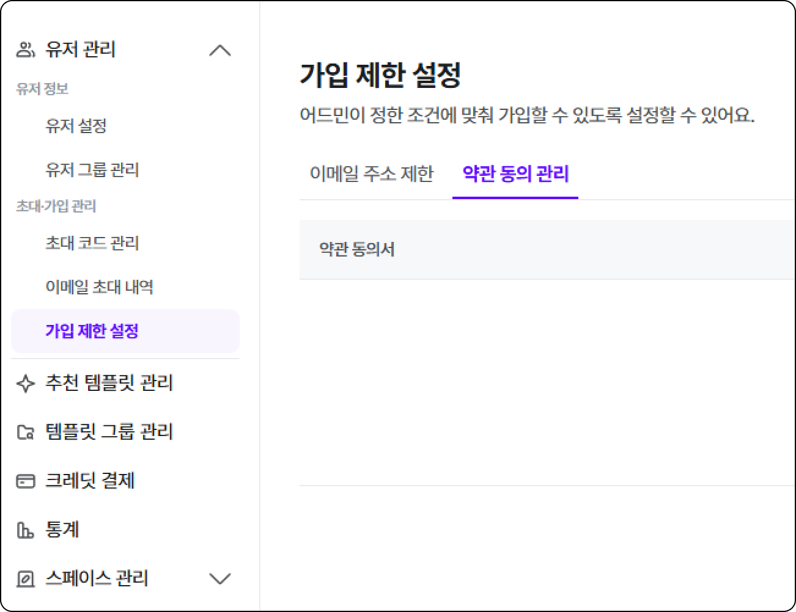

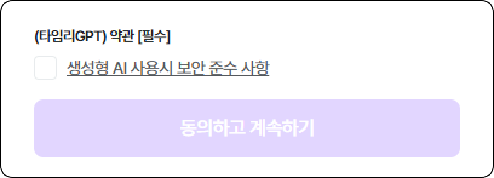

- 어드민은 서비스 이용과 관련된 커스텀 약관을 직접 등록 및 설정할 수 있어요.
- 설정된 약관은 회원가입시 유저에게 표시되며,  유저는 약관 동의 후 서비스를 이용할 수 있어요.
- 새로 등록된 약관은 등록 시점 이후 기존 유저가 최초 로그인할 때 약관 동의 절차가 진행되요.

## Q. 권한이 없다고 뜰 때?

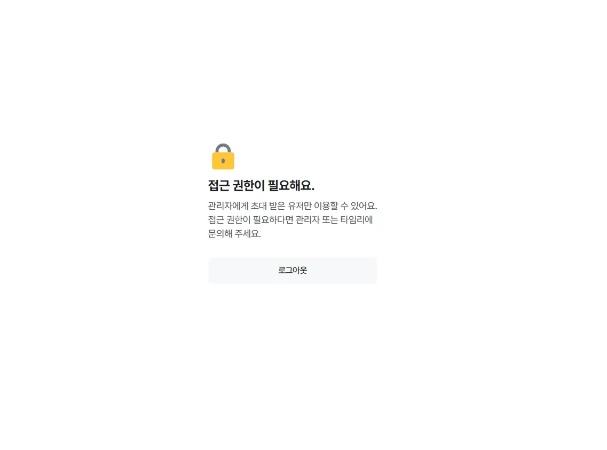

[로그인 링크]로 들어올 경우, 생길 수 있어요!

유저 초대 기능에서 [이메일 초대] 방법을 한 번 더 사용해 주세요!

!!! note "👉"

    이메일 초대 방법

## Q. 크레딧을 다 썼어요! (월 제한 요금제 변경 방법)

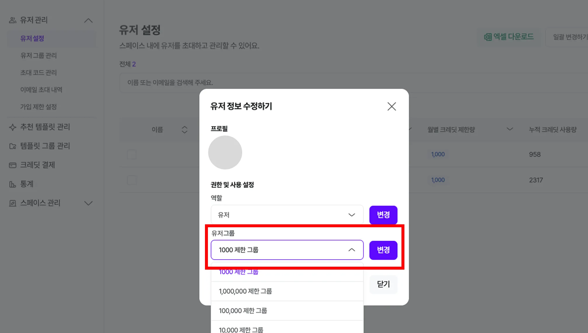

- [관리자 설정]-[유저 관리]-[유저 설정]에서 계정 검색
- 유저 선택 > [유저 그룹] 클릭 후, 수정

!!! note "👉"

    요금제를 변경하면,  그만큼 추가 ❌ 월 사용 제한량 변경 ⭕

    예시) 기존 제한량 1만 > 1만 5천으로 변경 : 5,000만큼 더 쓸 수 있어요

!!! note "⏪"

    이전으로

    스페이스 설정하기

!!! note "⏩"

    다음으로

    템플릿 관리하기
