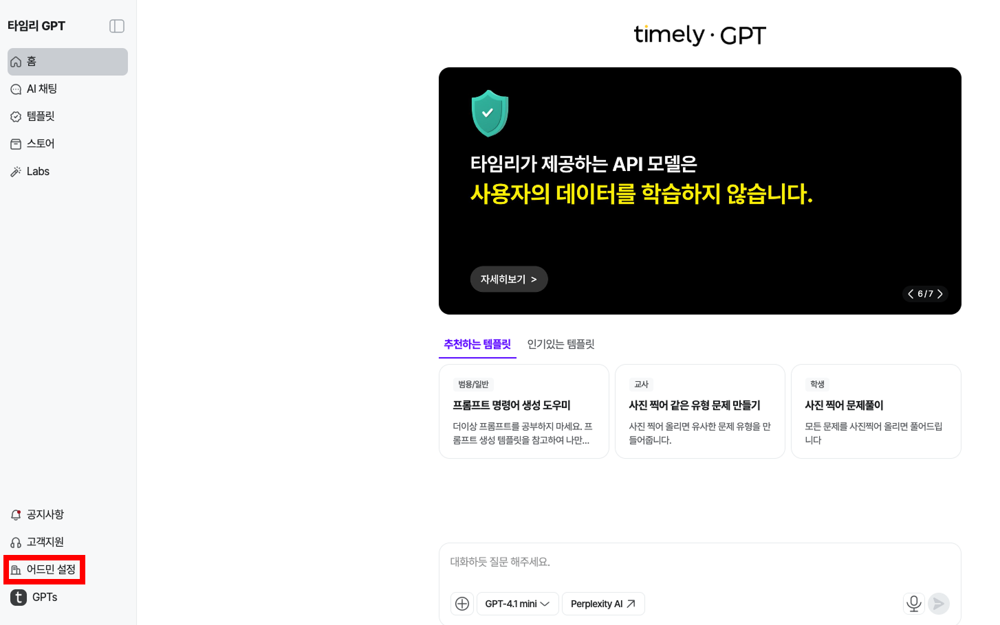
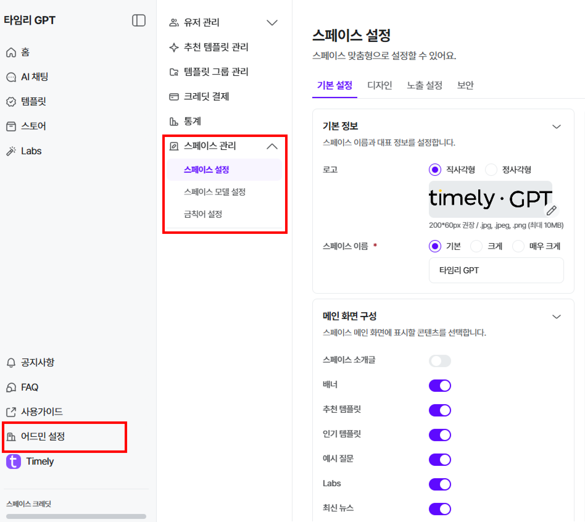
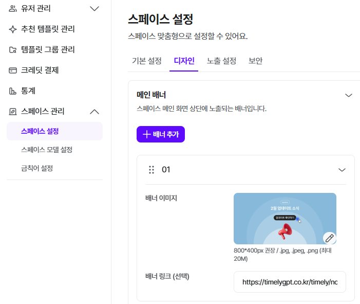
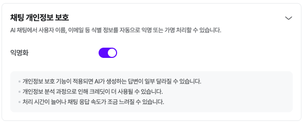
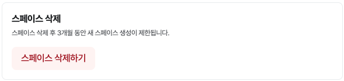

# 시작하기/스페이스 설정

## **1. 가입하기**

전달 받은 [가입링크]로 접속해 주세요.

!!! note "❓"

    회원가입 방법

## **2. 스페이스 설정하기**

어드민 로그인 후 [어드민 설정] 클릭

## **■ 스페이스 관리-스페이스 테마-일반**

[스페이스 관리] > [스페이스 테마] 에 접속해 초기 세팅을 확인/변경해 주세요.

메인 화면 테마 변경이 가능해요.

??? question "**로고 등 이미지, 텍스트를 모두 수정할 수 있어요**"

    - 로고 이미지를 삭제하면 스페이스 이름으로 대체됩니다.

??? question "스페이스 소개글 - ON/OFF에 따라 [배너] 사이즈가 커지고 줄어요!"

    - 소개글을 입력하지 않으면 항상 OFF 입니다.

- 추천/인기 템플릿 등 모두 ON/OFF 가능해요

## **■ 스페이스 관리-스페이스 테마-배너**

- 배너 이미지를 변경하거나, 링크도 입력할 수 있어요
- 배너 간 노출 순서도 조정 가능해요

## **■ 스페이스 관리-스페이스 설정-채팅 개인정보 보호**

- AI 채팅에서 사용자의 이름, 이메일 등 식별 정보를 자동으로 익명 또는 가명처리할 수 있어요!
- 가명처리 된 개인정보는 **로 표시되어 보여져요.

## **■ 스페이스 관리-스페이스 설정-스페이스 삭제**

- 스페이스를 생성한 마스터는 스페이스를 삭제할 수 있어요.
- 삭제 후, 3개월 동안 새 스페이스 생성이 제한되요!

## 3단계.  AI 활용하기

여기까지 완료하셨다면 스페이스 초기 셋팅은 완료했어요! 

이제 다양한 AI 기능을 사용할 수 있어요. 메인 화면으로 돌아와 필요한 기능을 직접 사용해 보세요.

!!! note "❓"

    [스페이스 관리] 더 자세히 보기

!!! note "🔗"

    타임리 GPT 홈페이지

    [홈페이지 이동하기](https://www.timelygpt.co.kr/main)

!!! note "⏩"

    다음으로

    유저 초대/관리하기
