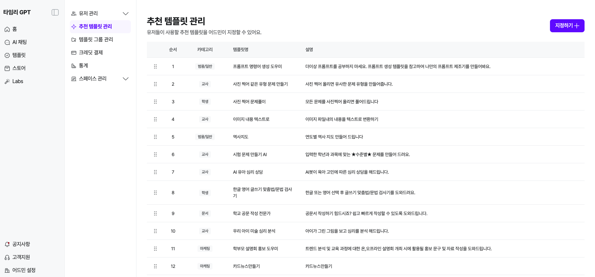
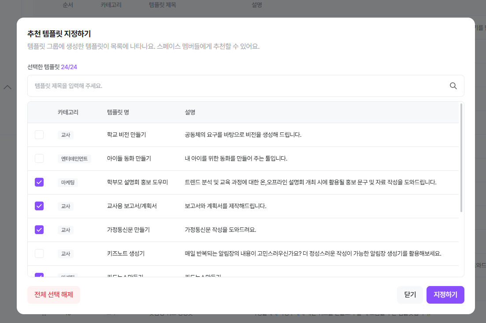
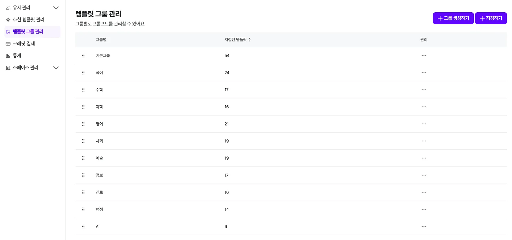

# 템플릿 관리

!!! note "목차"

    추천 템플릿 관리

    그룹별 템플릿 관리

    통계

---

!!! note "❓"

    ***템플릿*** 이란? 타임리가 제공하는 AI 도구입니다. 주어진 빈 칸이나 목록에 원하는 [프롬프트]를 입력하면 더 편리하게 결과를 얻을 수 있어요!

    ✅ AI와 친하지 않다면, ***만들어져있는 템플릿*** 이용해 효율적으로 사용

    ✅ AI와 친숙한데 특정 프롬프트를 자주 사용한다면, ***직접 템플릿을 만들어*** 시간 단축 가능

## **1. 추천 템플릿 관리**

- 추천 템플릿은 [어드민 설정] > [추천 템플릿 관리] > [지정하기]로 설정 가능해요

- ‘템플릿 그룹’에 있는 템플릿 중 선택 가능해요.

## **2. 템플릿 그룹 관리**

- 스토어에 있는 템플릿을 그룹에 보이게 하고 싶다면 [템플릿 그룹 관리]-[지정하기] 클릭

![그룹명 선택 후, [다음으로] 클릭](../../assets/images/admin-templates/img04.png)

그룹명 선택 후, [다음으로] 클릭

![프롬프트 클릭 후, [지정하기] 클릭](../../assets/images/admin-templates/img05.png)

프롬프트 클릭 후, [지정하기] 클릭

!!! note "👉"

    템플릿 더 알아보기

## **3. 통계**

- 스페이스의 크레딧 정보(스페이스 총 보유 크레딧/사용한 크레딧/남은 크레딧) 등의 정보가 보여요!
- 원하는 날짜를 설정해 편리하게 볼 수 있어요

!!! note "👉"

    통계 기능 더보기

!!! note "⏪"

    이전으로

    멤버 초대하기
