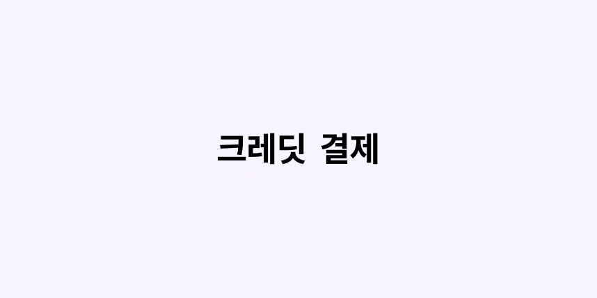
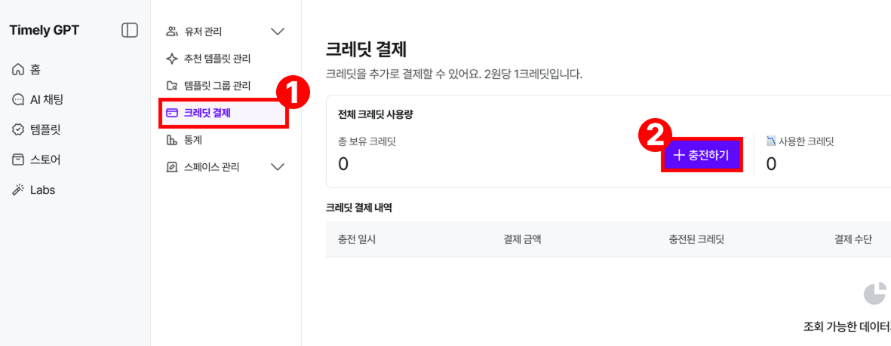
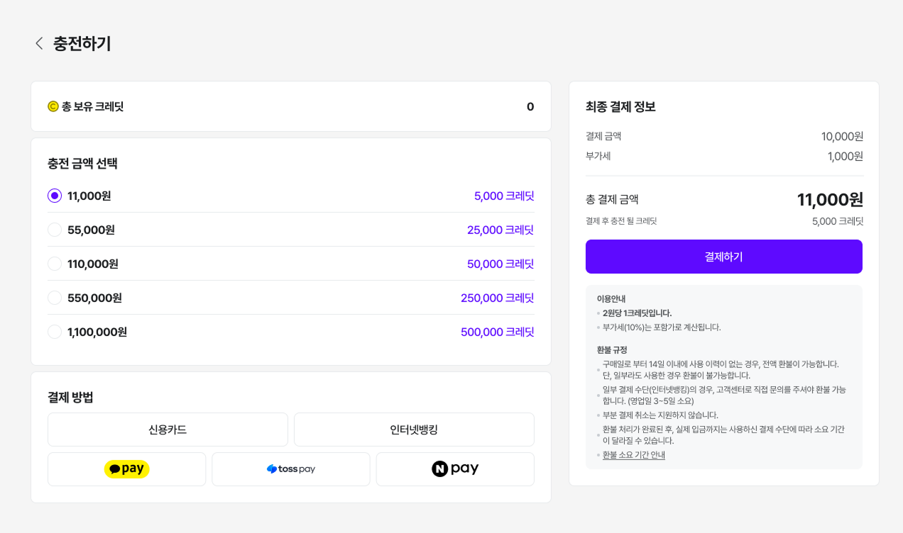
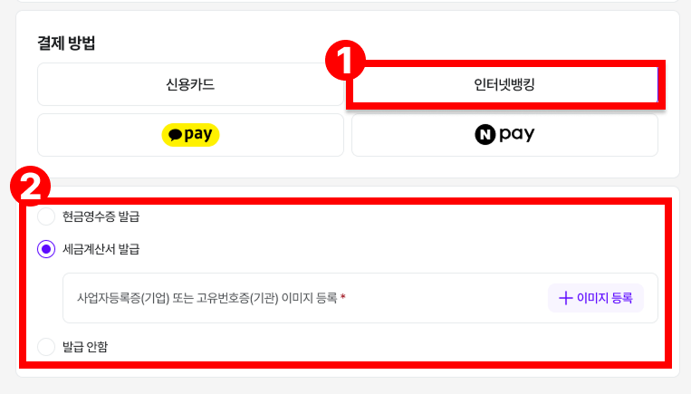
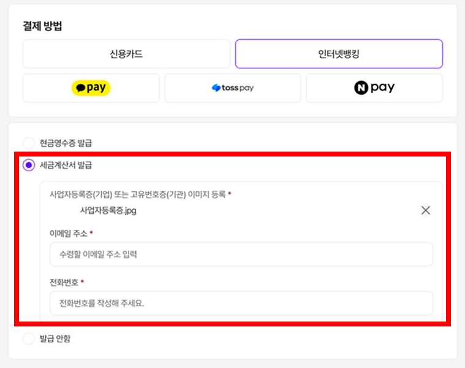
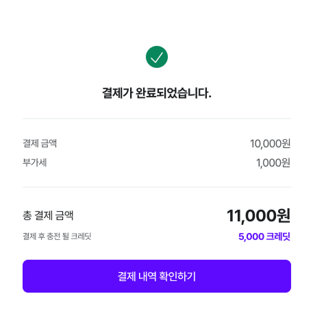
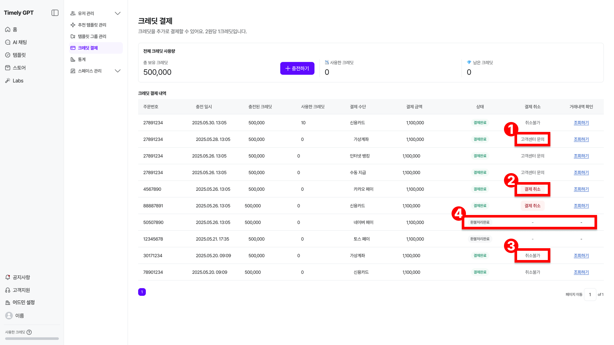

# 크레딧 결제

## 크레딧 결제

!!! note "❓"

    ***크레딧*** 이란? AI 서비스를 이용할 때 차감되는 단위입니다. 질문 입력, 답변 생성, 이미지 처리 등 작업 시마다 일정량의 크레딧이 차감되며, 보유 크레딧 내에서 자유롭게 서비스를 사용할 수 있습니다.

    ✅ 텍스트 길이, 이미지 처리, 모델 종류(예: mini, pro)에 따라 소모량이 다름.

    ✅ 그룹별로 크레딧을 제한해 사용량을 관리할 수 있음.

- [어드민 설정] > [크레딧 결제] 에서 충전이 가능해요

- [충전 금액 선택] > [결제 방법] > [결제하기]
- 1 크레딧 = 2원 으로 계산되며, 최종결제금액은 ‘부가세 포함’ 금액이에요.

## 1-1. 세금계산서 발급

- [인터넷 뱅킹] 결제 시 세금계산서 발급이 가능해요.

- 세금계산서 발급에 필요한 서류나 이미지를 등록 후 이메일과 전화번호를 입력해요.

- 결제 완료 후, 결제금액과 충전 크레딧을 확인할 수 있어요.

## 2. 크레딧 결제 취소

- 크레딧 결제 취소는 결제일로부터 14일 이내에만 가능하며, 구입한 크레딧을 사용하지 않은 경우에 한해 가능합니다.

1. [고객센터 문의] : 결제 수단이 가상계좌, 인터넷뱅킹, 수동지급일 경우.
2. [결제취소] : 결제 수단이 카드나 페이머니일 경우.
3. [취소불가] : 결제일로부터 14일이 경과했거나, 구매한 크레딧을 사용했을 경우.
4. [환불처리완료] : 환불 처리가 완료된 상태.