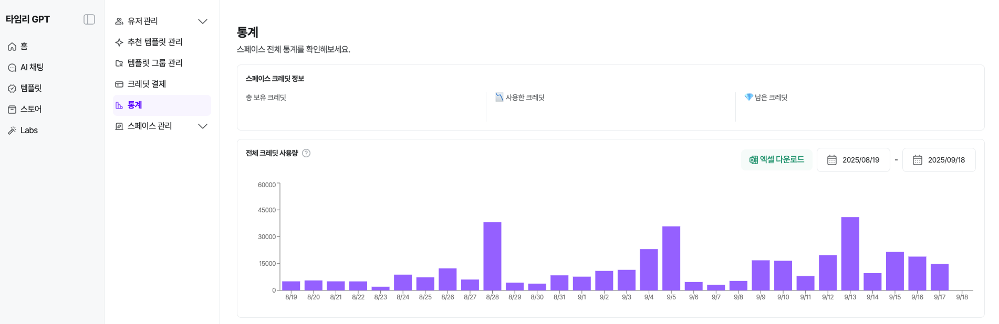

# 통계

## 통계

스페이스에 소속된 어드민&유저가 사용한 크레딧 관련 통계를 확인할 수 있어요.

⓵ **스페이스 크레딧 정보 :** 스페이스 총 보유 크레딧, 사용한 크레딧, 남은 크레딧

⓶ **전체 크레딧 사용량 :** 날짜별 사용량 확인

날짜 조정 가능

오늘 사용 내역은 다음날 새벽에 반영

⓷ **유저별 크레딧 사용량** : 월별 각 유저의 크레딧 사용량 확인

      이메일 또는 이름 검색 가능

⓸ **모델별 크레딧 사용량** : 월별 각 LLM모델별 사용량과 횟수 확인

⓹ **엑셀 다운로드** : 선택한 기간 또는 유저별로 엑셀 파일로 저장 가능