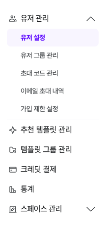
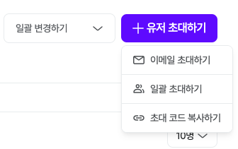
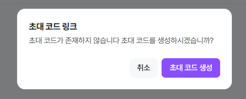
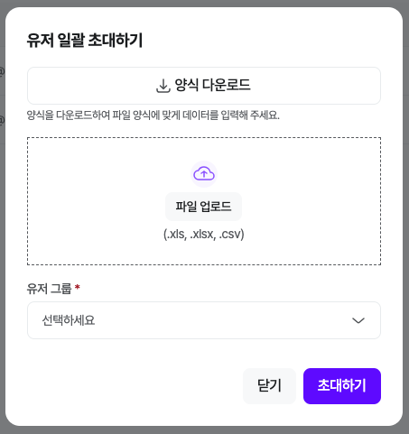
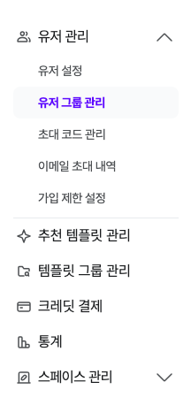
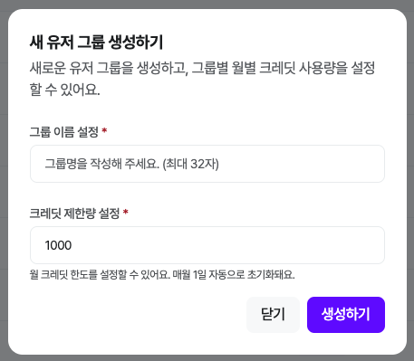
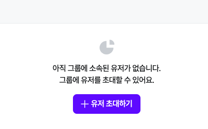
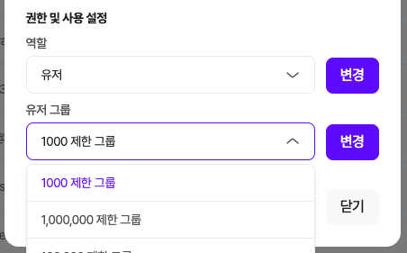
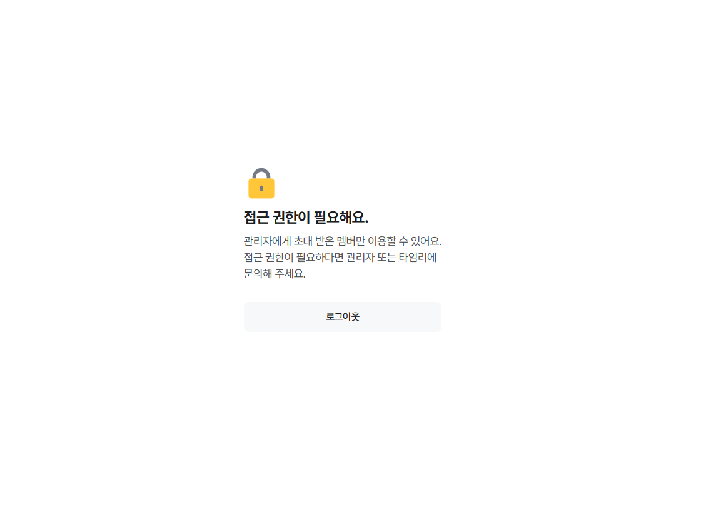
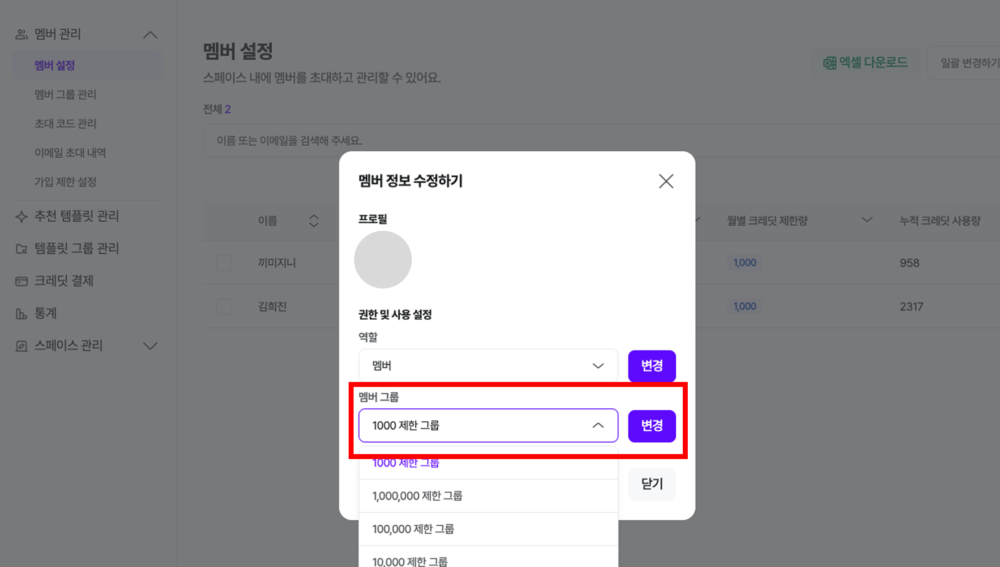

# 유저 관리

!!! note "📚 **목차**"

    유저 관리
    그룹 관리
    Q&A

## 1. 스페이스 유저 초대하기

- 스페이스 테마 설정 단계를 완료하셨다면 [유저 관리 > 유저 설정]에 접속하여 유저를 초대해 보세요.
- [+유저 초대하기] 버튼을 눌러주세요.

멤버 초대 방법은 3가지 중 선택할 수 있어요.

## 1-1. 이메일 초대(개별 이메일 입력)

초대하고 싶은 그룹명 클릭

이메일 계정 입력 후, 해당 그룹 한 번 더 선택!

!!! note
    유저 그룹 만드는 방법

## 1-2. 일괄 초대(다수의 이메일 입력)

[양식 다운로드] 클릭 후, 입력 > [파일 업로드] > [멤버 그룹] 선택 > [초대하기]

## 1-3. 초대 코드 복사(배포 링크)

- 특정 [유저 그룹] 선택 시 위에 링크가 생성되요!

## 2. 유저 그룹 설정

유저를 그룹에 지정, 그룹에 필요한 프롬프트를 각각 설정해 줄 수 있어요.

## 2-1. 유저 그룹 추가

원하는 그룹이 없다면, [유저 그룹 설정]-[생성하기] 클릭

- [그룹 이름 설정] 및 [크레딧 제한량 설정] 후, [생성하기] 클릭

- NEW 유저 초대 방법은 위와 동일

- 기존 유저를 이동하고 싶다면, [유저 관리] > [유저 설정]

- 해당 유저 클릭 후, [유저 그룹] 변경

## Q. 권한이 없다고 뜰 때?

[로그인 링크]로 들어올 경우, 생길 수 있어요!

유저 초대 기능에서 [이메일 초대] 방법을 한 번 더 사용해 주세요!

!!! note
    이메일 초대 방법

## Q. 크레딧을 다 썼어요! (월 제한 요금제 변경 방법)

- [어드민 설정]-[유저 관리]-[유저 설정]에서 계정 검색
- 유저 선택 > [크레딧 제한량] 클릭 후, 수정

!!! note
    요금제를 변경하면,  그만큼 추가 ❌ 월 사용 제한량 변경 ⭕

    예시) 기존 제한량 1만 > 1만 5천으로 변경 : 5,000만큼 더 쓸 수 있어요
