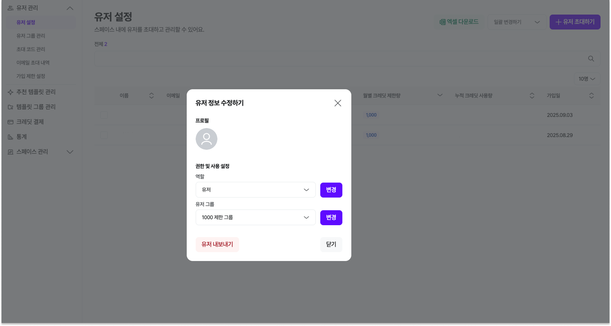
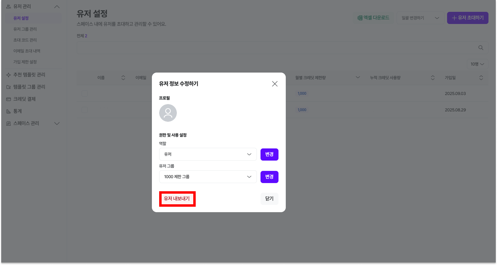
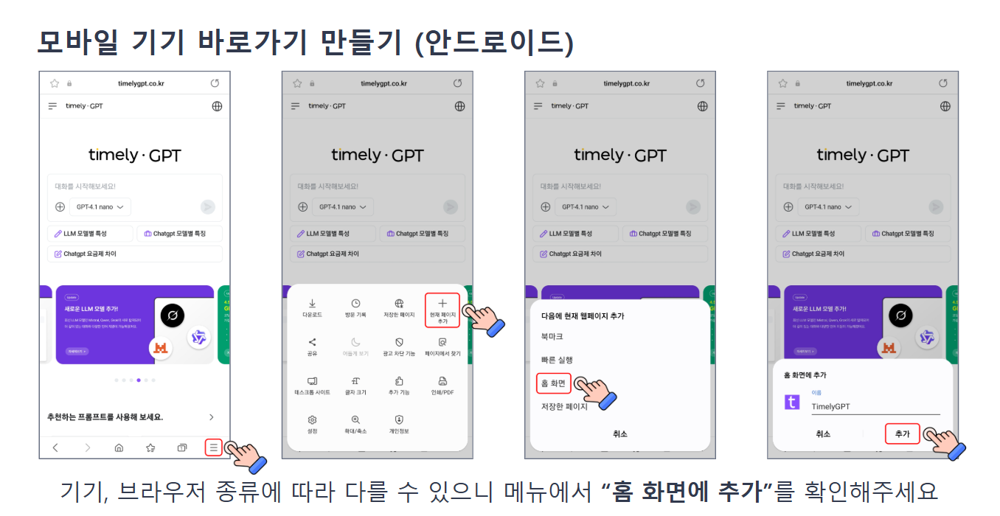
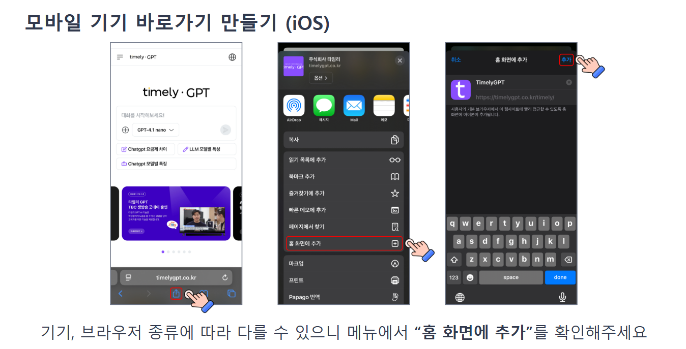

# 자주 묻는 질문

---

??? question "프롬프트는 무엇인가요?"

    **프롬프트(prompt)**는 사용자가 컴퓨터나 프로그램에 입력하는 명령이나 질문을 의미해요.
    
    쉽게 말해, 우리가 어떤 정보를 얻거나 작업을 수행하기 위해 시스템에 요청하는 내용을 말하죠.
    
    예를 들어, 검색 엔진에 "날씨"라고 입력하면, "날씨"가 프롬프트가 되는 거예요.
    
    이 프롬프트를 통해 시스템은 사용자가 원하는 정보를 찾아서 보여줍니다.
    
    프롬프트는 대화형 AI와의 대화에서도 중요한 역할을 해요.
    
    우리가 AI에게 질문을 하거나 요청할 때 사용하는 문장이 바로 프롬프트입니다.
    
    AI는 이 프롬프트를 바탕으로 적절한 답변이나 정보를 제공하게 됩니다.
    
    즉, **프롬프트는 우리가 원하는 결과를 얻기 위해 시스템에 전달하는 요청이나 질문**이라고 생각하면 됩니다!

    
??? question "LLM 모델별 사용 특징"

    ## 🔴 Open AI
    
    | 모델명 | 주요특징 |
    | --- | --- |
    | GPT-5.4 | 최신 고성능 모델로, 복잡한 추론과 다양한 작업을 정밀하게 처리할 수 있으며 전반적인 성능이 크게 향상되었습니다. |
    | GPT-5.4 Mini | GPT-5.4의 경량 버전으로, 빠른 응답 속도와 효율적인 비용으로 일반적인 업무 및 생성 작업에 적합합니다. |
    | GPT-5.4 Nano | 초소형 모델로, 저비용 환경에서 간단한 질의응답 및 경량 작업을 빠르게 처리하는 데 적합합니다. |
    | GPT-5.3 Chat | 대화형에 최적화된 모델로, 자연스러운 응답 생성과 지속적인 멀티턴 대화에 강점을 보입니다. |
    | GPT-5.2 | GPT-5.1 대비 추론 정확도와 안정성이 향상된 최신 고성능 모델로, 복합 업무와 고난도 작업에 적합합니다. |
    | GPT-5.2 chat | GPT-5.2를 기반으로 한 대화 특화 버전으로, 자연스러운 응답과 빠른 상호작용에 최적화되어 있습니다. |
    | GPT-5.2 Codex Mini | 코드 생성 및 간단한 개발 작업에 특화된 경량 모델로, 빠른 응답과 효율적인 코드 보조 기능을 제공합니다. |
    | GPT-5.1 | 추론·문서작성·기획·코딩 등 전반적인 작업에 강한 고성능 범용 모델로, 정확도와 일관성이 뛰어납니다. |
    | GPT-5.1 chat | 빠른 응답과 부드러운 대화에 최적화된 챗봇 버전으로, 일상 대화·업무 보조·아이디어 정리에 적합합니다. |
    | GPT-5.1 Codex | 대규모 코드베이스 이해, 복잡한 리팩토링, 테스트 생성 및 코드 품질 개선에 강점을 가진 고성능 개발 특화 모델입니다. |
    | GPT-5.1 Codex Mini | GPT-5.1 Codex의 경량 버전으로, 간단한 코드 작성·수정·리뷰 작업을 빠르고 효율적으로 처리할 수 있습니다. |
    | O3 Deep Research | 광범위한 자료 수집과 심층 분석을 통해 리포트·조사·연구 업무에 적합한 고급 리서치 특화 모델입니다. |
    | GPT-5 | 차세대 모델로, 종합적인 추론 능력과 창의성이 한층 강화되었습니다. |
    | GPT-5 Mini | GPT-5의 경량 버전으로, 속도와 비용 효율성을 높여 일반적인 활용에 적합합니다. |
    | GPT-5 nano | 초소형 모델로, 저비용과 초고속 응답이 필요한 환경에서 사용하기 좋습니다. |
    | GPT-5 Codex | 대형 리포지토리 리팩토링, 버그 검출, 코드 리뷰, 멀티모달 입력 지원 등 에이전트형 개발 환경에 최적화되어 있습니다. |
    | Codex Mini | 일반적인 대화, 생성, 간단한 코딩 및 분석 작업에 적합합니다. |
    | GPT-4.1 | 최대 100만 토큰을 처리할 수 있는 최신 모델로, 복잡한 추론과 지시 따르기에 강점을 보이며 GPT-40 대비 속도와 비용이 최적화되었습니다. |
    | GPT-4.1 Mini | GPT-4.1의 경량 버전으로, 빠른 응답 속도와 합리적인 비용으로 일반적인 업무 활용에 적합합니다. |
    | GPT-4o Mini | GPT-4.0을 경량화한 모델로, 중간 수준의 작업을 빠르고 안정적으로 처리할 수 있습니다. |
    | GPT-4o | 텍스트·이미지·음성을 동시에 이해하고 생성할 수 있는 멀티모달 모델로, 실시간 처리와 다국어 지원이 우수합니다. |
    | o3 | OpenAI의 새로운 추론 특화 모델로, 복잡한 질문에 대한 논리적 답변을 제공합니다. |
    
    ## 🟠 Google (Gemini)
    
    | 모델명 | 주요 특징 |
    | --- | --- |
    | Gemini 3.1 Pro | 대규모 데이터 이해와 복합적인 추론에 강점을 가진 고성능 모델로, 긴 컨텍스트 기반 분석 및 정밀한 결과 도출에 최적화되어 있습니다. |
    | Gemini 3.1 Flash Lite | 초고속 응답과 비용 효율성에 특화된 경량 모델로, 대량 요청 처리 및 실시간 서비스 환경에서 안정적인 성능을 제공합니다. |
    | Gemini 3 Flash | 초고속 응답에 최적화된 경량 멀티모달 모델로, 실시간 대화·요약·간단한 생성 작업을 빠르고 효율적으로 처리할 수 있습니다. |
    | Gemini 2.5 Pro | Google의 고성능 모델로, 긴 문맥과 멀티모달 작업을 안정적으로 처리할 수 있습니다. |
    | Gemini 2.5 Flash | 빠른 속도와 비용 효율성을 제공하여 실시간 대화형 멀티모달 환경에 적합합니다. |
    | Gemini 2.5 Flash Lite | Gemini 2.5 Flash의 속도와 효율성을 유지하면서, 비용과 지연(latency)을 더욱 줄인 모델로 설계되었습니다. |
    | Gemini 2.5 Pro | 경량화 모델로, 기본적인 활용에서 속도와 비용 효율성이 뛰어납니다. |
    | Gemini 2.0 Flash | 이전 세대 Flash 모델로, 빠른 속도와 실시간 응답에 최적화되어 있습니다. |
    
    ## 🟡 Anthropic (Claude)
    
    | 모델명 | 주요특징 |
    | --- | --- |
    | Claude Opus 4.6 | 매우 긴 컨텍스트 처리와 정밀한 추론 능력을 바탕으로, 복잡한 문서 분석·요약 및 고난도 문제 해결에서 높은 신뢰도의 결과를 제공하는 프리미엄 모델입니다. |
    | Claude Sonnet 4.6 | 긴 문맥 이해와 자연스러운 글쓰기 능력에 강점을 가진 모델로, 보고서·기획서 등 장문의 문서 작성과 일관성 있는 콘텐츠 생성에 최적화되어 있습니다. |
    | Claude Sonnet 4.5 | 균형형 모델로, 뛰어난 문서 이해력과 긴 맥락 처리 능력을 바탕으로 기획·요약·분석·코딩 작업에 고르게 강점을 보입니다. |
    | Claude Haiku 4.5 | Claude 4.5 계열 중 빠르고 가벼운 버전**으**로, 실시간 대화·요약·문서 분석에 최적화되어 있습니다. |
    
    ## 🟢 Perplexity (Sonar)
    
    | 모델명 | 주요특징 |
    | --- | --- |
    | Sonar Pro | 신뢰할 수 있는 출처와 함께 답변을 제공하는 고급 검색형 모델입니다. |
    | Sonar | 표준형 검색 모델로, 빠른 속도로 최신 정보를 탐색할 수 있습니다. |
    | Sonar Reasoning | 복잡한 질문에도 논리적인 답변을 생성할 수 있도록 추론 기능이 강화된 모델입니다. |
    | Sonar Reasoning Pro | Reasoning 기능이 한층 강화된 고급 모델로, 전문적인 분석이 필요한 경우 적합합니다. |
    | Sonar Deep Research | 여러 출처를 종합해 심층적으로 조사하는 데 특화된 모델입니다. |
    
    ## 🔵 Meta (LLaMA)
    
    | 모델명 | 주요특징 |
    | --- | --- |
    | LLaMA 4 Scout 17B | 중간 규모의 오픈소스 기반 모델로, 빠른 추론과 효율적인 자원 활용이 가능합니다. |
    
    ## 🟣 Mistral
    
    | 모델명 | 주요특징 |
    | --- | --- |
    | Mistral Small | 가벼운 작업에 최적화된 모델로, 빠른 응답 속도와 비용 효율성이 뛰어납니다. |
    | Mistral Medium | 속도와 성능의 균형이 잘 맞는 중간급 모델로, 일반적인 업무 활용에 적합합니다. |
    | Mistral Large | 복잡한 작업이나 고난도의 질문에도 높은 수준의 답변을 제공하는 대규모 모델입니다. |
    | Magistral Small | Magistral의 경량 버전으로, 빠른 처리와 기본적인 업무에 적합합니다. |
    | Magistral Medium | 특정 업무 영역에 최적화된 모델로, 전문적인 환경에서 효율적인 성능을 발휘합니다. |
    | Devstral Medium | 개발자 환경에 특화된 모델로, 코드 작성과 기술 문서 작업에 유리합니다. |
    | Codestral | 프로그래밍 코드 생성과 지원에 특화된 모델로, 개발 자동화에 효율적입니다. |
    
    ## 🟤 Alibaba (Qwen)
    
    | 모델명 | 주요특징 |
    | --- | --- |
    | Qwen QWQ 32B | 중국어를 비롯한 다국어 지원에 강점을 가진 대규모 모델로, 아시아권 데이터 활용에 특히 적합합니다 |
    
    ## ⚫ X AI (Grok)
    
    | 모델명 | 주요특징 |
    | --- | --- |
    | Grok 4.1 Fast Reasoning | 고속 추론 특화 모델로, 논리적 사고가 필요한 질문·분석·의사결정 작업을 빠른 속도로 처리하는 데 적합합니다. |
    | Grok 4.1 Fast Non Reasoning | 추론 과정을 최소화해 응답 속도를 극대화한 모델로, 단순 질의응답·요약·일상 대화 등 즉각적인 반응이 필요한 작업에 적합합니다. |
    | Grok 4 Fast Reasoning | 추론(Reasoning) 속도와 효율을 극대화한 경량형 모델로, 실시간 질의응답·분석·코딩 작업에 적합합니다. |
    | Grok 4 Fast Non Reasoning | 간단하고 속도 중심의 작업에 최적화된 모델로 요약, 분류, 빠른 응답·검색 중심 용도에 적합합니다. |
    | Grok 4 | 최신 모델로, X(Twitter) 데이터와 실시간 연동이 가능해 시의성이 중요한 주제에 적합합니다. |
    | Grok 3 | 안정적인 성능을 제공하는 표준형 모델로, 일반적인 질의응답에 활용할 수 있습니다. |
    | Grok 3 Mini | 경량화된 모델로, 빠른 응답 속도와 낮은 비용으로 운영할 수 있습니다. |
    | Grok Code Fast | 코드 작성 및 실행 지원에 특화된 모델로, 개발 관련 업무에 효율적입니다. |
    
    ## ⚪️ Upstage (Solar)
    
    | 모델명 | 주요특징 |
    | --- | --- |
    | Solar Pro2 | 국내 개발 대형 언어모델(LLM)로, 한국어 이해력과 문서 요약·검색·질의응답 성능이 우수합니다. |
    | Solar Pro3 | 한국어 이해와 생성에 최적화된 고성능 모델로, 자연스러운 문장 표현과 빠른 응답 속도를 기반으로 국내 환경에 적합한 안정적인 결과를 제공합니다. |

??? question "모델별로 크레딧 소진량에 차이가 있나요?"

    - 같은 질문, 같은 양을 질문해도 유료 버전에서만 제공되는 **ChatGPT 4.1 / o1 모델의 경우 크레딧** 소요가 많이 됩니다.
    - ChatGPT 4o Mini 모델 사용 기준
        - 질문과 대답 텍스트가 모두 8~900자일 경우 1크레딧이 소요됩니다.
    - LLM 모델별로 크레딧 소진량이 다르며 이미지 첨부, 이미지 생성, 파일 업로드, 음성 대화 등에 따라 소진량이 다릅니다.

??? question "AI Chat 개인정보 유출 방지법"

    - 민감한 개인정보 입력 금지
    - 업로드 파일에 개인정보 없는지 확인
    - 로그인 상태 & 히스토리 관리
    - 기업, 연구 기밀 공유 금지
    - AI 툴의 데이터 처리 정책 확인

??? question "오류가 발생한 것 같아요"

    불편을 드려서 죄송합니다.
    
    사용자 **이메일 계정,** **오류가 발생한 화면**, **사용하신 기기** 등을 함께 말씀해 주시면 
    
    더 빠르게 문제를 해결해 드립니다.
    
    편하신 방법을 통해 연락해 주세요.

    
??? question "관리자가 일반 유저의 권한을 변경하고 싶어요."

    - [오른쪽 상단 프로필 아이콘] 선택 > [관리자 설정] 선택 > [유저 관리 > 유저] 선택 > 권한 설정 **[설정하기]** 버튼 선택
        
        

        
??? question "초대된 유저를 내보내고 싶어요."

    - 내보내고 싶은 유저를 선택하신 후 **[내보내기]** 버튼을 선택하여 주세요.
        
        

    
??? question "유저를 초대하고 싶어요."

    - 관리자(Admin)만 멤버를 초대할 수 있어요. 편한 방법으로 유저를 초대해 주세요.
    (→ 유저 관리 설정하기)

??? question "Open AI GPT 랑 다른점이 뭔가요?"

    - 다양한 LLM 모델이 탑재되어 있어 특정한 응답에 대해 더 구체적인 답변이 가능해요.
    - 사용자별 크레딧 관리가 가능하여 스페이스 관리자는 소속된 사용자 크레딧을 관리할 수 있어요.
    - 스페이스별 로고, 예시 질문, 배너 등이 직접 설정이 가능하여 소속감을 줄 수 있어요.
    - 교육이면 교육, 기업이면 기업 맞춤형 프롬프트 템플릿이 사용 가능해요.

??? question "로그인이 안돼요."

    소셜 로그인으로 회원가입을 하셨나요?
    
    - 소셜 로그인(구글, 카카오톡)으로 간편 회원가입을 하신 회원이라면 이메일 로그인을 할 수 없습니다.
    소셜 로그인으로 로그인을 진행해 주세요!

    
??? question "휴대폰에서도 사용할 수 있나요?"

    - 타임리 GPT 서비스는 PC와 모바일 모두에서 사용할 수 있으며 Google Play, App Store에서 APP 서비스도 다운로드 하실 수 있습니다.
    - [Google Play 바로가기](https://play.google.com/store/apps/details?id=kr.co.timelygpt&hl=ko)
    - [App store 바로가기](https://apps.apple.com/kr/app/%ED%83%80%EC%9E%84%EB%A6%ACgpt/id6752765292)
    - 모바일 인터넷 바로가기 생성
        - 안드로이드 방법 - 삼성 인터넷 이용 권장
            
            
            
        - IOS(아이폰) 방법 - 사파리 이용 권장
            
            

    
??? question "hwp 파일도 업로드 할 수 있나요?"

    - 타임리 GPT에서는 hwp 파일을 업로드하여 내용 요약, 분석 등을 지원하고 있습니다.

??? question "관리자가 구성원의 채팅 리스트(기록)를 모니터링 할 수 있나요?"

    - 타임리 GPT 서비스에서는 개인정보 관련 문제로 유저의 채팅 내역은 본인 외 확인할 수 없도록 설정되어있습니다.
    - 기업이나 조직 차원에서 해당 기능에 대한 요청이 많아 필요 시 사용자의 동의를 별도로 받아 모니터링 할 수 있도록 기능 개발 중입니다.

??? question "서비스 접속 환경을 제어할 수 있나요?"

    - 고객사 요청 시 IP 대역을 제한하여 특정 IP에서만 접속하도록 설정할 수 있습니다.
    - 내부 시스템 기능 중 이메일 제한 기능을 활용하면 등록한 도메인에서만 접속할 수 있는 화이트리스트 형식의 접근 제한 설정도 가능합니다.
