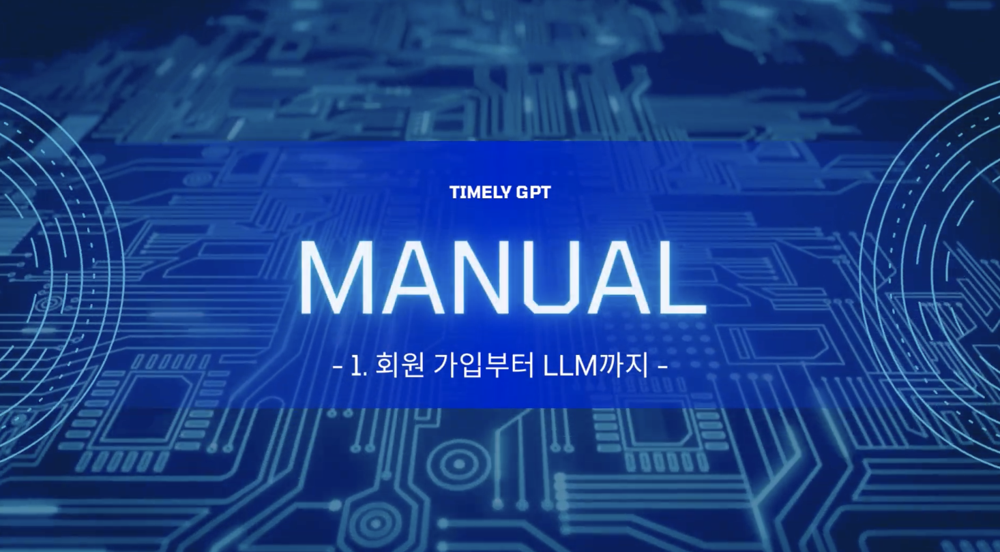
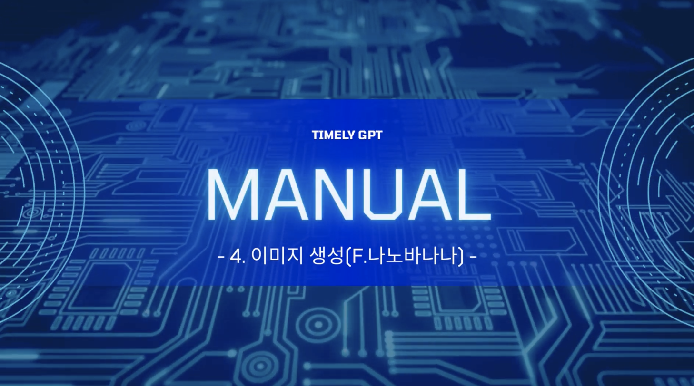
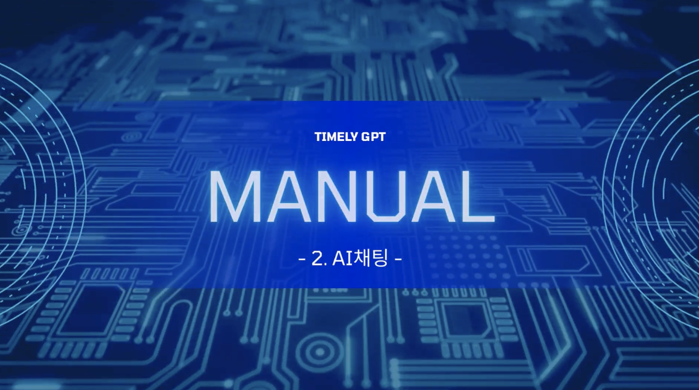
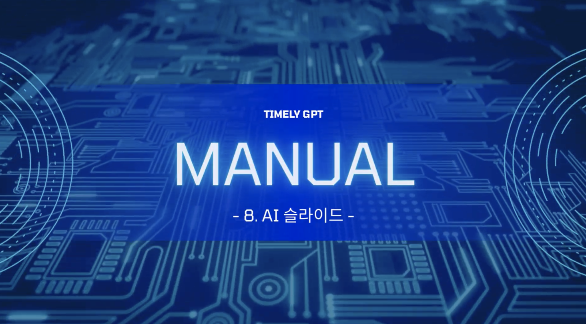
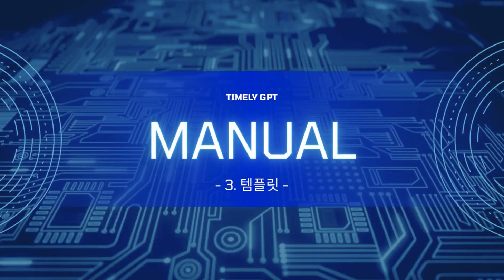
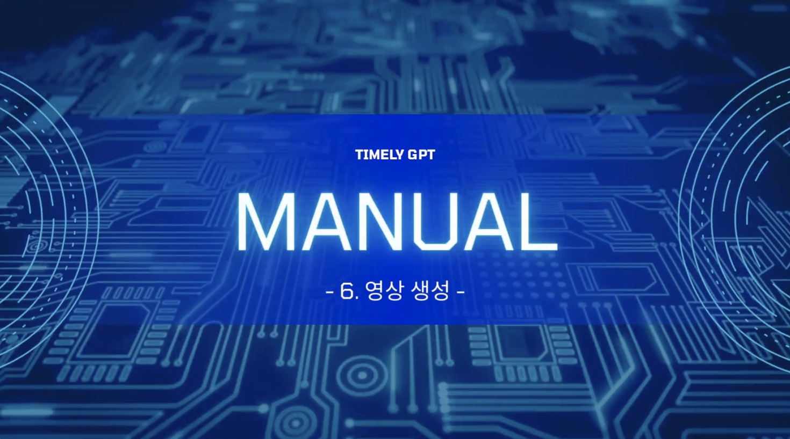
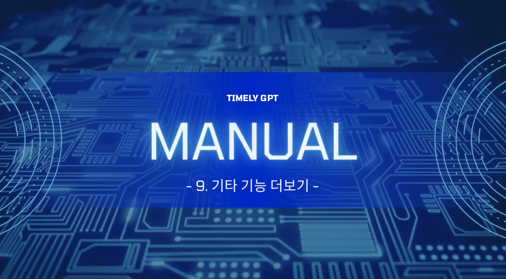
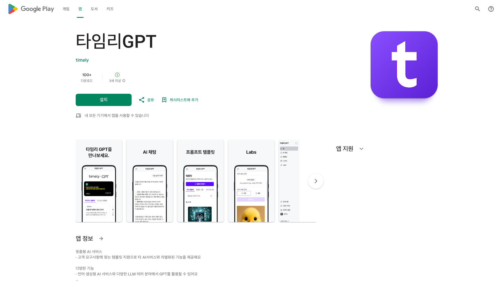
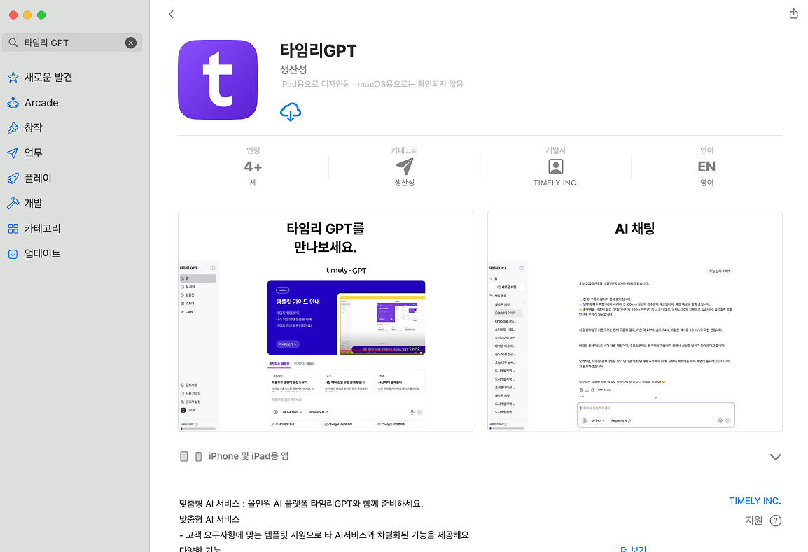

# 타임리GPT 서비스 사용 가이드

## ■ 어드민(관리자) 시작하기

---

시작하기/스페이스 설정

유저 초대/관리

템플릿 관리

크레딧 결제

## ■ 유저(멤버) 시작하기

---

시작하기

서비스 활용하기

템플릿 더 알아보기

Labs 더 알아보기

내 계정 설정하기

## ■ 어드민 기능 더보기

ㅤ

## ■ 타임리GPT 기능 더보기

---

ㅤ

## ■ 타임리 GPT 입문 가이드

**● 회원가입 안내**

**● 이미지 생성(F.나노바나나)**

**● LABS - 캔버스**

**●  AI 채팅 사용하기**

**● LABS - 이미지 생성**

**● LABS - AI슬라이드**

**● 템플릿 사용하기**

**● LABS - 영상 생성**

**● 추가 기능 알아보기**

## ■ 관리자 사용법 튜토리얼

[https://www.youtube.com/watch?v=4Cwv4UglCNE](https://www.youtube.com/watch?v=4Cwv4UglCNE)

## ■ 유저 튜토리얼

[https://www.youtube.com/watch?v=No0fxWBbHUI](https://www.youtube.com/watch?v=No0fxWBbHUI)

## ■ 템플릿 가이드 튜토리얼

## ■ FAQ

[자주 묻는 질문 보러가기 →](faq.md){ .md-button .md-button--primary }

관련: [할루시네이션을 줄이는 방법](hallucination.md)

## ■ 타임리GPT Application

??? question "**Android 가입**"

    

    
??? question "**IOS 가입**"

    

    

## ■ 직접 문의

[카카오 채널](http://pf.kakao.com/_DAxbQC/chat)

1551-3711

!!! info "[GPT 홈페이지](https://www.timelygpt.co.kr/main)"

    &nbsp;

## ■ Privacy

---

??? question "데이터 학습 및 보관 정책"

    
    
    1. 당사는 각 API사의 Privacy 정책을 준수하고 있습니다. 어떠한 형태로도 유저가 전송된 데이터를 저장하거나 AI 모델의 학습·개선 목적으로 활용하지 않습니다.
    2. API를 통해 처리되는 모든 데이터는 서비스 제공을 위한 목적에 한하여 사용되며, 처리 후 즉시 삭제됩니다.
    
    ▶ [각 정책 자세히보기](https://www.notion.so/GPT-API-Privacy-25ef49d7e77e8019bcf7d452d49d012b?pvs=21)
