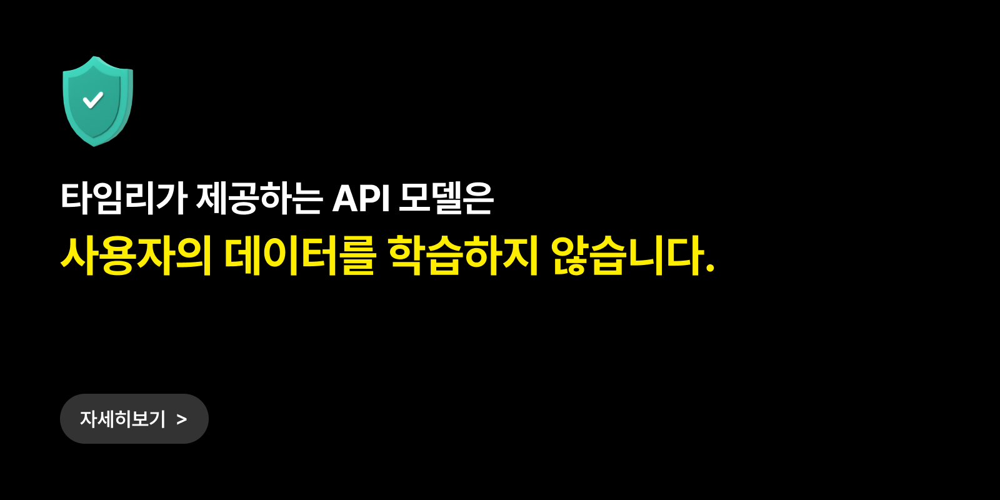

# Privacy

타임리GPT는 사용자 데이터의 보안과 개인정보 보호를 가장 중요한 가치로 여깁니다.

## 데이터 학습 및 보관 정책

1. 당사는 **각 API사의 Privacy 정책을 준수**하고 있습니다. 어떠한 형태로도 유저가 전송한 데이터를 저장하거나 AI 모델의 학습·개선 목적으로 활용하지 않습니다.
2. API를 통해 처리되는 모든 데이터는 **서비스 제공을 위한 목적에 한하여 사용**되며, 처리 후 **즉시 삭제**됩니다.

[:material-open-in-new: 각 정책 자세히 보기](https://www.notion.so/GPT-API-Privacy-25ef49d7e77e8019bcf7d452d49d012b?pvs=21){ .md-button target="_blank" }
