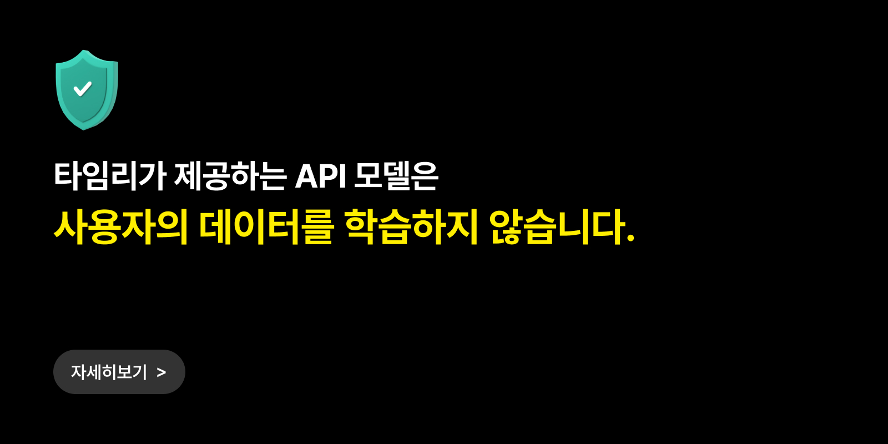

# Privacy

타임리AI는 사용자 데이터의 보안과 개인정보 보호를 가장 중요한 가치로 여깁니다.

## 데이터 학습 및 보관 정책

1. 당사는 **각 API사의 Privacy 정책을 준수**하고 있습니다. 어떠한 형태로도 유저가 전송한 데이터를 저장하거나 AI 모델의 학습·개선 목적으로 활용하지 않습니다.
2. API를 통해 처리되는 모든 데이터는 **서비스 제공을 위한 목적에 한하여 사용**되며, 처리 후 **즉시 삭제**됩니다.

??? info "🔒 각 정책 자세히 보기"

    각 AI 모델 제공사가 공식적으로 명시한 **데이터 학습·보관 정책**을 정리했습니다. 인용된 문단은 각 사의 공식 문서에서 그대로 발췌한 원문입니다.

    | 모델명 | 발췌 문단 | 데이터 정책 |
    | --- | --- | --- |
    | **OpenAI (ChatGPT)** | Ways to manage your data / Will OpenAI use my content to improve models and services? | **We do not train** on API, ChatGPT Enterprise, and ChatGPT Team **customer data by default.** / Data submitted through the OpenAI API is **not used to train** OpenAI models or improve OpenAI's service offering. |
    | **Google Gemini** | Data you submit and receive | Gemini **doesn't use your prompts or its responses as data to train its models.** Some features are only available through the Gemini for Google Cloud Trusted Tester Program, which lets you optionally share data, but the data is used for product improvements, **not for training Gemini models.** |
    | **Perplexity** | Will user data submitted through the API be used for model training or other purposes? | We collect the following types of information 중 **We do not retain any query data sent through the API and do not train on any of your data.** |
    | **Anthropic Claude** | Is my data used for model training? | By default, **we will not use your inputs or outputs** from our commercial products (e.g. Claude for Work, Anthropic API, Claude Gov, etc.) **to train our models.** |
    | **Meta Llama** | Llama API Data Commitments | **Meta does not train** its AI models on Llama API Customer Content or Customer Data. • Customer Data comprises your account data, roles, and profile fields. • Customer Content comprises both the inputs you submit to the model (prompts) and the outputs you receive based on your inputs (model responses). |
    | **Grok (xAI)** | Does xAI use my content for model training? | When using Private Chat, where available, your content and interactions are not used for model training. Similarly, **we do not use content from our business and enterprise customers to improve our models.** |
    | **Alibaba Qwen** | Does Alibaba Cloud Model Studio retain my data when I call a model? | Alibaba Cloud is committed to data privacy and **does not use your data to train models.** All data transmitted during application development or model training is encrypted to ensure security. |
    | **Mistral** | Controls on le Chat | Input and output training is not applicable to Team and Enterprise plans. **We do not use your data to train our models** and you can't manually opt-in for training yourself. |
