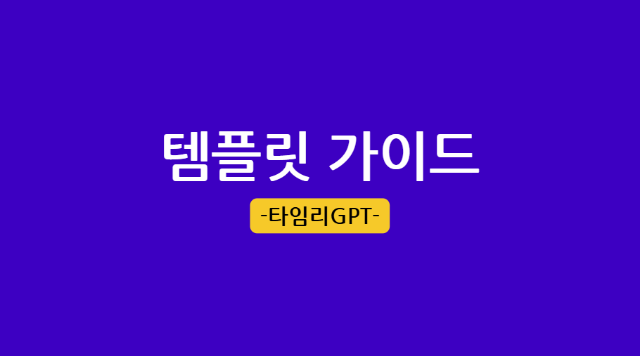

# 영상 튜토리얼

타임리GPT의 핵심 기능을 영상으로 빠르게 익혀보세요.

## 관리자 사용법 튜토리얼

스페이스 설정부터 유저·템플릿·크레딧 관리까지 — 관리자가 가장 먼저 알아야 할 흐름을 다룹니다.

[:material-youtube: 관리자 튜토리얼 보기](https://www.youtube.com/watch?v=4Cwv4UglCNE){ .md-button .md-button--primary target="_blank" }

## 유저 튜토리얼

회원가입부터 AI 채팅·템플릿·Labs까지 — 일반 사용자가 알면 좋은 핵심 기능 모음.

[:material-youtube: 유저 튜토리얼 보기](https://www.youtube.com/watch?v=No0fxWBbHUI){ .md-button .md-button--primary target="_blank" }

## 템플릿 가이드 튜토리얼

