# 타임리 에이전트

!!! note "목차"

    에이전트 기능 소개

    에이전트 사용하기

    꼭 알아두면 좋은 기능

    생성한 에이전트/스킬 등 확인하기

## **■ 에이전트 기능 소개**

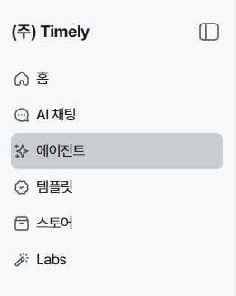

!!! note
    **타임리 에이전트란?**

    AI는 답변하는 시대를 넘어 **직접 일하는 시대**로 발전하고 있어요. 타임리 에이전트는 생성형 AI를 한 단계 더 발전시켜 **사용자를 대신해 업무를 수행**할 수 있도록 만든 기능이에요.

    별도의 프로그램 설치나 복잡한 설정 없이, **자연어 입력만으로** 에이전트를 만들고 사용할 수 있어요.

### 타임리 에이전트로 할 수 있는 일

- **나만의 기능(스킬) 만들기** — 원하는 기능이 없다면 자연어로 설명하여 나만의 스킬을 직접 만들어 사용할 수 있어요.
- **외부 서비스 연결(MCP)** — 기상청 날씨, 미세먼지, 공공데이터 등 다양한 외부 데이터와 연결하여 최신 정보를 활용할 수 있어요. 법률정보, 공공 API 등 새로운 서비스를 추가로 연결할 수도 있어요.
- **반복 업무 자동화** — 반복되는 업무를 예약하여 정해진 시간에 자동으로 실행할 수 있어요. *(예: 매일 오전 9시 AI 뉴스 요약)*
- **여러 에이전트 함께 활용하기** — 하나의 에이전트가 다른 에이전트에게 작업을 지시해 여러 단계를 거치는 업무를 처리할 수 있어요.
- **Google 서비스 연동하기** — Gmail, Google Calendar 등 Google 서비스와 연동하여 실제 업무를 수행할 수 있어요.
- **메신저에서 에이전트 사용하기** — 타임리에 접속하지 않아도 Slack, Telegram 등 메신저에서 에이전트와 대화하고 작업을 요청할 수 있어요.

## **■ 에이전트 사용하기**

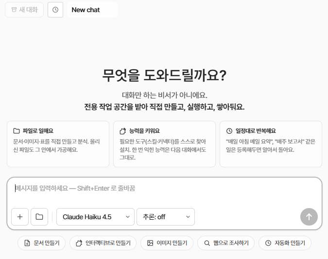

에이전트 생성은 메인 채팅창에서 **자연어로 요청하는 것**부터 시작해요. 만들고 싶은 기능이나 수행할 업무를 평소 말하듯 입력하면, AI가 필요한 에이전트 생성 과정을 안내해줘요.

> 💡 **어떻게 입력해야 할지 모르겠다면** 하단의 기능 버튼(문서 만들기, 이미지 만들기, 웹 조사하기, 자동화 만들기 등)을 눌러 예시를 참고해 보세요.

??? question "입력 예시"

    - 매일 오전 9시에 AI 뉴스 5개를 요약해서 알려주는 에이전트 만들어줘
    - 글의 내용과 톤을 입력하면, 사내 공지 형식으로 정리해주는 스킬 만들어줘
    - 제품 홍보용 SNS 이미지를 만들어줘

## **■ 꼭 알아두면 좋은 기능**

### ① 생성한 파일 확인하기

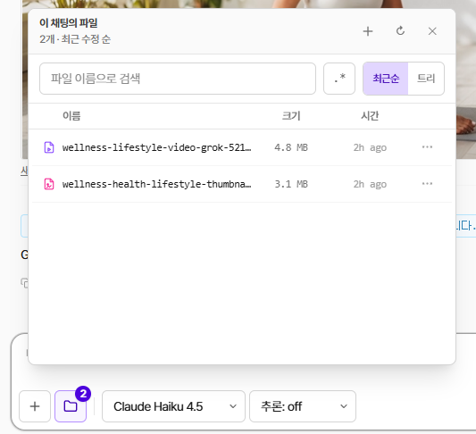

채팅에서 생성한 이미지, 영상, 문서 파일은 **메시지 입력창 왼쪽의 파일 버튼**을 눌러 확인할 수 있어요. 생성된 파일은 현재 채팅에 연결되어 저장되며, 다운로드하여 사용할 수 있어요.

### ② Thinking(추론) 기능

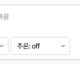

모델 선택 옆의 **'추론' 기능 레벨**을 조정하면, AI가 더 깊이 생각한 뒤 답변을 생성해요. 복잡한 분석, 보고서 작성, 코딩 등 **정확성이 중요한 작업**에 활용하는 것을 권장해요.

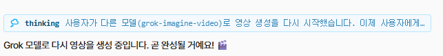

활성화된 경우 채팅창에 **파란색 Thinking 영역**이 표시되며, 일반 답변보다 응답 시간이 다소 길어질 수 있어요.

### ③ 이전 대화 이어서 사용하기

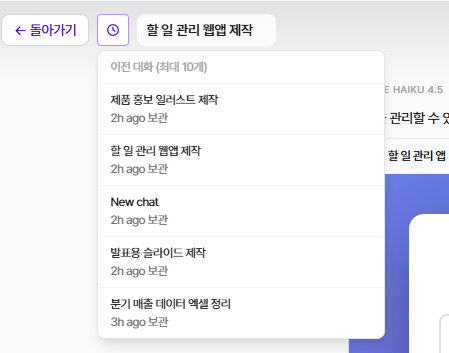

왼쪽 상단의 **시계 아이콘**을 클릭하면 최근 대화 목록을 확인할 수 있어요. 최근 대화는 최대 10개까지 저장돼요.

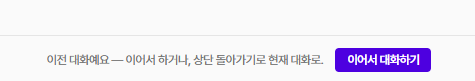

기존 대화 하단의 **'이어서 대화하기'** 를 클릭하면 내용을 이어서 진행할 수 있어요.

### ④ 새 대화 시작하기

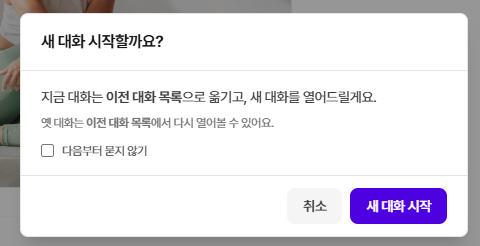

기존 대화 내용과 관계없이 새로운 작업을 시작하려면 **좌측 상단의 '새 대화' 버튼**을 클릭해요. 새 대화에서는 이전 대화 내용이 반영되지 않아요.

## **■ 생성한 에이전트/스킬 등 확인하기**

생성한 스킬과 에이전트는 물론, 연결된 커넥터와 알림 채널도 **에이전트 오른쪽 화면**에서 관리할 수 있어요.

### ① 스킬

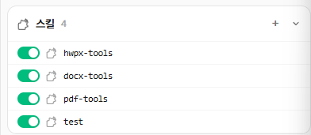

만들어진 스킬은 에이전트 오른쪽 화면에서 확인할 수 있어요. 스킬명을 클릭해서 이름을 바꾸거나 설명 등을 바꿀 수 있어요. 만들어진 스킬은 **스토어에 올려서** 스페이스를 사용하는 모든 사람과 공유하거나, 조직 스페이스에만 공유할 수도 있어요.

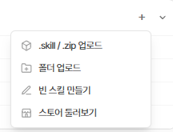

> 💡 스킬 화면의 **플러스 버튼**을 누르면 외부에서 제작한 스킬 파일(`.skill`, `.zip`)도 업로드하여 사용할 수 있어요.

### ② 커넥터

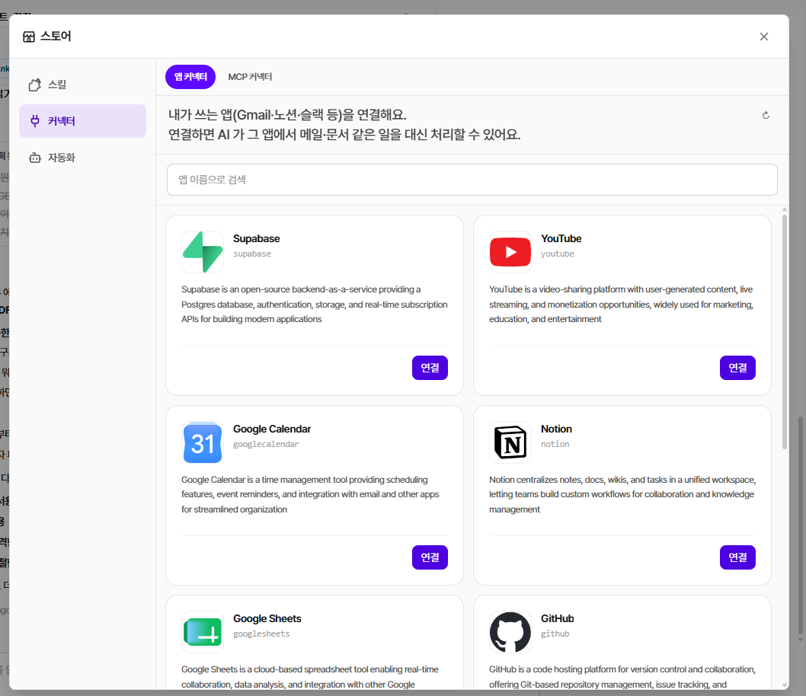

커넥터에서는 구글뿐 아니라 다양한 앱과 연결할 수 있어요. 예를 들어 **구글 캘린더 연결**을 한 후, 자연어 입력만으로 캘린더에 새로운 일정을 에이전트가 추가하게 할 수 있어요.

**MCP 커넥터**에 연결된 도구들을 연결하면, 각종 공식 정보에서 정확한 정보를 찾아 응답에 반영해 줘요.

### ③ 자동화(에이전트)

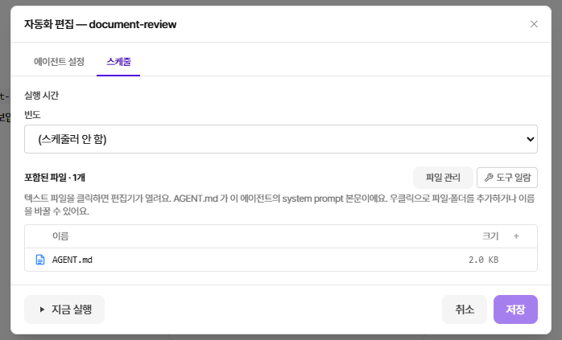

생성된 에이전트는 기본적으로 **'자동화' 메뉴**에 저장돼요. 에이전트를 매일, 매주 등 원하는 주기에 맞춰 **자동 실행**되도록 설정할 수 있고, 실행 시간과 주기는 언제든지 수정할 수 있어요.

- 생성된 에이전트는 **이름, 설명, 사용 모델** 등 주요 설정을 언제든지 수정할 수 있어요.

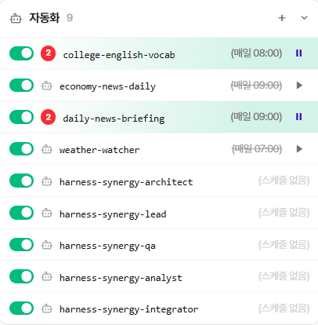

- 각 에이전트의 실행 결과는 해당 에이전트의 **'기록' 메뉴**에서 확인할 수 있어요.
- 특히, **스케줄이 설정된 에이전트**는 새로운 결과가 생성되면 **숫자 배지**로 표시돼요.

### ④ 알림 채널

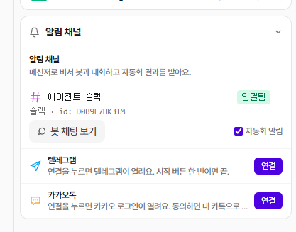

**슬랙, 텔레그램, 카카오톡** 메신저를 활용해서 에이전트를 각 메신저에서도 불러오거나 알림을 받을 수 있어요.

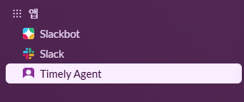

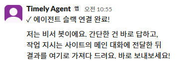

예를 들어 슬랙을 연결하면 타임리에 들어오지 않아도 슬랙에서 에이전트를 활용할 수 있어요. 연결된 에이전트 슬랙을 찾아서 자연어를 입력하면, 바로 메신저에서 에이전트에게 작업을 요청하고 결과를 받을 수 있어요.

> 💡 각 대화 내용은 타임리에서 **'봇 채팅 보기'** 를 누르면 확인할 수 있어요.

---

## **■ 영상으로 따라하는 타임리 AI 에이전트 제작**

에이전트와 스킬의 기본 개념부터 실제 제작·활용 방법까지, 교육 영상을 통해 단계별로 확인해 보세요.

[:material-play-circle-outline: 에이전트 제작 교육 영상 보기](https://www.youtube.com/live/iLcH1Yp0vTw?si=Ahho66yyRJh9z_Oz&t=773){ .md-button .md-button--primary target="_blank" rel="noopener" }
