

# AI 채팅 {#ai-ai-chat}

스페이스 메인화면에서 바로 질문하고, 문서·이미지와 다양한 기능을 활용해 답변을 받을 수 있어요.

## 질문하기 {#ai-ai-chat_1}

1. 스페이스 메인화면의 **채팅 입력창**에 질문을 입력해요.
2. 입력창 오른쪽의 **전송 버튼(화살표)**을 눌러 질문을 보내요.
3. 답변을 확인하고 필요한 내용을 이어서 질문해요.

별도의 AI 채팅 메뉴로 이동하지 않고 메인화면에서 대화를 시작해요.

**이미지 교체 예정 · 01 — 개편된 메인화면에서 질문 시작하기**

**추가할 화면:** 개편된 스페이스 메인화면 전체. 왼쪽 [새 채팅]·[최근] 영역과 중앙 채팅 입력창이 함께 보이도록 캡처해 주세요. 질문 입력 위치와 전송 버튼을 표시해 주세요. 기존 PDF에서 잘라낸 화면 대신, 실제 화면 전체를 사용해 주세요.

### 새 채팅·최근 대화 {#chat-history}

- **새 대화를 시작하려면:** 왼쪽 사이드바의 **[+ 새 채팅]**을 선택해요.
- **이전 대화를 이어가려면:** 왼쪽 **[최근]** 아래에 표시되는 채팅 목록에서 원하는 대화를 선택해요.

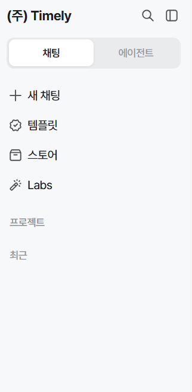{ width="280" }

**이미지 추가 예정 · 02 — 최근 대화 목록이 표시된 화면**

**추가할 화면:** [최근] 아래에 실제 대화 제목이 여러 개 표시된 사이드바와, 그중 하나를 선택해 열린 대화 화면. 현재 제공된 이미지는 [최근] 제목까지만 보여서 대화 목록이 채워진 화면을 추가해야 해요. 개인정보 없는 예시 대화를 사용해 주세요.

!!! warning "질문과 첨부 파일을 확인해 주세요"

    개인정보나 민감정보가 포함되지 않도록 주의해 주세요.

### 문서 미리보기 {#document-preview}

문서 미리보기가 열리면 **채팅 오른쪽 패널**에서 내용을 확인할 수 있어요.

- **페이지 확인:** 페이지 번호와 왼쪽 썸네일로 문서 구성을 살펴봐요.
- **확대·축소:** 뷰어 상단의 **[−]·[+]**로 표시 크기를 조절해요.
- **다운로드·닫기:** 패널 오른쪽 위의 다운로드 아이콘과 **[×]**를 이용해요.

아래는 PPTX 문서가 **PDF로 변환된 미리보기**로 표시된 예시예요. 계정·업무 관련 일부 정보는 가렸어요.

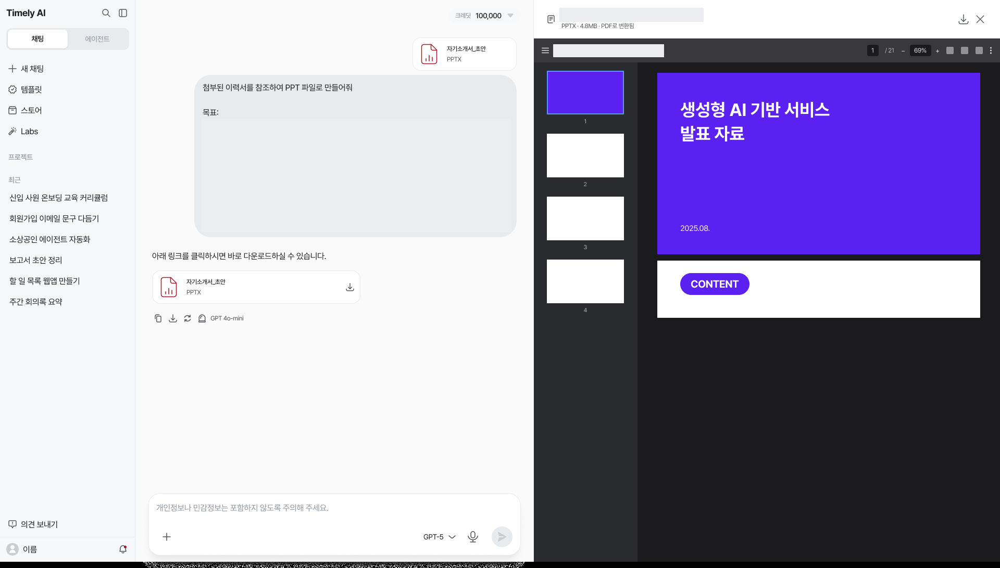

**이미지 추가 예정 — 문서 미리보기를 여는 위치**

**추가할 화면:** 같은 문서의 파일 카드에서 미리보기를 여는 버튼 또는 클릭 위치와 열린 패널을 함께 캡처해 주세요. 현재 제공된 예시는 카드와 미리보기의 파일명이 달라 실제 진입 동작을 확인할 화면이 더 필요해요.

## 모델 선택 {#model-selection}

1. **채팅 입력창 하단 오른쪽의 모델명**을 클릭해요.
2. 펼쳐지는 목록에서 사용할 모델을 선택해요.
3. 선택한 모델로 질문을 보내요.

모델은 새 채팅을 시작할 때뿐 아니라 대화 도중에도 변경할 수 있어요.

**이미지 교체 예정 · 07 — 모델 선택 위치와 펼쳐진 목록**

**추가할 화면:** 채팅 입력창 전체가 보이는 상태에서 하단 오른쪽의 모델명을 눌러 모델 목록을 연 화면. 클릭한 모델명과 그 위치에서 이어져 펼쳐지는 목록이 한 화면에 보여야 해요. 모델명에 테두리나 화살표를 표시해 주세요. 모델 목록만 따로 잘라 넣지 마세요.

### Auto 선택 {#auto-model}

어떤 모델을 선택할지 고민된다면 모델 목록에서 **[Auto]**를 선택해요. 질문에 알맞은 AI 모델을 자동으로 선택해 줘요.

### 더 오래 생각하기 {#thinking}

**이미지·설명 확인 예정 · 08 — 개편된 추론 옵션 설정**

**추가할 화면:** 채팅 입력창에서 추론 옵션을 열고 설정하는 화면. 제공된 이미지에는 모델명 옆에 [보통]이 보이지만 펼친 옵션은 없으므로, [보통]을 눌렀을 때의 목록과 [더 오래 생각하기]의 개편 후 설정 위치를 확인할 수 있게 캡처해 주세요. 기존의 ‘모델 위에 마우스를 올려 설정’ 안내는 새 동작 확인 후 반영할 예정이에요.

## 플러스 메뉴 {#plus-menu}

입력창 **왼쪽 아래의 [+]**를 누르면 다음 메뉴가 열려요.

| 메뉴 | 이용 내용 |
| --- | --- |
| **사진 및 파일 추가** | 질문에 참고할 문서나 이미지 첨부 |
| **그림 그리기** | 원하는 스타일과 내용으로 이미지 생성 요청 |
| **심층 리서치** | 심층 리서치 기능 선택 |
| **웹 검색** | 웹 검색 기능 선택 |
| **스킬** | 사용할 스킬 선택 및 스킬 관리 |
| **커넥터** | 커넥터 메뉴 및 커넥터 관리 |

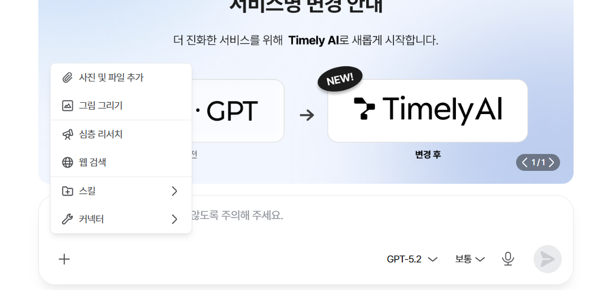

### 사진·파일 추가 {#ai-ai-chat-rag}

문서나 이미지를 첨부하면 해당 파일의 내용을 참고해 질문할 수 있어요. 파일의 정보를 찾아 답변에 활용하는 방식이 RAG(검색 증강) 기능이에요.

1. 입력창 왼쪽 아래의 **[+] → [사진 및 파일 추가]**를 선택해요.
2. 질문에 참고할 파일을 첨부해요.
3. 확인하고 싶은 내용을 입력한 뒤 질문을 보내요.

예: “첨부한 문서의 핵심 내용을 요약해 줘.” 또는 “이 Excel 파일의 주요 수치를 비교해 줘.”

**이미지 추가 예정 · 03 — 파일을 첨부한 질문과 답변**

**추가할 화면:** 아래 첨부·관리 화면은 확보했어요. 추가로 같은 문서를 첨부해 요약·분석을 요청한 질문과 해당 문서에 대한 실제 답변이 함께 보이는 화면을 캡처해 주세요.

#### 참고 파일 관리 {#reference-files}

파일을 첨부하면 입력창에 **[등록된 파일]**과 개수가 표시돼요. 이 자료는 AI가 질문에 답할 때 참고하는 파일이에요.

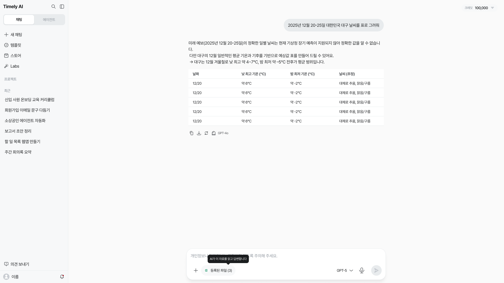

**[AI 참고 파일 관리]** 창에서 파일명과 각 파일의 용량, 전체 용량을 확인할 수 있어요. 확인을 마치면 **[닫기]**를 눌러요. 여기에 표시되는 총 용량은 현재 등록한 파일의 합계이며, 업로드 최대 한도가 아니에요.

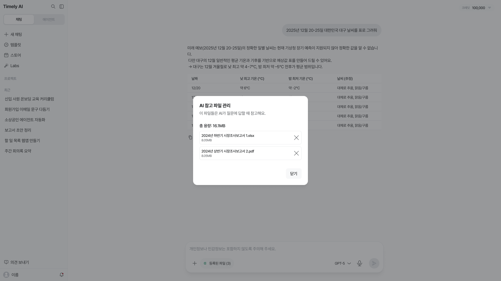

#### 파일 형식·제한 {#file-limits}

PNG, JPG 이미지와 PDF, HWP, Word(DOCX), Excel, PowerPoint 등 답변에 참고할 파일을 첨부할 수 있어요.

**OCR(이미지 속 글자 추출)이 필요한 PDF 등의 파일은 50MB 이하이면서 100페이지 이하여야 해요.** 이 기준은 OCR 처리가 필요한 파일에 대한 제한이에요.

#### 이미지 분석 {#image-analysis}

**[+] → [사진 및 파일 추가]**에서 이미지를 첨부한 뒤, 이미지에서 확인하고 싶은 내용을 질문해요.

예: “이 이미지에 있는 표의 내용을 정리해 줘.”

**이미지 추가 예정 · 04 — 이미지 분석 결과**

**추가할 화면:** 표나 사진을 첨부하고 내용을 질문한 실제 대화. 원본 이미지 미리보기, 질문, AI의 분석 답변이 함께 보이도록 캡처해 주세요.

### 그림 그리기 {#image-generation}

1. 입력창의 **[+] → [그림 그리기]**를 선택해요.
2. 입력창에 **[그림 그리기]**가 표시되고, 위쪽에 이미지 스타일이 나타나요.
3. **일러스트·수채화·사실적 사진·포스터** 중 원하는 스타일을 선택해요.
4. 만들고 싶은 이미지의 내용이나 분위기를 입력하고 요청을 보내요.

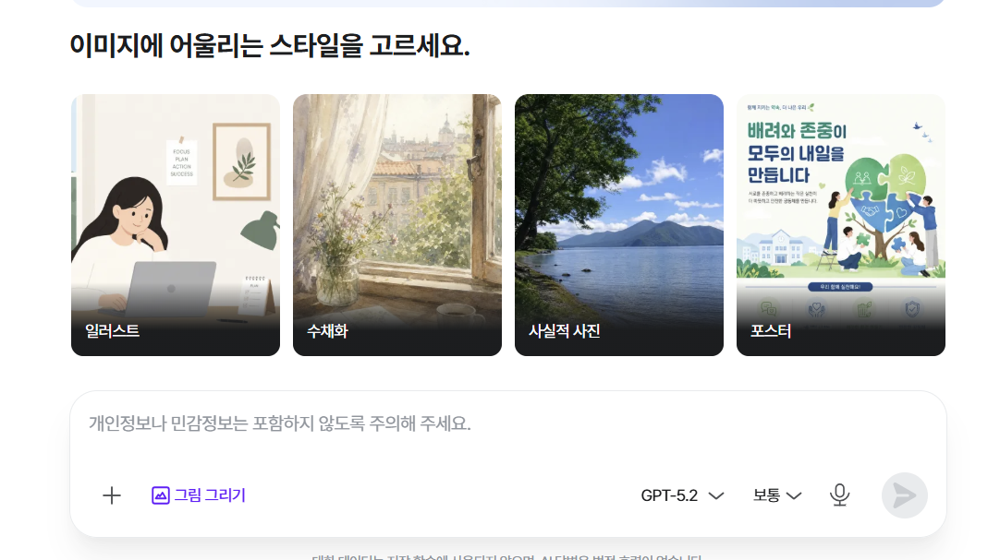

예: “하얀 고양이가 구름 위에서 노는 장면을 따뜻한 동화책 그림으로 만들어 줘.”

**이미지 추가 예정 · 05 — 이미지 생성 결과**

**추가할 화면:** 스타일을 선택하고 생성 요청을 보낸 실제 대화. 요청 문장과 완성된 이미지가 함께 보이도록 캡처해 주세요.

### 심층 리서치 {#research-search}

입력창의 **[+] → [심층 리서치]**를 선택한 뒤 질문을 입력해요.

**이미지 추가 예정 · 06 — 심층 리서치 선택과 응답**

**추가할 화면:** [심층 리서치]를 선택한 입력창과 실제 응답 화면. 선택된 기능을 알아볼 수 있는 표시와 질문이 함께 보이도록 캡처해 주세요.

### 웹 검색 {#web-search}

입력창의 **[+] → [웹 검색]**을 선택한 뒤 질문을 입력해요.

검색이 끝나면 **[웹 검색 완료]** 영역에서 검색에 사용된 URL 목록을 확인할 수 있어요. 목록이 펼쳐진 화면에서는 **[간략히 보기]**가 표시돼요.

답변 아래에는 **[답변 출처]**가 별도로 표시돼요. 검색 URL 목록과 답변 출처 표시는 구분해서 확인해 주세요.

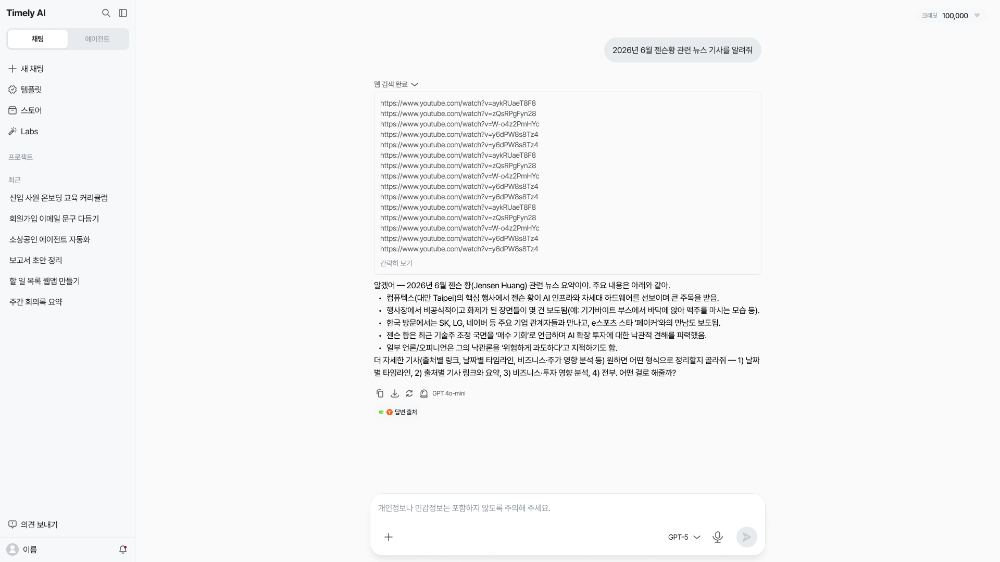

### 스킬 {#skills}

입력창의 **[+] → [스킬]**을 열고, 오른쪽 하위 메뉴에서 사용할 스킬을 선택해요. 제공된 화면에는 문서 공동 작성, 이미지 디자인, 웹사이트 테스트 등의 스킬이 표시되어 있어요.

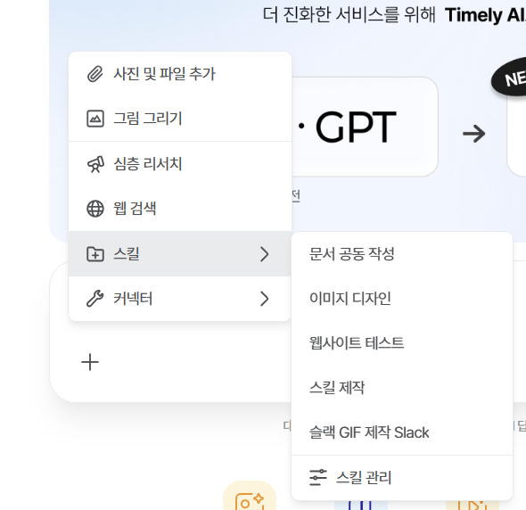

#### 스킬 관리 {#manage-skills}

**[+] → [스킬] → [스킬 관리]**로 열어요. 사이드바 하단 **프로필 → [내 계정] → [기능] → [스킬]**에서도 확인할 수 있어요.

스킬 관리 화면에서 사용할 스킬을 검색하거나 목록에서 확인해요. 각 스킬 오른쪽의 **스위치**로 켜거나 끌 수 있어요.

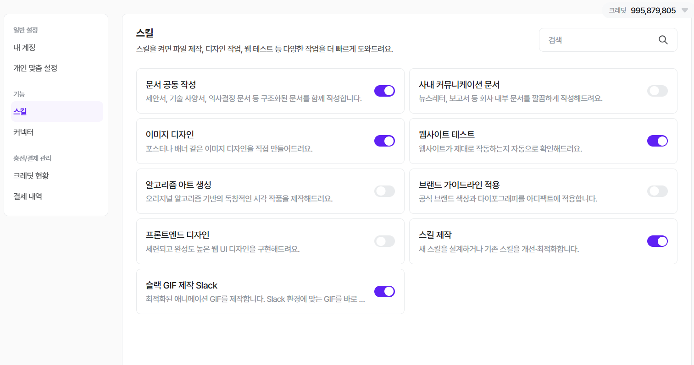

### 커넥터 {#connectors}

입력창의 **[+] → [커넥터]**를 열어요. 하위 메뉴의 **[커넥터 관리]**에서 연결할 앱을 확인할 수 있어요.

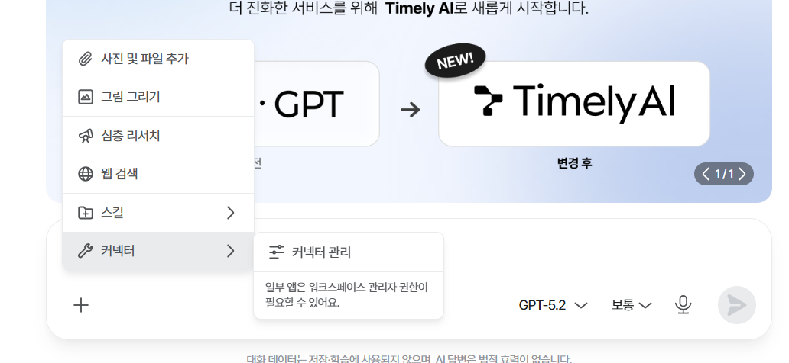

#### 커넥터 관리 {#manage-connectors}

**[+] → [커넥터] → [커넥터 관리]**로 열어요. 사이드바 하단 **프로필 → [내 계정] → [기능] → [커넥터]**에서도 확인할 수 있어요.

커넥터 관리 화면에서 앱을 찾아 **[+ 연결]**을 선택해요. 자주 쓰는 앱을 연결해 두면 대화 중에 사용할 수 있어요.

일부 앱은 **워크스페이스 관리자 권한**이 필요할 수 있어요. 연결이 되지 않으면 관리자에게 요청해 주세요.

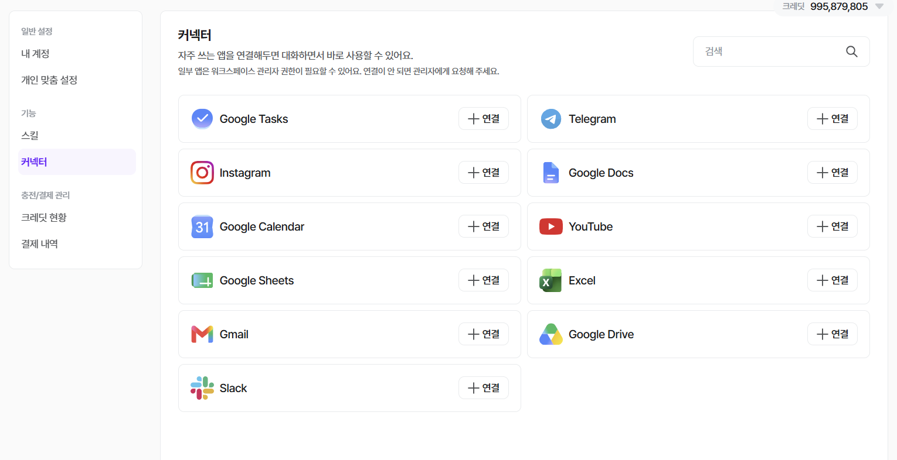

