<div class="overview-guide" markdown="1">

# Labs {#labs}

왼쪽 **[Labs]**에서 필요한 도구를 선택해요. 아래는 기능별 핵심 절차예요. 각 설명 아래에서 해당 화면을 바로 확인할 수 있어요.

<span id="labs_1"></span>
<span id="4-ai"></span>

실행 전에 선택한 모델의 이용 조건과 예상 크레딧을 확인해 주세요.

## 이미지 생성 {#4-1}

1. 모델과 프롬프트를 설정하고, 필요하면 소스 이미지를 업로드해요.
2. 비율·생성 개수·해상도를 선택해요.
3. 예상 크레딧을 확인하고 **[생성하기]**를 누른 뒤 결과를 확인해요.

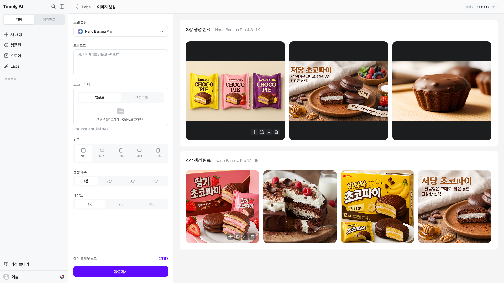

## 텍스트 추출 {#text-extraction}

<div class="guide-image-placeholder" markdown="1" data-image-slot="labs-text-extraction">

**화면·설명 추가 예정 — 텍스트 추출**

**추가할 화면:** Labs의 [텍스트 추출]을 연 화면과 자료 입력, 추출 결과 화면을 보내주세요. 현재 자료에는 이 기능의 화면이 없어 실제 버튼·지원 형식·이용 순서는 화면 확인 후 안내할 예정이에요.

</div>

## 문서번역 {#translation}

1. **[텍스트]** 또는 **[문서]**를 선택하고 원문·번역 언어를 정해요.
2. 텍스트를 입력하거나 문서를 **[파일 업로드]**로 등록해요.
3. 문서는 **[번역하기]**를 누른 뒤 완료된 결과를 **[다운로드]**해요.

문서 업로드는 **최대 30MB**이며 DOCX·PPTX·XLSX·PDF·HTM·HTML·TXT를 지원하는 화면이에요.

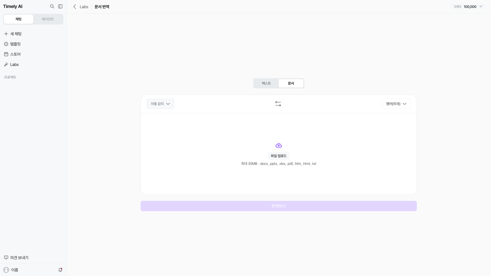

## 문서작성 {#document-writing}

1. **[새 프로젝트 시작]** 후 작성할 파일을 선택해요.
2. 문서 스타일과 프로젝트 배경지식을 입력해요.
3. 목차별 작성 지침을 저장하고 **[작성하기]**로 내용을 만들어요.
4. **[파일 생성] → [Word 문서 내려받기]**로 가져가요.

Word 파일에는 작성 완료된 섹션이 포함돼요. 빈 항목이나 미완료 섹션은 내려받기 전에 확인해 주세요.

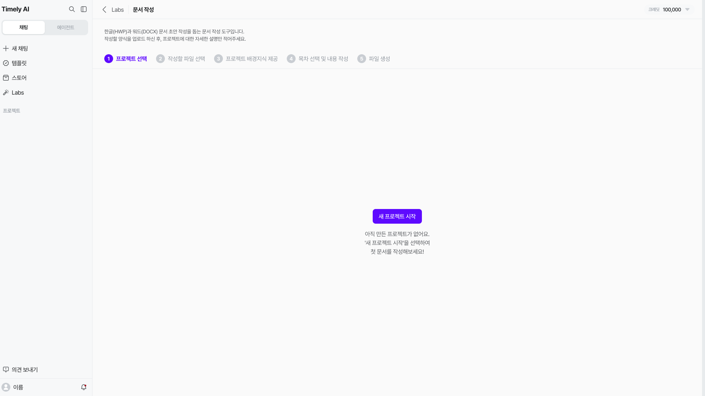

## AI 시트 {#ai-sheet}

1. **[새 시트]**로 시작하거나 **[파일 가져오기]**로 자료를 불러와요.
2. 채팅으로 데이터 정리·계산 등 원하는 작업을 요청해요.
3. 오른쪽 시트와 **[저장됨]** 상태를 확인하고 **[내려받기]**에서 편집본과 파일 형식을 선택해요.

**[파일 전체 처리]**는 실행 전 비용 안내를 확인한 뒤 진행해 주세요.

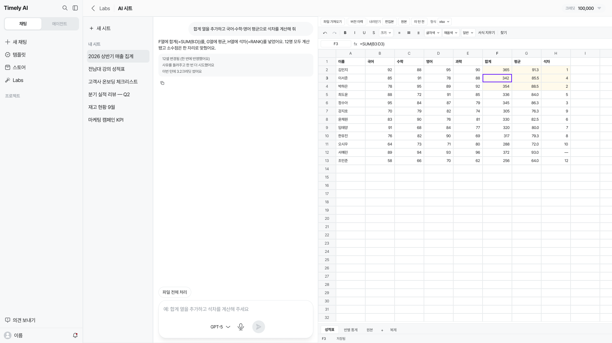

## TTS {#tts}

입력한 글을 AI 음성으로 변환하는 기능이에요.

1. 음성으로 만들 스크립트를 입력해요.
2. 음성 스타일 지침과 사용할 목소리를 설정해요.
3. 음성을 생성하고 결과를 내려받아요.

<div class="guide-image-placeholder" markdown="1" data-image-slot="labs-tts">

**이미지 추가 예정 — TTS**

**추가할 화면:** 개편된 TTS의 스크립트 입력창, 음성 스타일·목소리 선택, 생성 결과와 다운로드 위치. 기능 설명은 사용가이드를 참고했으며 이미지와 버튼명은 최신 화면으로 보완할 예정이에요.

</div>

## 영상 생성 {#video-generation}

1. 모델과 영상 길이를 정하고 만들 장면을 설명해요.
2. 시작 프레임·시작→끝 프레임·참조 이미지 중 필요한 방식과 이미지를 선택해요.
3. 비율·해상도와 예상 크레딧을 확인한 뒤 **[생성하기]**를 누르고 결과를 재생해요.

모델에 따라 선택할 수 있는 길이와 해상도가 달라요. 생성 실패 시 차감 정책도 실행 전 안내에서 확인해 주세요.

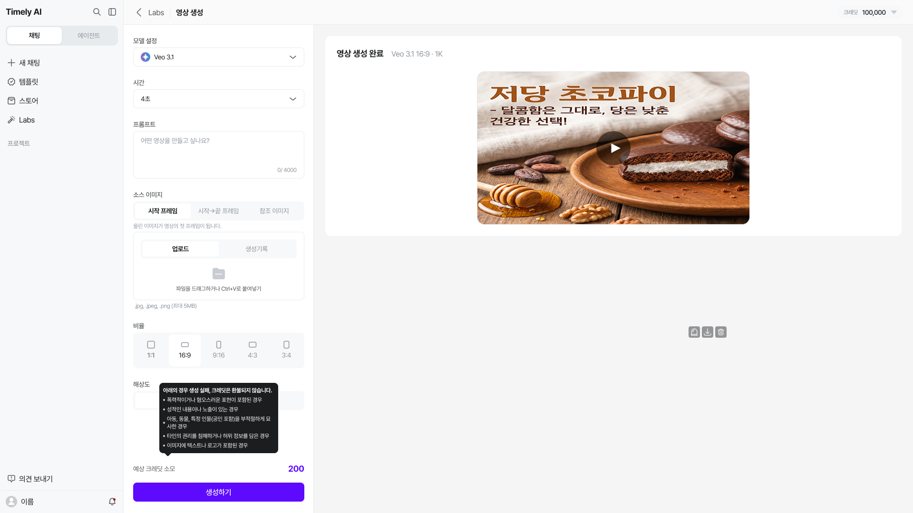

## AI 슬라이드 {#1-ai}

1. **[어떤 슬라이드를 만들까요?]**에 주제와 요구 사항을 입력해요.
2. 언어·장수·설정을 확인하고 필요하면 템플릿이나 참고 자료를 선택한 뒤 화살표 버튼으로 요청해요.
3. 생성 후 **[이 발표자료 고치기]**로 수정하고 결과를 확인해요.
4. **[저장]** 후 **[내보내기] → [PPT 다운로드] / [PDF 다운로드]**로 가져가요.

수정 결과에는 **[이 편집 되돌리기]**가 표시돼요. 내보내기 경고와 받은 파일의 표·이미지·글꼴을 확인해 주세요.

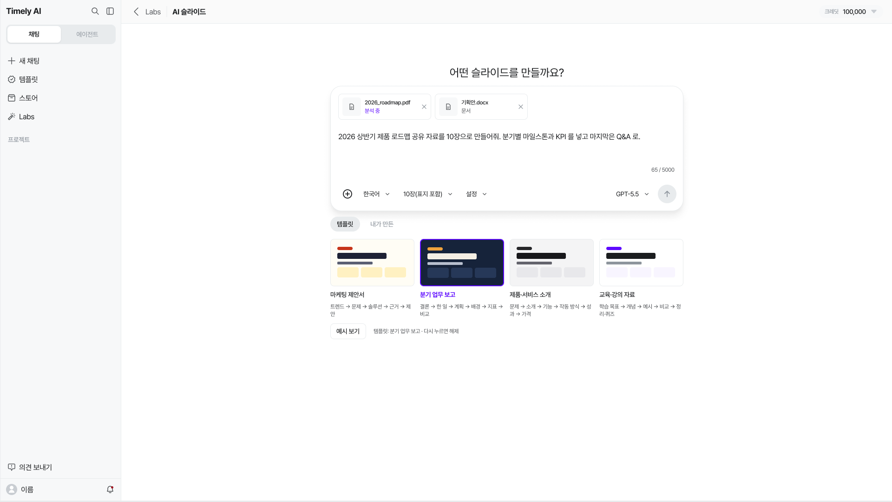

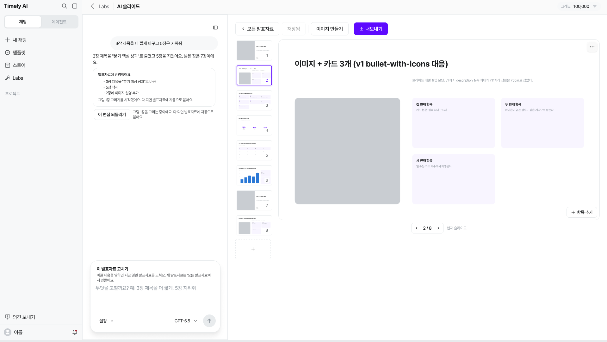

## 에이전트 빌더 {#5}

시작 노드부터 필요한 도구·모델을 연결하고 **[워크플로우 실행]**으로 결과를 검토해요. 발행 전에는 공개 범위와 자료의 노출 범위를 확인해 주세요.

<span id="5-1"></span>
<span id="5-2"></span>
<span id="_1"></span>
<span id="_2"></span>
<span id="_3"></span>
<span id="5-3-publish"></span>


**생성·실행**

**+ 에이전트 만들기**를 눌러 편집기를 여세요. 이전 작업은 **내가 만든 워크플로우** 또는 **초안**에서 찾아요.

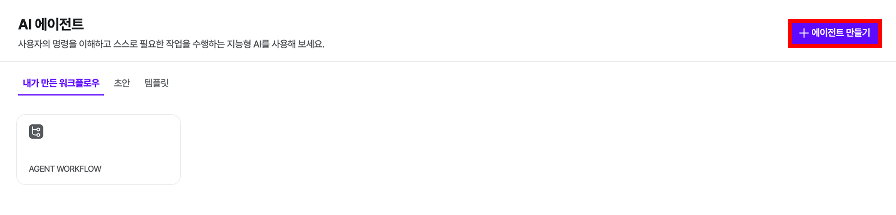

1. **시작** 노드의 입력 형식을 정하세요.
2. 필요한 노드를 추가·연결하고 모델·도구·입출력 값을 설정하세요.
3. **워크플로우 실행**으로 결과를 확인하고, 실패한 단계나 출력 내용을 수정하세요.
4. 검토를 마친 뒤 **Publish**로 발행하세요. 발행 버전과 공개 범위는 [발행과 권한 설정](#5-3-publish)을 참고하세요.

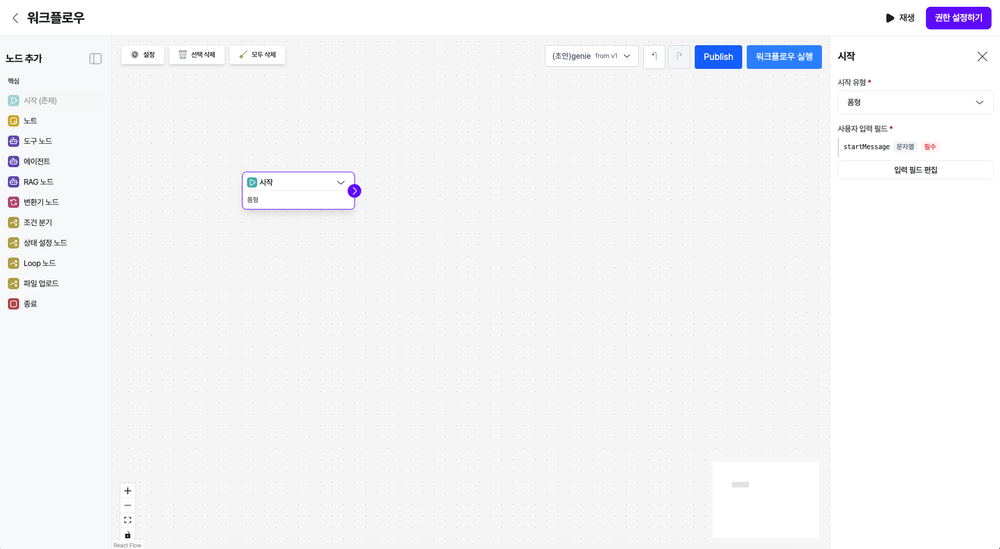

<div class="guide-image-placeholder" markdown="1" data-image-slot="labs-09">

**이미지 추가 예정 · Labs 09 — 완성된 워크플로우 실행과 검증**

**캡처할 화면:** 비민감 예시로 시작→도구→에이전트→종료를 연결하고 모든 필수값을 설정한 화면, **워크플로우 실행** 버튼과 각 단계의 실행 결과. 현재 캡처는 도구 미선택 상태이므로 성공 예시로 보지 않아요. 실패 시 오류 확인 위치도 확보해 주세요.

</div>

**노드 설정**

**노드**는 에이전트의 작업 단위예요. **시작** 노드부터 입력값이 전달되도록 구성하세요. **노드 추가**에서 필요한 노드를 선택해요.

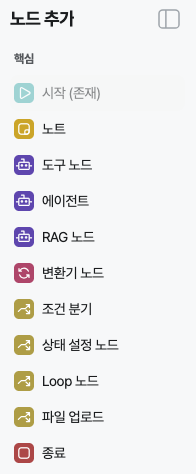

각 노드를 선택해 모델·도구·출력 형식·입력값 바인딩을 설정하고, 연결선(edge)으로 다음 노드와 연결하세요. 다음 단계가 필요한 속성과 데이터 타입을 받을 수 있는지 확인하세요.

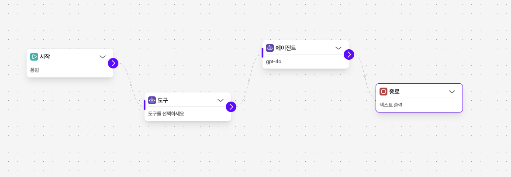

!!! note "노드 명칭과 상세 사양 확인"
    아래 상세 설명은 기존 안내의 기능 사양을 보존한 내용이에요. 캡처에는 **에이전트**로 표시되지만 설명에서는 **LLM**으로 부르는 항목이 있어요. **노트**, **파일 업로드**도 목록에 보이지만 상세 사용법은 확인 중이에요. 변수명·표현식·사전 설정 경로는 실제 노드 설정과 실행 결과를 확인한 뒤 적용하세요.

**핵심 노드**

워크플로우를 만들기 위한 가장 기본적인 구성 요소입니다. 모든 워크플로우에는 시작 노드가 필요합니다.

**Start**

??? question "워크플로우의 시작점이자 입력값을 정의하는 노드입니다. 이 노드는 사용자 입력을 두 가지 형식으로 받을 수 있습니다."

    - **채팅 형식:** 사용자가 대화창에 직접 입력하는 텍스트입니다. 이 경우, 입력된 텍스트 내용은 `userMessage` 라는 변수로 자동 노출되어 워크플로우 전체에서 사용됩니다.
    - **폼 형식:** 미리 정의된 양식(Form)을 통해 구조화된 데이터를 입력받을 때 사용됩니다.


**LLM**

- 이 노드는 대규모 언어 모델(LLM)을 워크플로우에 연결하는 역할을 합니다.
- 노드 생성 화면에서 채팅모델 설정, 지침, 필요한 도구를 정의할 수 있으며, 모델의 출력 형태를 지정할 수 있습니다.
- 사용할 채팅 모델은 별도의 페이지에서 미리 생성한 후, 이 노드에서 선택하여 워크플로우에 적용합니다.

**End**

- 워크플로우의 실행을 끝내는 지점을 명시적으로 정의합니다.
- 사용자가 보게될 출력 형식을 정할 수 있습니다.

**도구·데이터 노드**

이 노드들은 AI 에이전트에게 외부 데이터 검색능력을 부여하거나, 워크플로우 내에서 데이터를 관리하고 조작하는 역할을 합니다.

**도구 노드**

사용자 정의 도구, MCP 또는 TimelyGPT 에서 제공하는 빌트인 도구를 실행하는데 사용됩니다. AI 에이전트가 외부 서비스의 기능을 사용하도록 연결해 줍니다.

**RAG 노드**

벡터 검색 기능을 워크플로우에 연결하여, 벡터 저장소에서 필요한 정보를 검색하고 가져옵니다. LLM이 더 정확한 답변을 생성하도록 돕는 데 사용됩니다.

- 참고: 사용할 벡터 저장소는 별도의 페이지에서 미리 생성한 후, 이 노드에서 선택하여 적용합니다.

**변환기 노드**

이전 노드의 출력 데이터를 다음 노드의 입력 형식에 맞춰 변환합니다. 변환 요청 사항을 자연어로 적으면 AI가 데이터를 자동으로 변환합니다.

- 예시: "result 필드를 추출하여 문자열로 변환", "JSON을 평문으로 변환"

**상태 설정 노드**

워크플로우 내의 전역 상태를 관리합니다.

??? question "**값 설정 (기본):**"

    - **입력값 선택:** 이전 노드의 출력값을 선택합니다.
    - **State 키:** 자동으로 설정(입력 키 사용)되거나, 직접 키를 추가하여 선택할 수 있습니다.
    - **값 변환:** 필요시 JavaScript 문법을 사용하여 값을 변환할 수 있습니다.

??? question "**키 추가 (옵션):**"

    - 키만 추가하면 기본값으로 초기화됩니다.
    - 키를 추가하고 값을 설정하면 해당 키에 값이 저장됩니다.
    - 데이터 타입(string, number 등)을 지정할 수 있습니다.

??? question "**키 이름 규칙:**"

    - 영문 대소문자, 숫자, 언더스코어(`_`)만 사용 가능합니다.
    - 숫자로 시작하거나 공백을 포함할 수 없습니다.


**로직 노드**

워크플로우의 실행 흐름을 제어하는 규칙을 정의합니다.

**조건 분기 노드**

조건을 평가하여 다음 노드를 선택적으로 실행합니다. 설정된 조건에 따라 워크플로우의 실행 경로를 나눕니다.

- 평가 방식: 위에서부터 순서대로 조건을 평가하며, 첫 번째로 `true`인 조건의 출력 핸들로 이동합니다. (모두 `false`일 경우 `else` 경로로 이동)

??? question "사용 가능한 변수:"

    - `nodeName.keyPath`: 이전 노드의 출력 값 (예: `시작.startMessage`, `RAG.documents`, `LLM.result`)
    - `state.keyPath`: 전역 상태 값

!!! warning "표현식 예시 검증 대기"
    아래 코드는 기존 안내를 보존한 예시이며 실행 검증을 마치지 않았어요. 첫 코드 블록의 마지막 줄은 닫는 괄호가 없고, Loop 예시는 CEL 설명에 `===` 연산자가 섞여 있어요. `userMessage`, `startMessage`, `START.value`도 실제 입력 키와 노드 이름에 맞는지 확인해야 해요. 그대로 복사해 운영 워크플로우에 적용하지 마세요.

- CEL(Common Expression Language) 표현식 예시:

```tsx
시작.startMessage.length > 0
RAG.score >= 80
LLM.count > 0 && LLM.isValid
Tool.status == "success" || Tool.retry < 3
시작.score >= 90 ? true : RAG.bonus > 10
시작.items.filter(x, x.price > 100
```

**Loop 노드**

특정 조건이 충족될 때까지 노드들의 집합을 반복 실행합니다.

??? question "사용 방법:"

    1. Loop 노드를 추가하고 외부에서 Loop 입력 핸들로 연결합니다.
    2. **Loop 내부 시작**에서 반복할 첫 번째 노드를 연결합니다.
    3. 내부 노드들을 순서대로 연결하고, 마지막 노드를 **Loop 내부 끝**에 연결합니다.
    4. **Loop Exit / MaxReached** 핸들을 반복 종료 후 실행할 다음 노드에 연결합니다.
    5. Exit 조건 및 최대 반복 횟수를 설정합니다.

- 종료 조건 예시 (CEL):

```tsx
state.counter >= 10

state.isComplete === true

state.errorCount > 3

state.items.size() === 0

START.value > 100
```

??? question "**출력 핸들:**"

    - **초록색**: 종료 조건 충족 (정상 종료)
    - **빨간색**: 최대 반복 횟수 도달 (강제 종료)

- **주의사항:** Loop 내부 노드는 매 반복마다 실행됩니다. 무한 루프 방지를 위해 `State 노드`를 활용하여 반복 횟수를 추적하거나 명확한 종료 조건을 설정하세요.

<div class="guide-image-placeholder" markdown="1" data-image-slot="labs-10">

**이미지 추가 예정 · Labs 10 — 노드 설정과 조건식 검증**

**캡처할 화면:** 시작 노드의 실제 입력 키, LLM/에이전트의 모델 설정 경로, RAG 저장소 선택, 조건 분기와 Loop의 유효한 표현식·실행 결과. **노트**와 **파일 업로드** 노드의 설정도 확보해 주세요. 위 코드의 문법과 변수 경로는 확인 중이며, 검증 후 별도로 수정할 예정이에요.

</div>

**발행·권한**

편집기의 **저장** 상태를 확인하고 **워크플로우 실행**으로 결과를 검토한 뒤 **Publish**를 선택하세요. 기존 안내에서는 자동 저장, 발행 시 새 버전의 스냅샷 보관, 기존 발행 내역 확인, API 호출 시 특정 버전 지정이 가능하다고 설명했어요. 현재 저장 시점·버전 확인 화면·API 지정 방법은 확인 중이에요.

공개 범위는 **권한 설정하기**에서 확인하세요. 기존 화면에는 이메일 입력과 **초대**, **모든 사람** 및 **초대 받은 사람만 공개** 선택지가 있어요. 외부에 공개하기 전에 포함된 문서와 도구의 정보 노출 범위를 검토하세요. 공개 범위 설정과 발행 권한은 같은 의미가 아니에요.

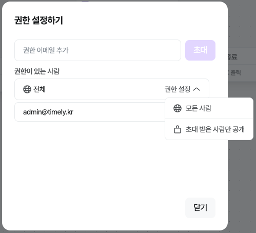

<div class="guide-image-placeholder" markdown="1" data-image-slot="labs-11">

**이미지 추가 예정 · Labs 11 — 발행 완료·버전·공개 범위 확인**

**캡처할 화면:** **Publish** 버튼을 누른 뒤의 확인 절차와 완료 상태, 발행 버전 목록, **권한 설정하기**에서 선택한 공개 범위와 반영 결과. 자동 저장 여부, 누가 발행할 수 있는지, API 버전 지정 방법은 실제 화면 또는 제품 사양으로 확인해 주세요. API 키·개인 이메일은 가려 주세요.

</div>


<span id="1-1-ai"></span>
<span id="canvas-code"></span>
<span id="canvas-document"></span>
<span id="slides-edit-download"></span>

## 지식 검색 {#4-2-perplexity-ai}

1. 질문을 입력하고 전송해요.
2. 답변의 **[출처 웹 문서]**와 이미지를 확인하고, 추가 출처를 펼쳐 원문을 살펴봐요.
3. **[관련된 질문]**을 선택하거나 새 질문으로 이어가요.

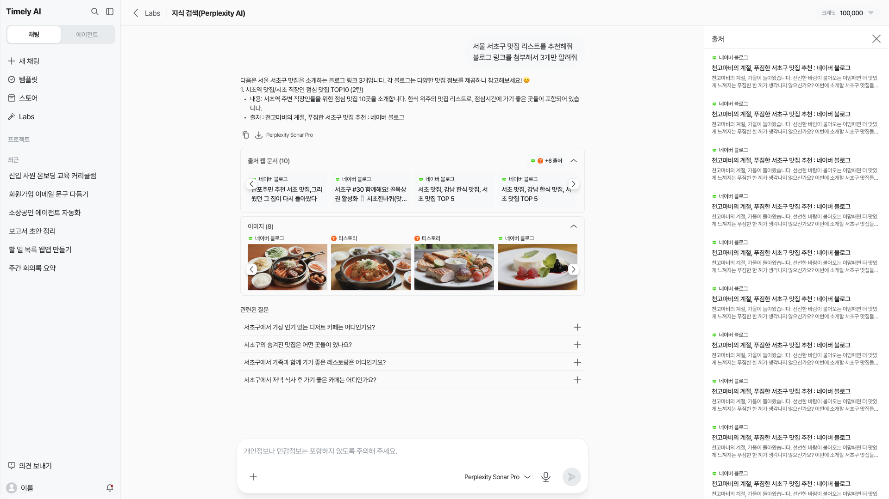

## 문서 검색(RAG) {#4-3-rag}

1. **[모델 역할 설정]**과 모델을 정하고 **[파일 업로드]**로 참고 문서를 등록해요.
2. 파일의 **처리중·완료·실패** 상태를 확인해요. 필요하면 새로고침해요.
3. **[모델 설정 업데이트]** 후 문서에 관한 질문을 입력해요.

역할 지침으로 답변 방식과 형식을 정할 수 있어요. 온도·Top P는 표현의 다양성을 조절하며, 낮은 값이 정확성을 보장하지는 않아요.

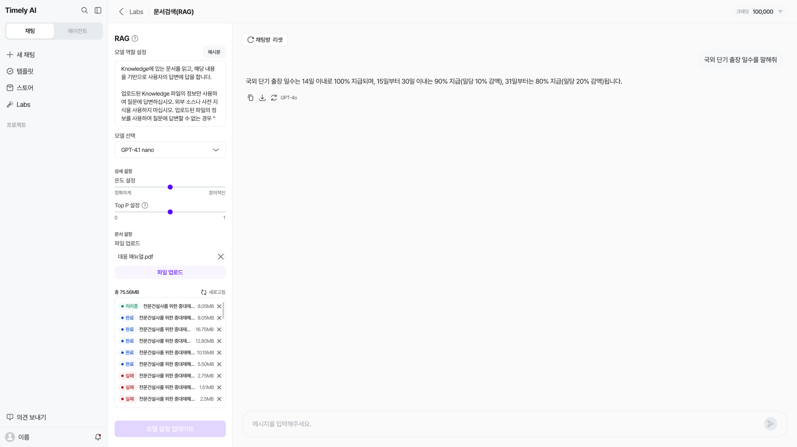

## 캔버스 {#3}

1. 만들 문서나 코드를 채팅으로 요청해요.
2. 생성된 결과를 열고, 문서는 **[수정하기]**로 보완해요.
3. 코드는 지원되는 환경에서 **[실행하기]**로 결과를 확인하고, **[복사]·[다운로드]**로 가져가요.

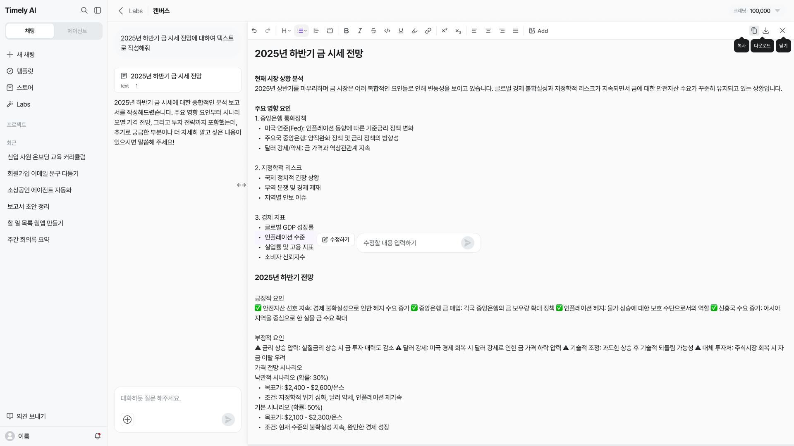

## 대화 기록 {#4-4}

1. **[파일 업로드하기]**에서 음성 파일과 **[인원 수]**를 선택해요.
2. **[업로드하기]**를 누르고 처리된 기록을 열어요.
3. 시간·화자별 내용을 확인하고 **[AI 요약]** 또는 **[AI 채팅]**을 이용해요.

음성 파일 안내는 **최대 1GB, FLAC·MP3·WAV·OGG**예요. 일반 채팅의 [최근] 목록과는 다른 기능이에요.

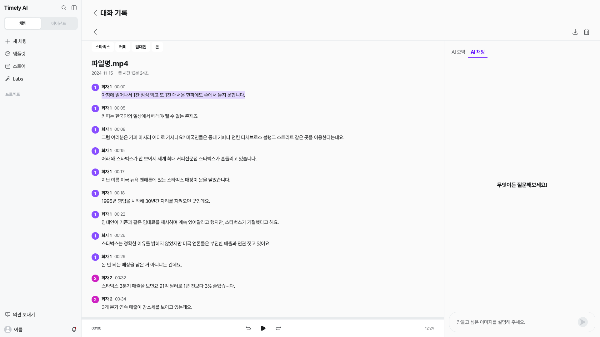

## 기타 도구 {#other-ai-tools}

- **나노바나나:** 예시 프롬프트나 참고 이미지를 활용해 이미지를 만들고 편집해요.
- **AI 요약:** 자막·스크립트가 있는 유튜브 영상의 내용을 요약해요.
- **AI 텍스트 탐지기:** AI 생성 여부를 참고용으로 확인해요. 확정 판정으로 사용하지 마세요.
- **음성 대화:** AI와 실시간으로 음성 대화를 나눠요.

<span id="2-nano-banana"></span>

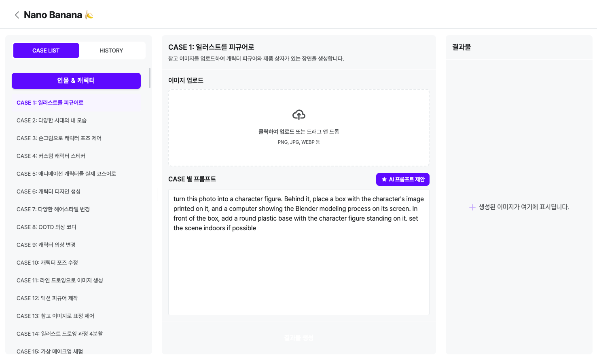

</div>
