# 내 계정 설정하기

!!! note "목차"

    내 계정 설정

    크레딧 현황

    연동 키 관리

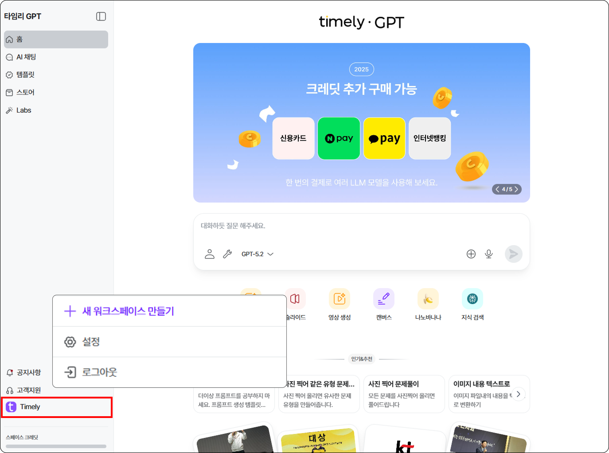

메인페이지 왼쪽 하단의 [내 계정] - [설정] 을 클릭해요.

## 1. 내 계정 설정

- 프로필 이미지, 이름, 비밀번호를 변경할 수 있어요.

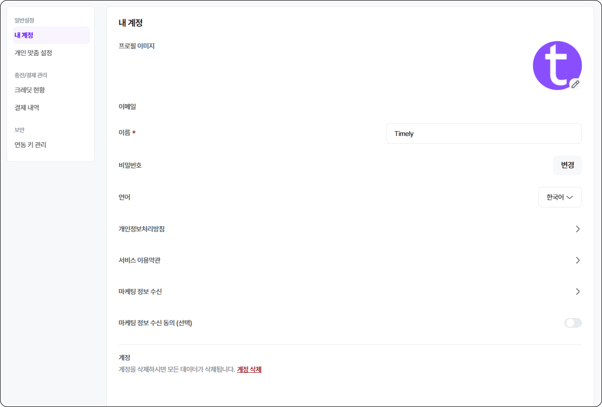

- 스페이스 내에서 사용할 언어를 설정할 수 있어요.
( 스페이스 내 언어를 **English** 로 설정하여도 기존에 만들어진 템플릿 이름은 변경되지 않아요.)
- 타임리GPT 서비스 가입 시에 필수적으로 동의했던 [타임리GPT 이용약관] 및 [개인정보처리방침]을 다시 확인할 수 있어요.
- 마케팅 정보 수신 동의는 선택사항이라 이 곳에서 ‘ON/OFF’를 설정 할 수 있어요.
- [계정 삭제]를 클릭하면 모든 데이터가 삭제되며, 1개월간 동일 계정으로 가입할 수 없으니 주의해주세요.

## 1-1. 개인 맞춤 설정

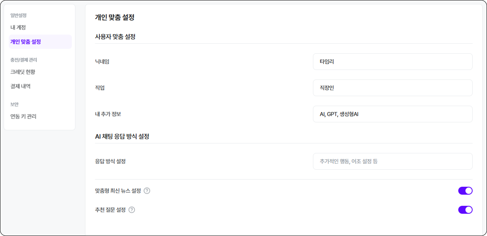

1. AI 답변을 받을 때 내 닉네임과 직업, 추가 정보를 입력할 수 있어요
2. 입력한 [사용자 맞춤 설정]을 참고하여 AI가 답변을 생성해요.
3. AI 채팅 응답 방식도 자유자재로 설정할 수 있어요.

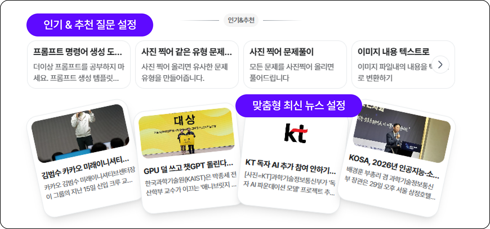

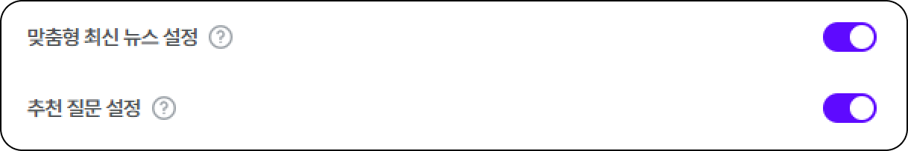

1. 스페이스 메인화면에 내가 설정한 사용자 설정에 맞춰 최신 뉴스를 제공해줘요.
2. 메인화면에서 제공하는 스페이스 추천 질문을 ON/OFF 할 수 있어요.

(조직에 따라 관리자가 모두 OFF 해 둔 경우에는 내가 다시 ON으로 바꿀 수 없는 점 참고해주세요)

## 2. 크레딧 현황

현재 스페이스에서 사용 가능한 크레딧 현황을 확인할 수 있어요!

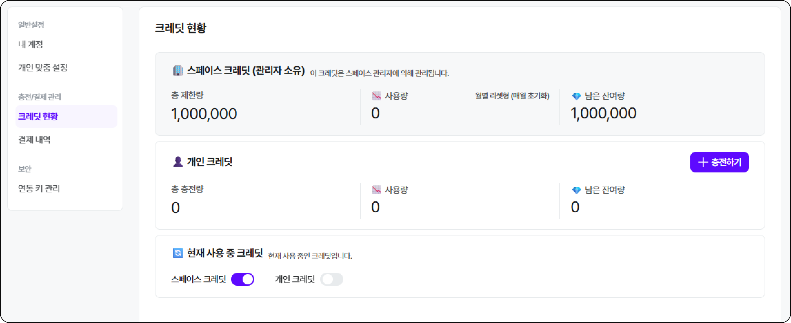

- [스페이스 크레딧] : 현재 이용 중인 스페이스 내에서 내가 부여받은 이달의 크레딧 양
- [개인 크레딧] : 유저 개인이 결제하여 충전한 크레딧 양

- 현재 스페이스에서 사용될 크레딧을 유저가 선택할 수 있어요!
- 스페이스에서 부여받은 크레딧을 모두 소진하면, 개인크레딧을 ON 하여 지속적으로 이용할 수 있어요.

## 2-1. 개인크레딧 결제

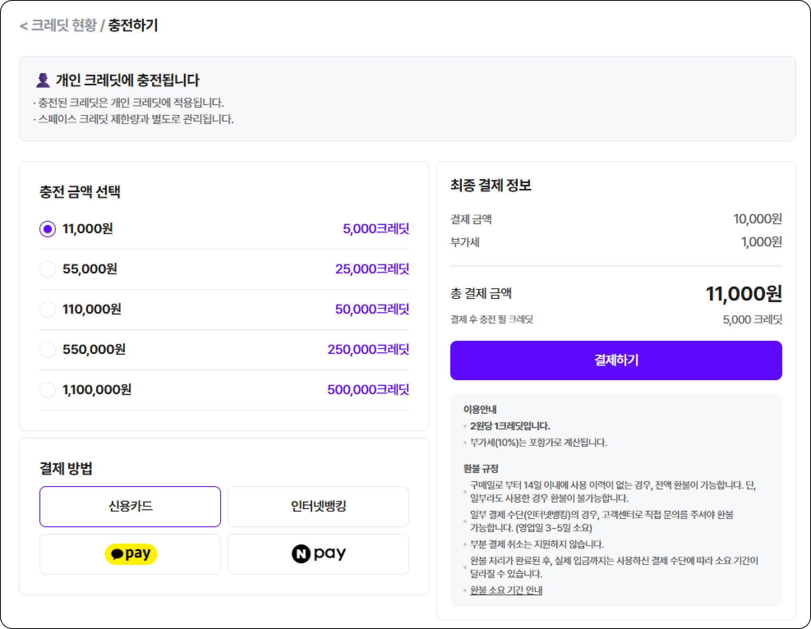

- [충전 금액 선택] > [결제방법] > [결제하기]
- ‘1 크레딧 = 2원’ 으로 계산되며, 최종결제금액은 ‘부가세 포함’ 금액이에요.
- [인터넷 뱅킹], [페이머니] 결제 시, 현금영수증 발급이 가능해요.

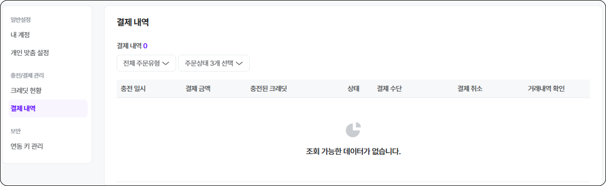

- [결제 내역]에서 결제한 주문내역을 확인할 수 있어요.
- 크레딧 결제 취소는 결제일로부터 14일 이내에만 가능하며, 구입한 크레딧을 사용하지 않은 경우에 한해 가능합니다.

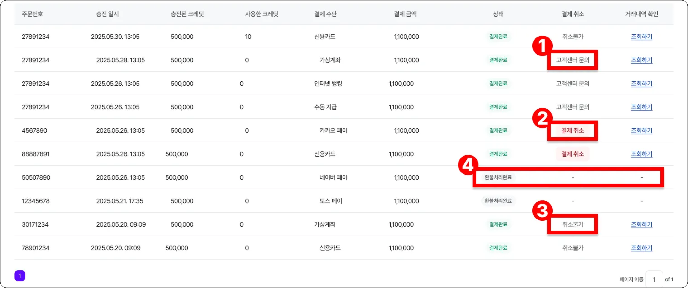

1. [고객센터 문의] : 결제 수단이 가상계좌, 인터넷뱅킹, 수동지급일 경우.
2. [결제취소] : 결제 수단이 카드나 페이머니일 경우.
3. [취소불가] : 결제일로부터 14일이 경과했거나, 구매한 크레딧을 사용했을 경우.
4. [환불처리완료] : 환불 처리가 완료된 상태.

## **3. 연동 키 관리**

- 타임리에서 제공하는 API Key를 연동해 나만의 AI를 만들 수 있어요!

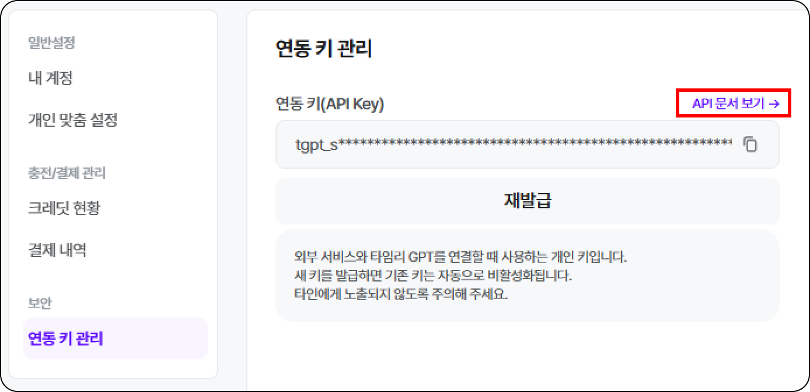

- 연동 키(API Key)를 복사하여 타임리GPT와 외부서비스를 연동하여 사용할 수 있어요!
- 새 키를 발급하면 기존 키는 자동으로 비활성화되요.
- [API 문서 보기] 에서 해당 내용에 대한 가이드를 제공해주고 있어요.

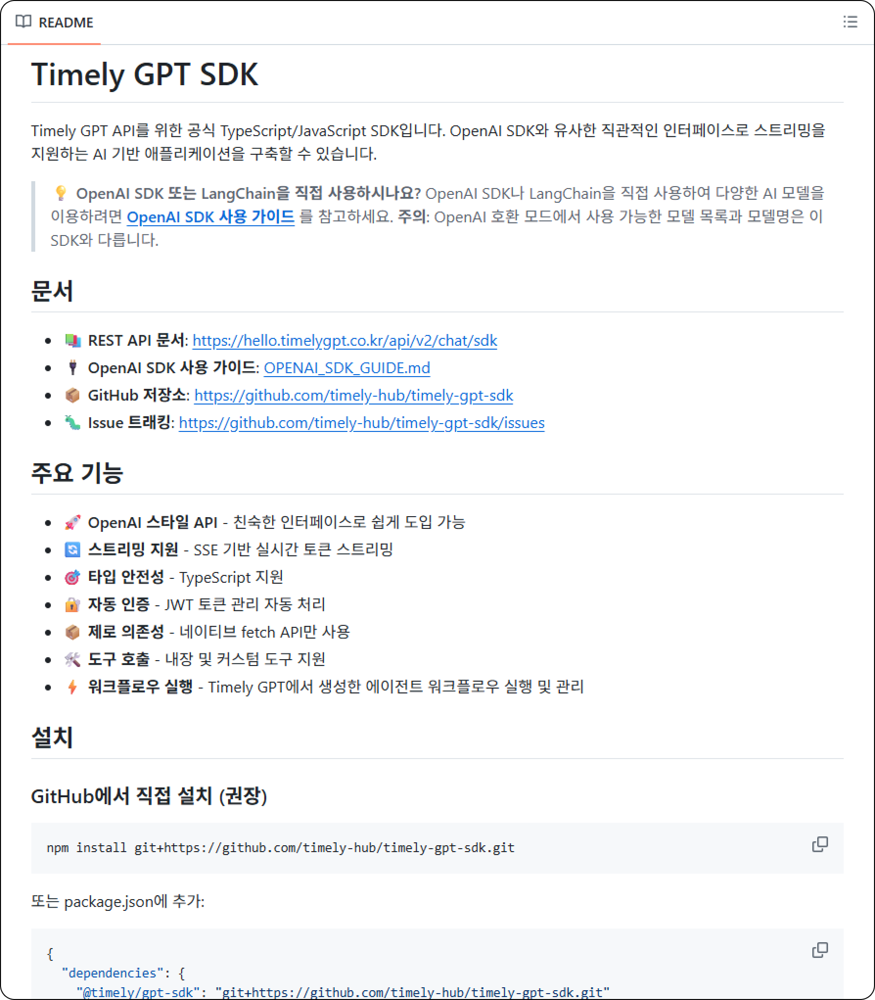

- 타임리에서 제공하는 API Key 가이드를 확인해 외부 서비스와 연동해 이용할 수 있어요.

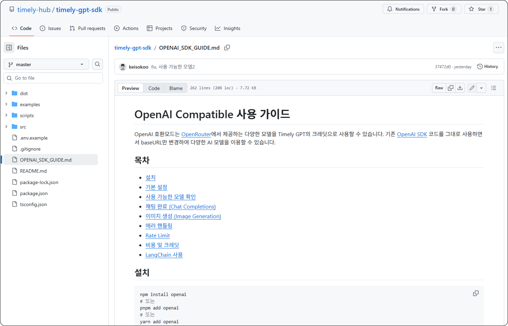

- Open AI 나 LangChain을 직접 사용하시는 유저들을 위해 OpenAI SDK 사용가이드도 제공하고있어요.

!!! note
    이전으로

    [템플릿 더 알아보기](https://www.notion.so/294f49d7e77e8138befcf17912b84fb5?pvs=21)
