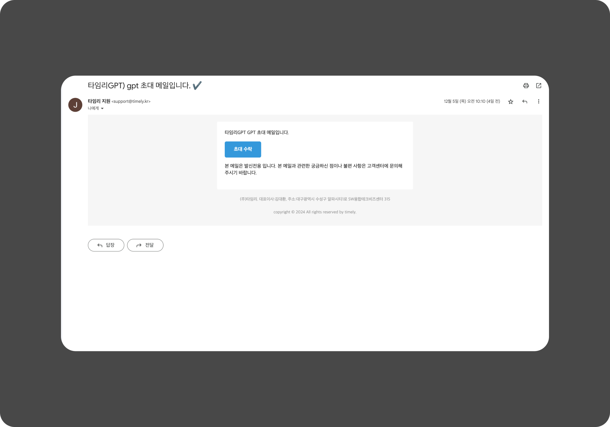
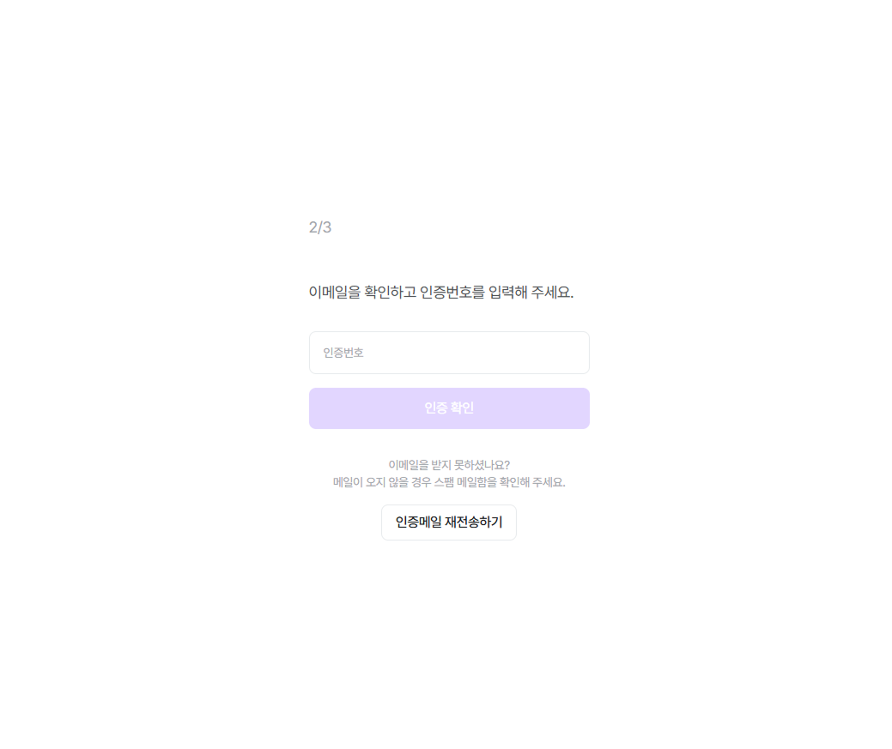
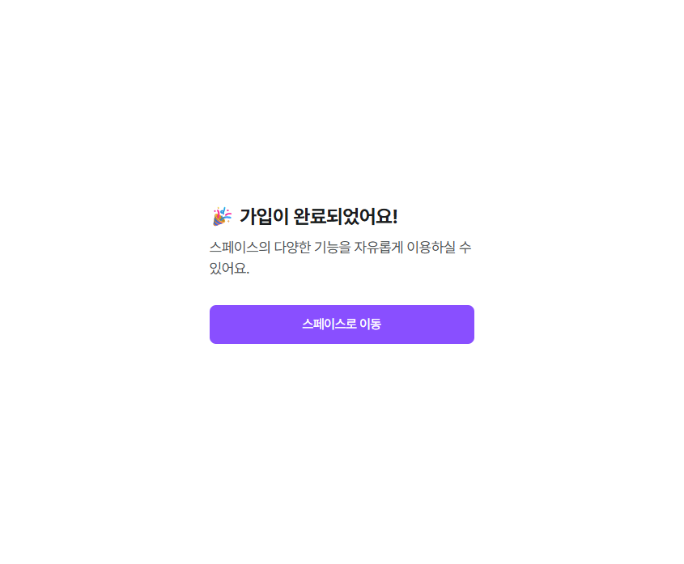

# 시작하기

!!! note "목차"

    접속하기

    회원가입

    계정 연동 가입

    Q&A

## 1. 접속하기

> 💡 **최초 로그인 시, 회원가입을 먼저 진행해주세요**
## 1-1. 이메일(일괄) 초대를 받은 경우

관리자가 보낸 메일 **[초대 수락]** 클릭 후, 회원가입 해주세요!

초대 메일의 ‘초대 수락’ 버튼을 클릭해 주세요

## 1-2.  초대 코드(링크)를 받은 경우

공유 받은 초대 코드(링크)로 페이지를 접속해서 회원가입 해주세요!

> 👇 **아래 단계를 거치면, 스페이스 가입 완료**
## 2. 회원가입 방법 ✅

계정은 (1-1) 이메일 초대 받았으면 자동으로, (1-2) 링크 통한 경우는 직접 입력 해야해요!

가입 완료 후 ‘스페이스로 이동’ 클릭

## 2-2. SNS 계정 연동 가입

SNS 계정으로 로그인 한다면, 정보만 따로 입력해주세요

!!! warning "카카오톡/구글 로그인은 ‘타임리’에서 비밀번호를 바꿀 수 없어요"

    (비밀번호를 잊어버리셨으면 카톡/구글 자체의 비밀번호를 바꿔야해요)

## Q. 권한이 없다고 뜰 때?

⚠️초대 링크가 아닌 [로그인 링크]로 가입⚠️하면, 권한이 없다고 보일 수 있어요!!

당황하지 말고 스페이스 관리자나 1551-3711로 문의주세요 

!!! note
    타임리 GPT 홈페이지

    [홈페이지 이동하기](https://www.timelygpt.co.kr/main)

!!! note
    다음으로

    서비스 활용하기
