

# 개요 {#_1}

## 이용 시작 {#1}

소속 기관의 스페이스를 이용하는지, 개인적으로 이용하는지에 따라 회원가입을 시작하는 경로가 달라요.

| 이용 방식 | 회원가입을 시작하는 곳 |
| --- | --- |
| **소속 기관의 스페이스 이용** | 초대 이메일의 **[초대 수락]** 또는 관리자가 전달한 **초대 링크** |
| **개인적으로 타임리AI 이용** | [타임리AI 홈페이지](https://timelygpt.co.kr/main)의 **[회원가입]** |

!!! warning "기관 사용자는 초대 경로로 가입해 주세요"

    **초대 링크는 처음 기관 스페이스에 가입할 때**, **기관 접속 주소는 가입 후 로그인할 때** 사용해요.

    홈페이지나 기관 접속 주소에서 바로 회원가입하면 타임리AI 계정만 생성되고, 해당 기관 스페이스에는 가입되지 않아요.

### 이메일 초대 {#1-1}

관리자가 보낸 초대 이메일에서 **[초대 수락]**을 클릭한 뒤 회원가입을 진행해요.

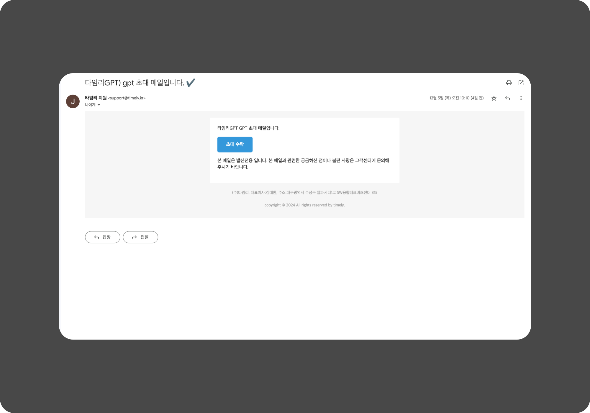

### 초대 링크 {#1-2}

관리자가 전달한 **스페이스 초대 링크**에 접속한 뒤 회원가입을 진행해요. 함께 받은 기관 접속 주소가 아니라 **초대 링크**로 시작해 주세요.

### 개인 가입 {#personal-signup}

[타임리AI 홈페이지](https://timelygpt.co.kr/main)에 접속해 **[회원가입]**을 선택해요. 기관 초대 없이 개인적으로 이용하려는 경우에는 이 경로로 가입하면 돼요.

## 회원가입 {#2}

위에서 선택한 경로로 들어온 뒤 회원가입을 진행해요. 기관 사용자는 초대 이메일이나 초대 링크로 열린 화면에서 가입을 이어가 주세요.

### 이메일 가입 {#email-signup}

**1. 이메일 확인 및 입력**
{ .overview-step }

가입할 이메일 주소를 확인하고 **[다음]**을 클릭해요. 이메일 초대를 받은 경우에는 초대받은 이메일 주소가 자동으로 입력되고, 초대 링크로 접속한 경우에는 직접 입력해요.

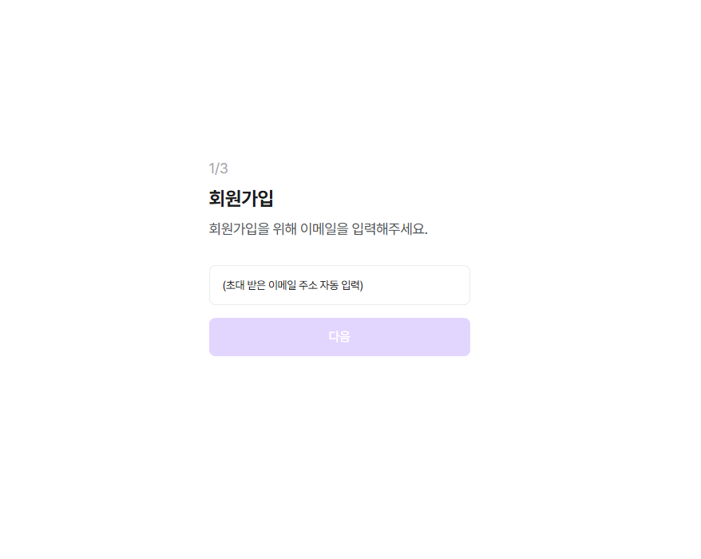

**2. 이메일 인증**
{ .overview-step }

입력한 이메일로 받은 인증번호를 입력하고 **[인증 확인]**을 클릭해요. 메일이 보이지 않으면 스팸 메일함을 확인하거나 **[인증메일 재전송하기]**를 선택해 주세요.

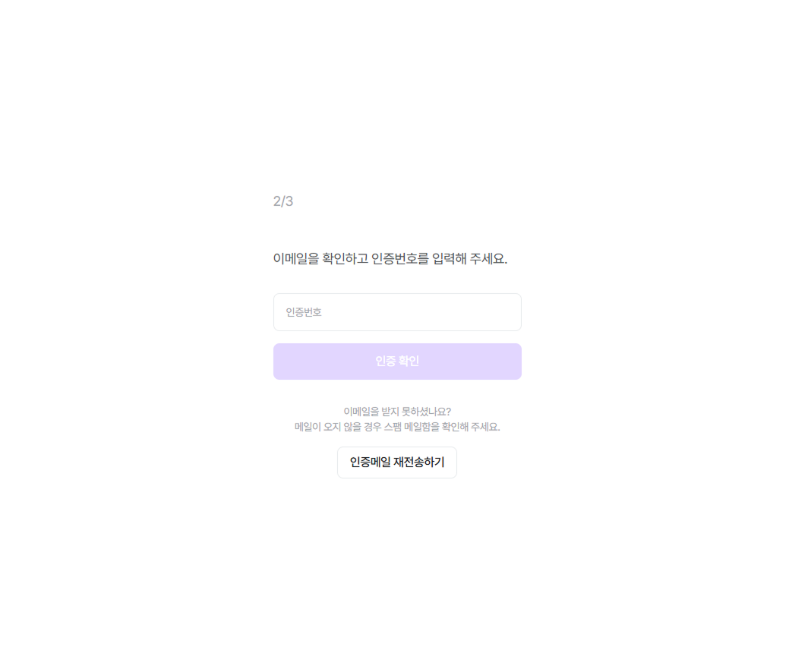

**3. 가입 정보 입력**
{ .overview-step }

이름, 비밀번호, 비밀번호 확인을 입력해요. 필수 약관에 동의한 뒤 **[가입하기]**를 클릭해요.

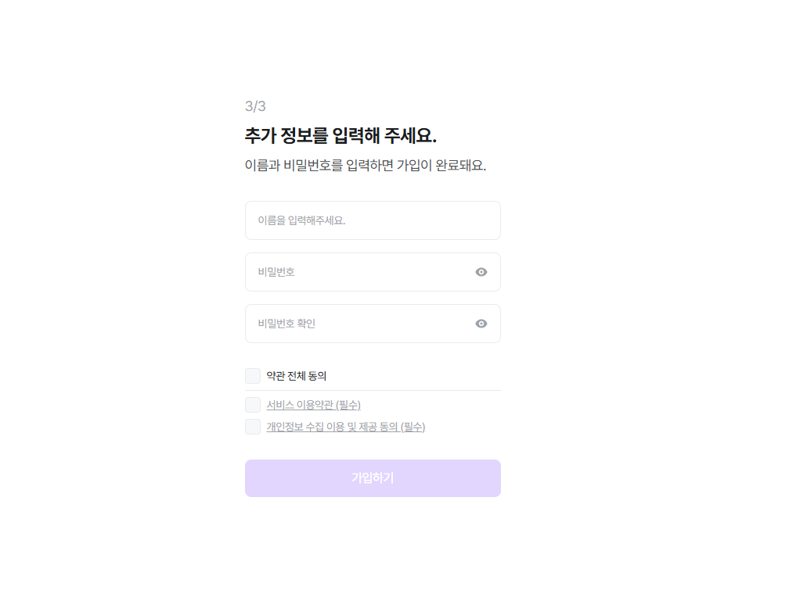

### SNS 가입 {#2-2-sns}

SNS 계정을 이용하려면 **카카오 또는 구글**을 선택하고, 화면에서 요청하는 추가 정보를 입력해 가입을 진행해요. 이후에도 가입할 때 선택한 SNS 계정으로 로그인해 주세요.

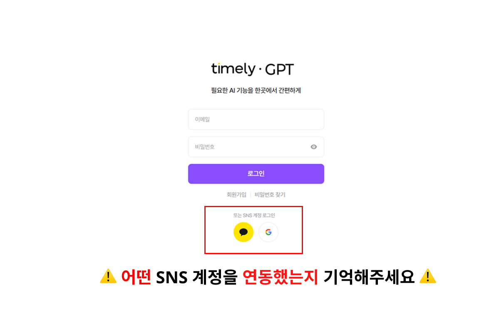

카카오·구글 계정의 비밀번호는 타임리AI에서 변경할 수 없어요. 비밀번호를 잊었다면 해당 SNS 서비스에서 재설정해 주세요.

## 가입 후 접속 {#after-signup}

### 기관 사용자 {#organization-login}

초대 경로로 회원가입을 마쳤다면 **[스페이스로 이동]**을 클릭해 소속 기관의 스페이스로 들어가요.

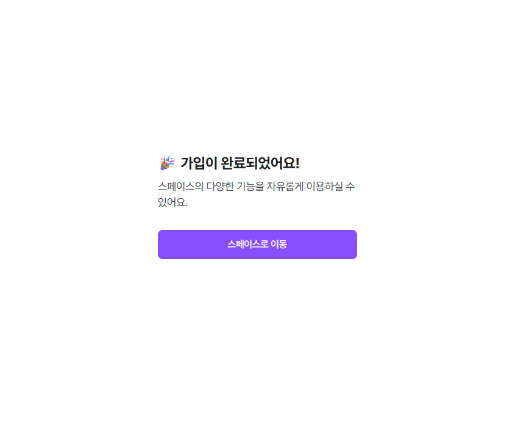

다음 접속부터는 관리자가 전달한 **기관 접속 주소**에서 가입한 계정으로 로그인해 주세요.

### 개인 사용자 {#personal-login}

[타임리AI 홈페이지](https://timelygpt.co.kr/main)에서 가입한 계정으로 로그인해 이용해요. 별도의 스페이스를 직접 만들고 싶다면 이 페이지 마지막의 **워크스페이스 만들기**를 참고해 주세요.

## 접근 권한 문제 {#q}

기관 접속 주소로 로그인했는데 **접근 권한이 필요하다는 안내**가 표시되면, 해당 기관 스페이스에 가입되어 있는지 확인해 주세요.

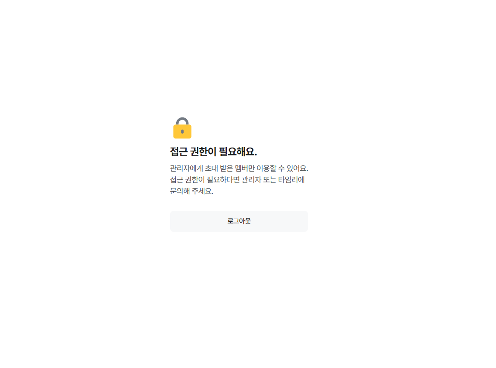

**왜 이런 안내가 나오나요?**

초대 이메일이나 초대 링크가 아닌 홈페이지 또는 기관 접속 주소에서 바로 가입하면, **타임리AI 계정은 생성되지만 기관 스페이스에는 가입되지 않아요.** 이 상태에서는 기관 접속 주소로 로그인해도 접근 권한이 필요하다는 안내가 나올 수 있어요.

**어떻게 확인하나요?**

기관 관리자에게 가입한 이메일 주소를 전달하고, 해당 스페이스의 가입 여부를 확인해 달라고 요청해 주세요. 도움이 필요하면 고객센터 **1551-3711**로 문의해 주세요.

## 워크스페이스 만들기 {#4}

워크스페이스는 **개인 사용자와 기관 사용자 모두 만들 수 있어요.** 개인적으로 이용하거나 기관·팀이 함께 사용할 스페이스가 필요할 때 아래 절차를 진행해 주세요. 스페이스를 만든 사용자가 해당 스페이스의 관리자가 돼요.

**1. 홈페이지 접속**
{ .overview-step }

[타임리AI 홈페이지](https://timelygpt.co.kr/main)에 접속해요.

**2. 워크스페이스 만들기 선택**
{ .overview-step }

**[워크스페이스 만들기]**를 선택해요.

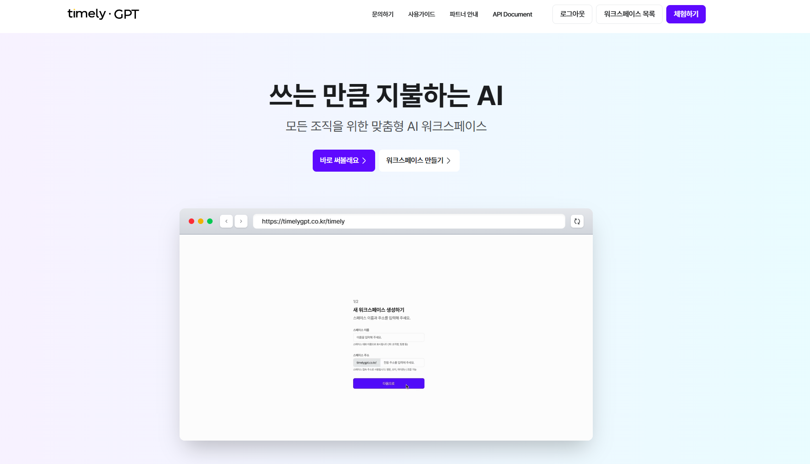

**3. 스페이스 정보 입력**
{ .overview-step }

**[스페이스 이름]**과 스페이스 전용 주소를 입력해요.

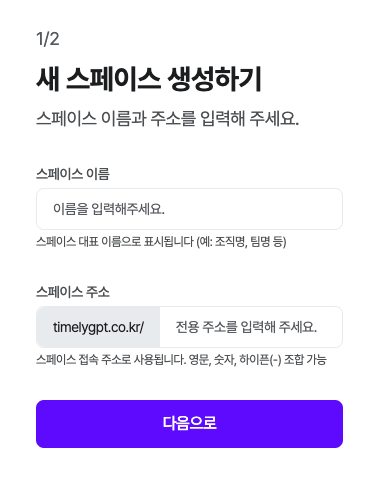

**4. 기본 템플릿 선택**
{ .overview-step }

사용 목적에 맞는 기본 스페이스 템플릿을 선택해요. 원하는 템플릿이 없다면 **[템플릿 없이 생성하기]**를 선택해요.

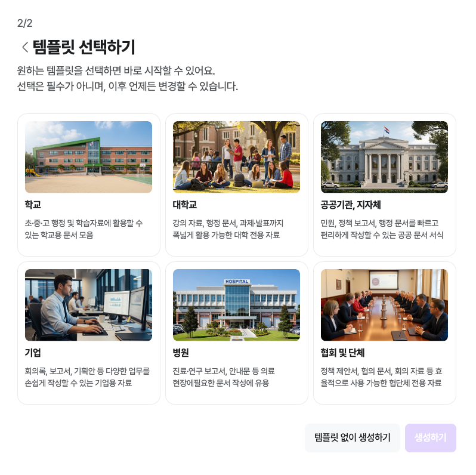

**5. 생성된 스페이스 확인**
{ .overview-step }

생성이 완료된 스페이스에서 관리자로 이용을 시작해요.

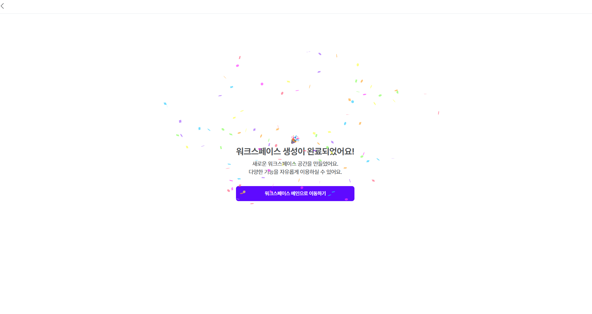

