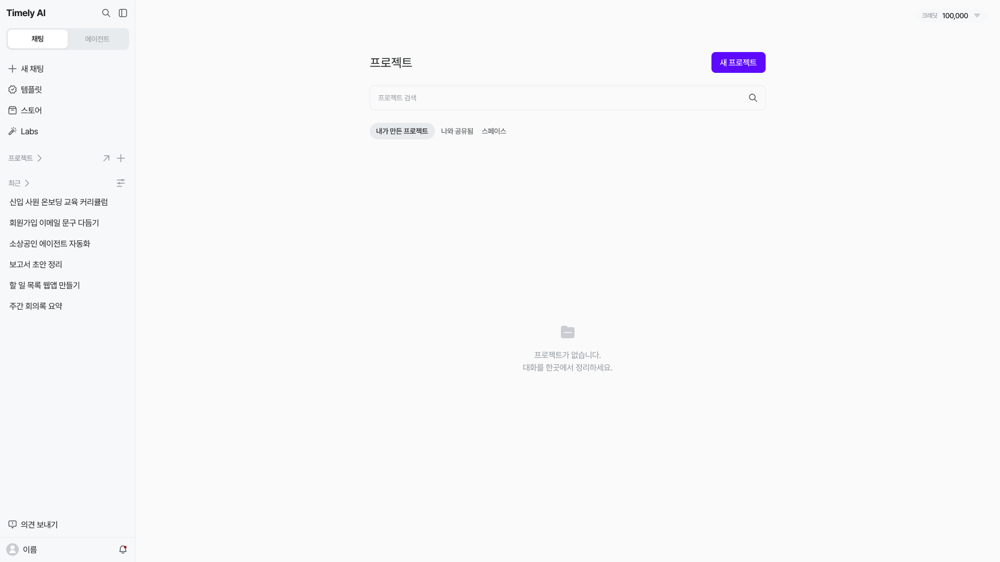
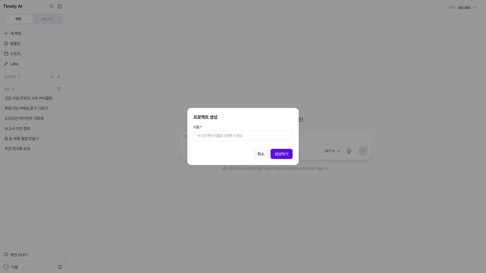
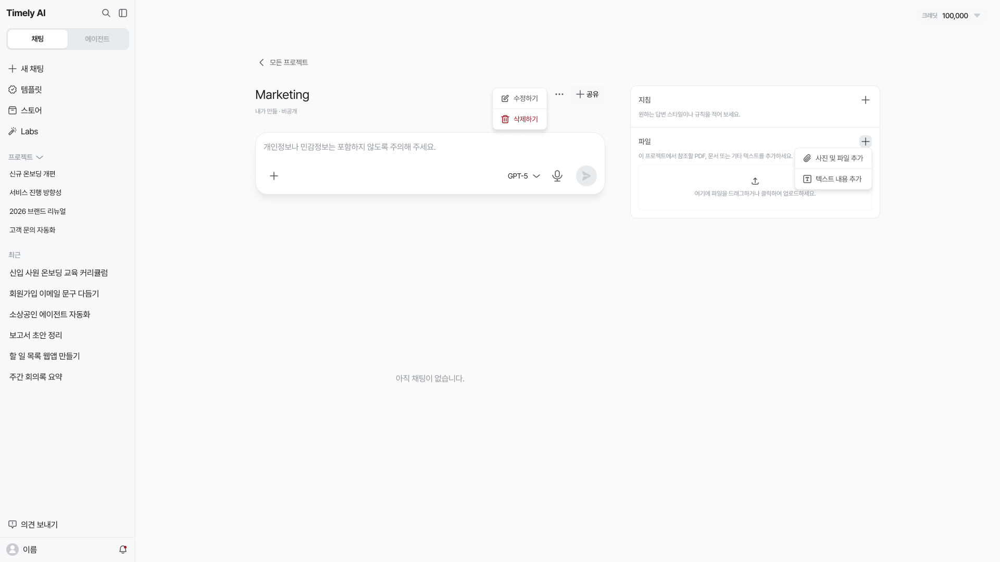
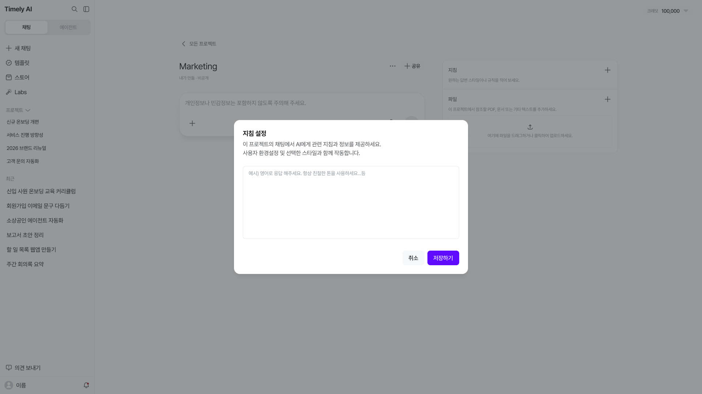
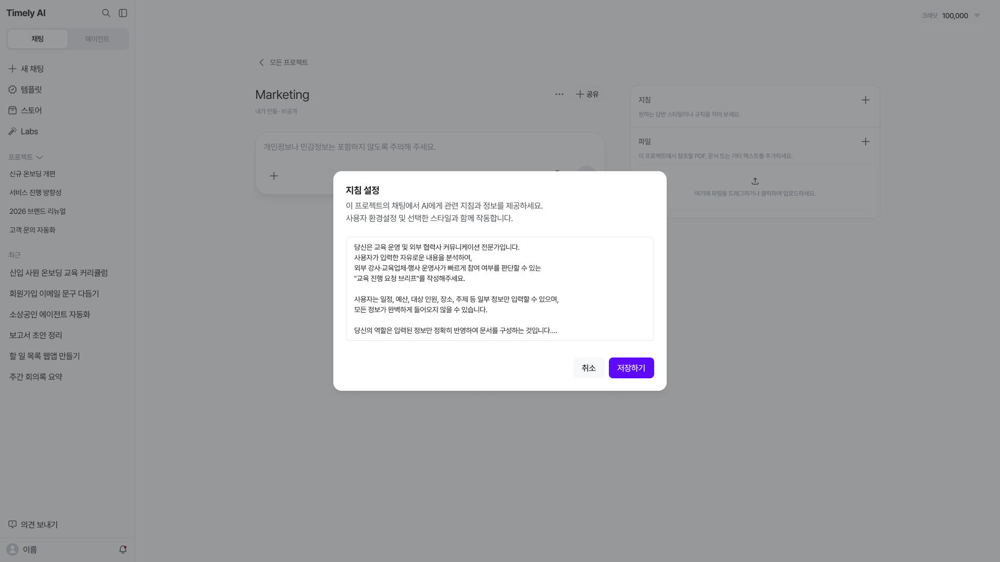
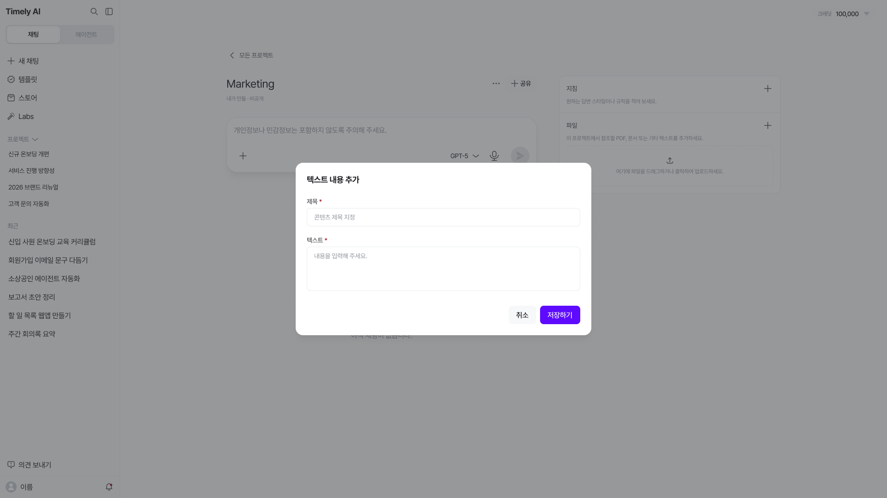
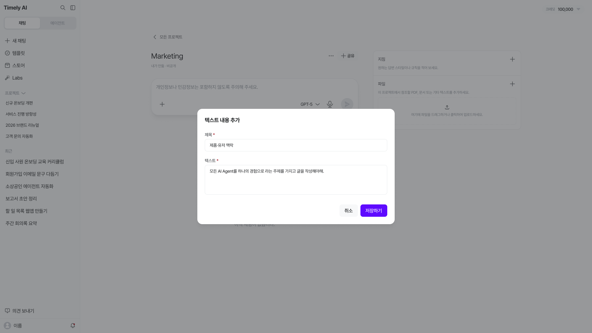
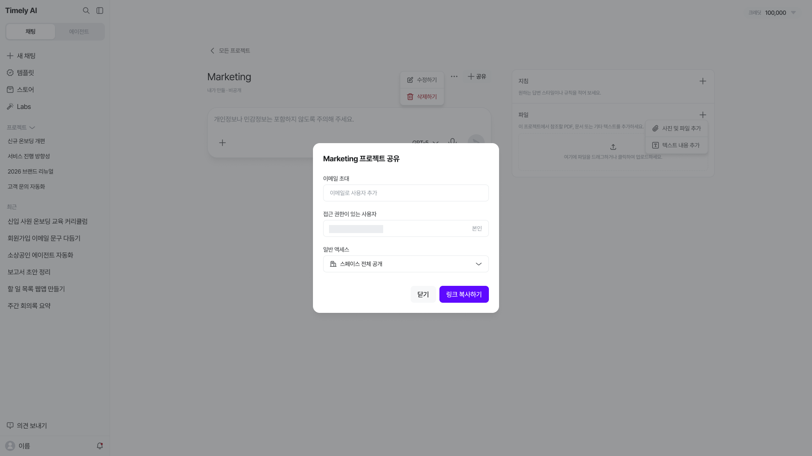

# 프로젝트 {#_1}

프로젝트는 **특정 주제의 자료·대화·지침을 한곳에서 관리하는 기능**이에요. 업무·과제·보고서별로 공용 문서, 회의록, 업무 자료를 모아두면 AI가 그 자료를 참고해 답변하고, 같은 맥락에서 작업을 이어갈 수 있어요.

## 프로젝트 목록 {#_2}

왼쪽 사이드바 **[프로젝트] 행 오른쪽의 [↗]**를 누르면 프로젝트 목록 화면이 열려요. 같은 행의 **[+]**는 새 프로젝트를 만드는 버튼이에요.

| 탭 | 확인할 프로젝트 |
| --- | --- |
| **내가 만든 프로젝트** | 내가 생성한 프로젝트 |
| **나와 공유됨** | 다른 사용자가 나에게 공유한 프로젝트 |
| **스페이스** | 스페이스의 프로젝트 |

원하는 탭을 선택하고, **[프로젝트 검색]**에 이름을 입력해 프로젝트를 찾을 수 있어요. 목록에서 프로젝트 하나를 선택하면 상세 화면으로 이동해요.

프로젝트가 없는 경우에는 **“프로젝트가 없습니다. 대화를 한곳에서 정리하세요.”**라는 안내가 표시돼요.

## 프로젝트 만들기 {#create-project}

1. 왼쪽 사이드바 **[프로젝트] 행의 [+]**를 눌러요. 목록 화면 우측 상단의 **[새 프로젝트]**로도 시작할 수 있어요.
2. **[프로젝트 생성]** 창의 **[이름]**에 프로젝트 이름을 입력해요.
3. **[생성하기]**를 눌러 프로젝트를 만들어요.

사이드바 위쪽의 **[+ 새 채팅]**과 프로젝트 행의 **[+]**는 다른 버튼이에요.

## 프로젝트 작업 {#project-detail}

프로젝트 하나를 선택하면 **채팅 입력창, 프로젝트 대화 목록, 지침, 파일**을 한 화면에서 확인할 수 있어요.

- **가운데:** 프로젝트에서 질문하는 입력창과 해당 프로젝트의 대화 목록
- **오른쪽 [지침]:** 답변 스타일과 공통 규칙 설정
- **오른쪽 [파일]:** 답변에 참고할 파일이나 텍스트 등록

### 프로젝트 대화 {#project-conversations}

가운데 입력창에 질문을 입력해 프로젝트 안에서 대화를 시작해요. 이전 대화는 **프로젝트의 대화 목록**에서 확인할 수 있어요. 아직 대화가 없으면 **“아직 채팅이 없습니다.”**가 표시돼요.

왼쪽 사이드바의 **[최근]** 목록과 프로젝트 안의 대화 목록은 구분해서 확인해 주세요.

**이미지 추가 예정 · 캡처 1 — 프로젝트 대화 목록과 이어가기**

**추가할 화면:** 프로젝트 안에서 예시 대화를 만든 뒤 대화 목록에 제목이 표시된 화면과, 해당 대화를 선택해 다시 연 화면. 현재 제공된 상세 화면은 ‘아직 채팅이 없습니다’ 상태이므로 목록이 채워진 화면을 추가해 주세요.

### 지침 설정 {#project-instructions}

지침에는 AI의 역할, 답변 방식, 준수사항을 적어요. 설정한 지침은 해당 프로젝트 안의 대화에 공통으로 적용돼요.

1. **[지침]** 옆 **[+]** 를 눌러 **[지침 설정]** 창을 여세요.
2. 원하는 답변 스타일이나 규칙을 적으세요. 예를 들어 “영어로 응답해 주세요”, “항상 친절한 톤을 사용해 주세요”처럼 입력할 수 있어요.
3. **[저장하기]** 를 눌러 반영하세요.

지침은 **이 프로젝트의 채팅**에 적용되며, 사용자 환경설정 및 선택한 스타일과 함께 작동해요. 아래는 내용을 입력한 예시이며, 작성 후 **[저장하기]**를 눌러야 해요.

### 참고 자료 추가 {#project-reference}

오른쪽 **[파일] 옆 [+]**를 누르면 **[사진 및 파일 추가]**, **[텍스트 내용 추가]** 메뉴가 열려요.

#### 파일 업로드 {#project-files}

**[파일] 옆 [+] → [사진 및 파일 추가]**에서 참고할 파일을 선택해요. 점선 업로드 영역으로 파일을 드래그하거나, 해당 영역을 클릭해서 업로드할 수도 있어요.

**이미지 추가 예정 · 캡처 2 — 참고 파일 등록 결과**

**추가할 화면:** 예시 파일을 올린 뒤의 프로젝트 화면. 오른쪽 [파일] 영역에 등록된 파일명과 업로드 결과가 함께 보이도록 캡처해 주세요. 개인정보가 없는 자료를 사용해 주세요.

#### 텍스트 추가 {#project-text}

1. 오른쪽 **[파일] 옆 [+] → [텍스트 내용 추가]**를 선택해요.
2. 열린 창에서 **[제목]**과 참고할 **[텍스트]**를 입력해요.
3. **[저장하기]**를 눌러 등록해요.

제목과 텍스트는 모두 필수 입력 항목이에요.

내용을 입력한 뒤 **[저장하기]**를 눌러요. 아래는 저장 전 입력 상태의 예시예요.

## 프로젝트 공유 {#share-project}

1. 프로젝트 화면 우측 상단의 **[공유]** 를 누르세요.
2. 특정 사람을 초대하려면 **[이메일 초대]** 에서 이메일로 사용자를 추가하세요.
3. **[일반 액세스]** 에서 **[스페이스 전체 공개]** 또는 **[초대받은 사람만]** 을 선택해 접근 범위를 정하세요.
4. 링크로 전달하려면 **[링크 복사하기]** 를 누르세요. 전달하기 전에 접근 범위와 공유할 자료를 확인하세요.

공유 창의 **[접근 권한이 있는 사용자]**에서 현재 표시된 사용자를 확인할 수 있어요. 일반 액세스의 설정값을 확인하고 필요한 범위로 공유해 주세요.

