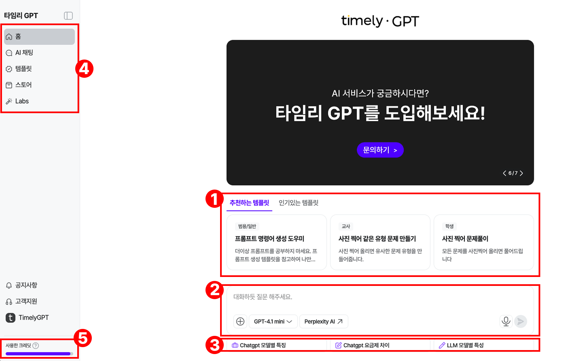
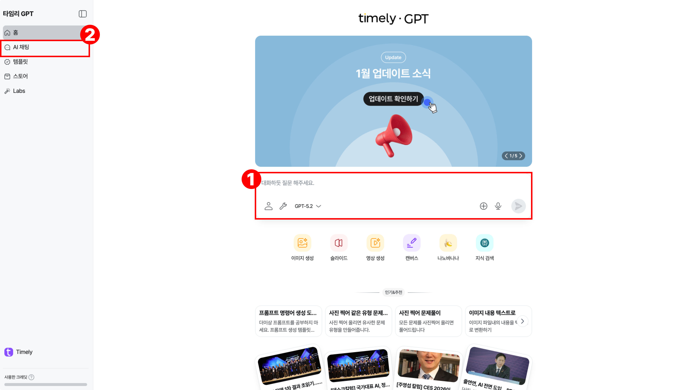
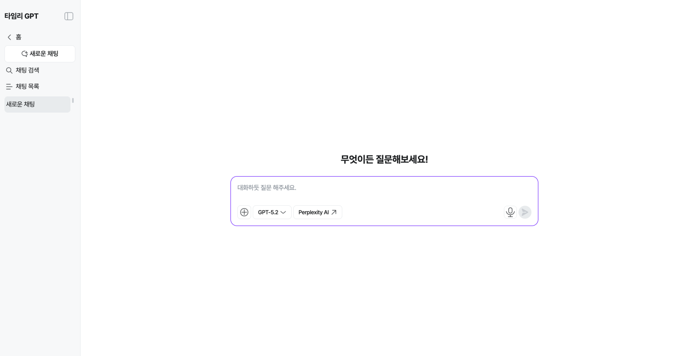
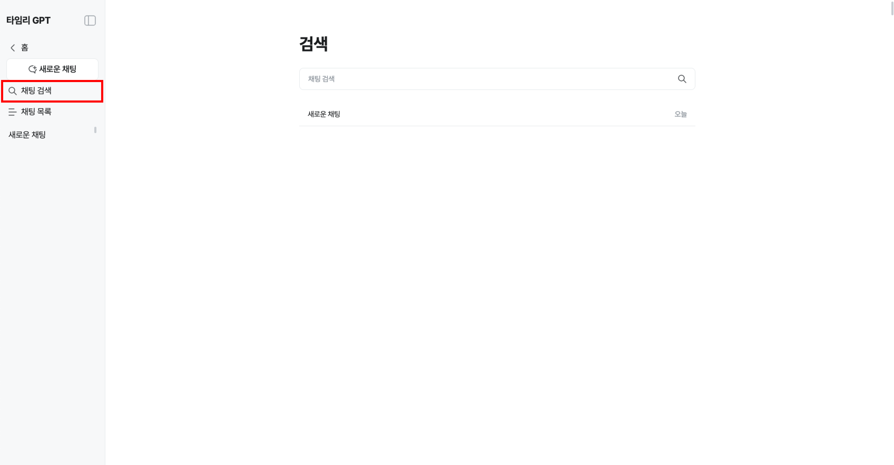
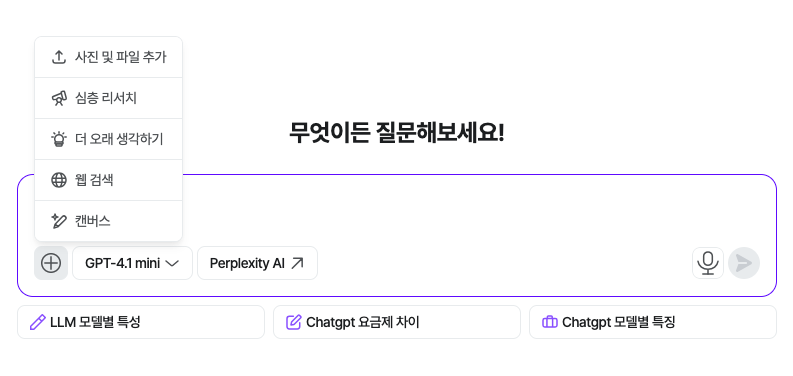
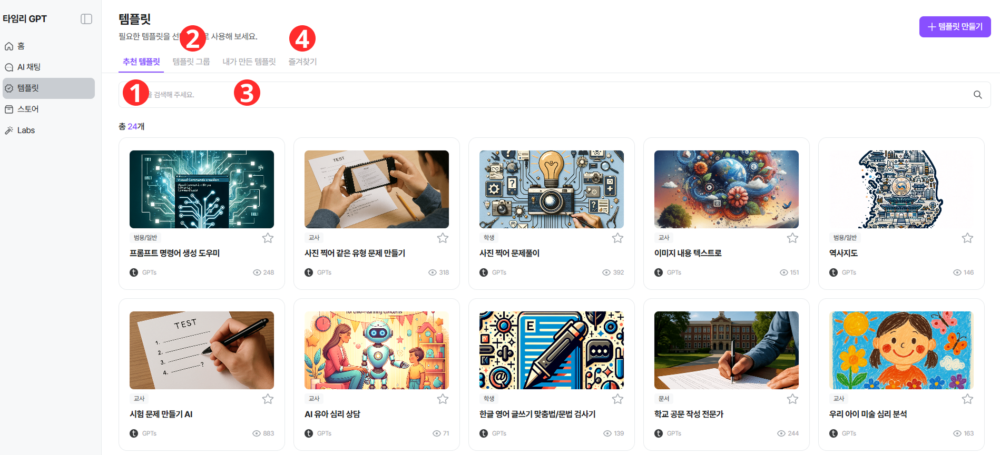
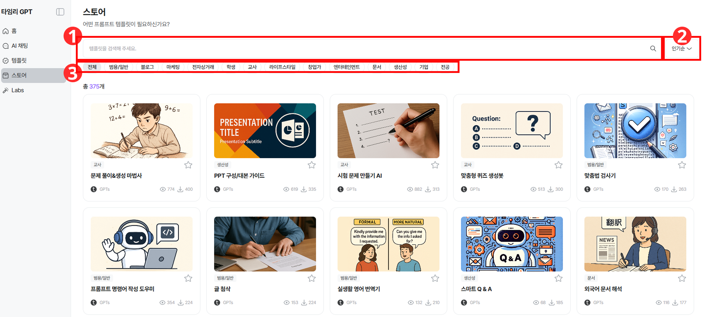

# 서비스 활용하기

!!! note "목차"

    메인

    AI 채팅

    템플릿

    스토어

## **■ 메인**

1. 추천/인기 템플릿을 볼 수 있어요
2. AI chat을 바로 사용 가능해요
3. 질문을 어떻게 할 지 모르겠다면, 예시 질문의 도움을 받아요
4. 각종 기능들이 모여있어요
5. 마우스를 올리면, 사용한 크레딧(총 보유, 사용량, 남은량)을 볼 수 있어요

## **■ AI 채팅(AI Chat)**

1. 질문하고 싶은 내용을 바로 입력해요
2. 큰 화면으로 보고 싶거나 기존 채팅 목록을 보려면 클릭해주세요.

2를 눌렀을때 화면 예시

- [채팅 검색] 을 통해 기존의 채팅내역에서 원하는 내용을 찾아 확인할 수 있어요.

!!! note "***LLM 모델**  각 채팅별 변경도 가능, 질문마다 변경도 가능해요!*"

    &nbsp;

## **■ AI 채팅(AI Chat)-RAG 기능**

- PNG, JPG, WORD, PDF, HWP 등 답변에 참고 할 수 있는 파일을 업로드해 질문이 가능해요.
- OCR(이미지의 텍스트 추출)이 필요한 PDF 등의 경우에는 50MB, 100p 이하의 파일만 업로드 할 수 있어요.

## **■** 템플릿

!!! note
    ***템플릿*** 이란? 타임리가 제공하는 AI 도구입니다. 주어진 빈 칸이나 목록에 원하는 [프롬프트]를 입력하면 더 편리하게 결과를 얻을 수 있어요!

    ✅ AI와 친하지 않다면, ***만들어져있는 템플릿*** 이용해 효율적으로 사용

    ✅ AI와 친숙한데 특정 프롬프트를 자주 사용한다면, ***직접 템플릿을 만들어*** 시간 단축 가능

1. 관리자가 설정한 추천 템플릿을 볼 수 있어요
2. 그룹별 추천 템플릿을 볼 수 있어요
3. 내가 복제하거나/직접 제작한 템플릿을 볼 수 있어요
4. 내가 즐겨찾기 해 둔 템플릿을 볼 수 있어요

!!! note
    ***AI 채팅에서 나눈 대화, 내가 사용한/만든 템플릿은 관리자도 볼 수 없어요***

## **■** 스토어

1. 원하는 템플릿이 있는 지 검색해보세요
2. 최신/인기/조회순으로 정렬이 되요
3. 어떤 템플릿이 있는 지 모를 땐, 카테고리를 클릭해보세요!

## Q. 크레딧을 다 썼어요!

A. 관리자가 월 요금제 제한량을 변경해 줄 수 있어요. 관리자에게 요청해주세요! 

!!! note
    이전으로

    시작하기

!!! note
    다음으로

    템플릿 더 알아보기
