# 서비스 활용하기

!!! note "목차"

    메인

    AI 채팅

    프로젝트

    템플릿

    스토어

## **■ 메인**

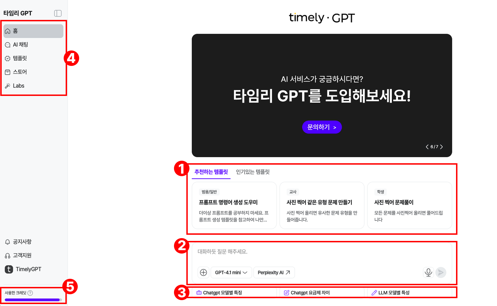

1. 추천/인기 템플릿을 볼 수 있어요
2. AI chat을 바로 사용 가능해요
3. 질문을 어떻게 할 지 모르겠다면, 예시 질문의 도움을 받아요
4. 각종 기능들이 모여있어요
5. 마우스를 올리면, 사용한 크레딧(총 보유, 사용량, 남은량)을 볼 수 있어요

## **■ AI 채팅(AI Chat)**

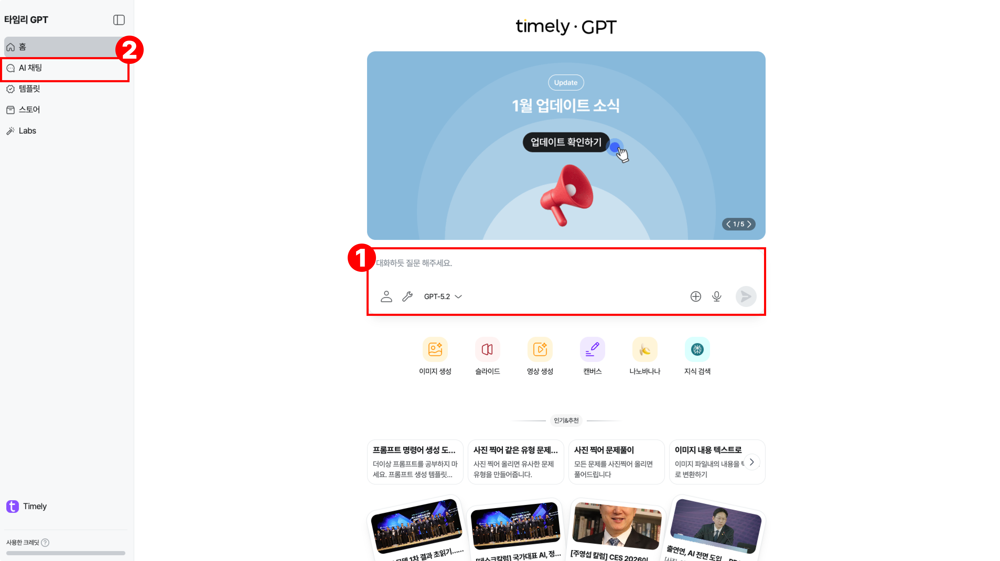

1. 질문하고 싶은 내용을 바로 입력해요
2. 큰 화면으로 보고 싶거나 기존 채팅 목록을 보려면 클릭해주세요.

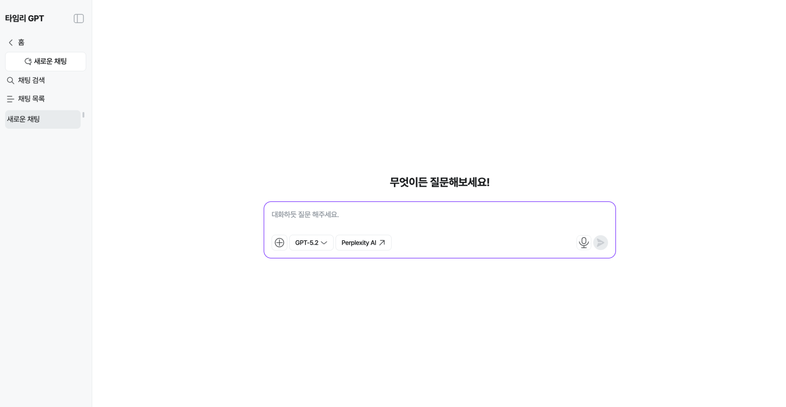

2를 눌렀을때 화면 예시

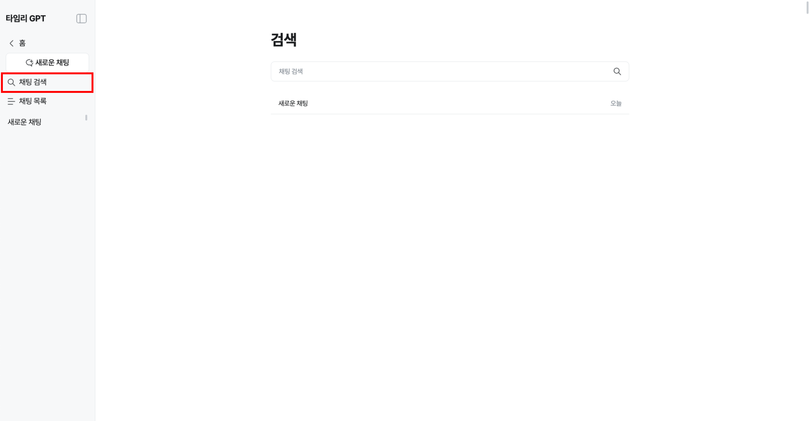

- [채팅 검색] 을 통해 기존의 채팅내역에서 원하는 내용을 찾아 확인할 수 있어요.

> 📌 *****LLM 모델**  각 채팅별 변경도 가능, 질문마다 변경도 가능해요!***
## **■ AI 채팅(AI Chat)-RAG 기능**

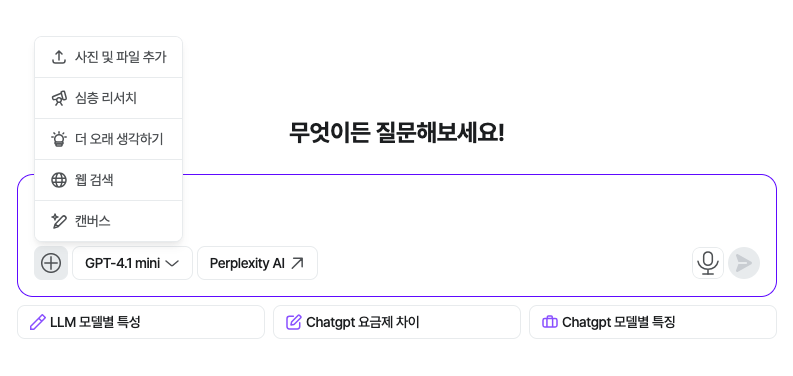

- PNG, JPG, WORD, PDF, HWP 등 답변에 참고 할 수 있는 파일을 업로드해 질문이 가능해요.
- OCR(이미지의 텍스트 추출)이 필요한 PDF 등의 경우에는 50MB, 100p 이하의 파일만 업로드 할 수 있어요.

## **■ 프로젝트**

!!! note
    ***프로젝트*** 란? **업무·과제·보고서 등 특정 주제의 자료와 대화를 한 곳에서 관리하는 기능**이에요.
    팀에서 쓰는 공용 문서·회의록·업무 자료를 프로젝트에 모아두면, AI가 그 자료를 바탕으로 답변을 생성해요.

    💡 프로젝트 안에서는 대화·문서·지침이 한곳에 모여 있어, **AI 작업을 연속적으로** 이어갈 수 있어요.

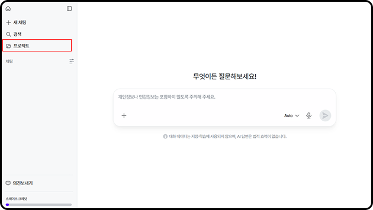

- AI 채팅 화면에서 왼쪽 사이드바의 **[프로젝트]** 를 선택하면 이용할 수 있어요.

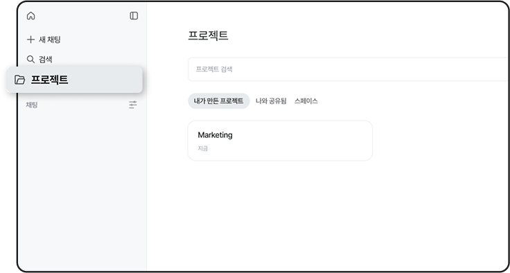

1. **[내가 만든 프로젝트]**, **[나와 공유됨]**, **[스페이스]** 탭으로 프로젝트 목록을 볼 수 있어요.
2. 상단 검색창에서 프로젝트 이름을 검색할 수 있어요.

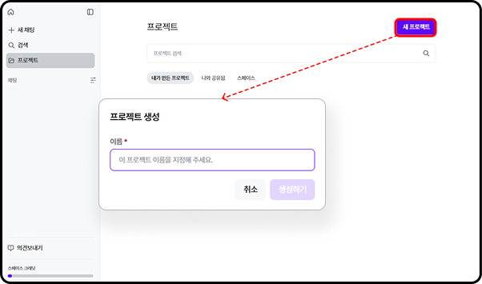

- 우측 상단의 **[새 프로젝트]** 를 클릭하면 **[프로젝트 생성]** 창이 열려요.
- 프로젝트 이름을 입력하고 **[생성하기]** 를 누르면 새 작업 공간이 만들어져요.

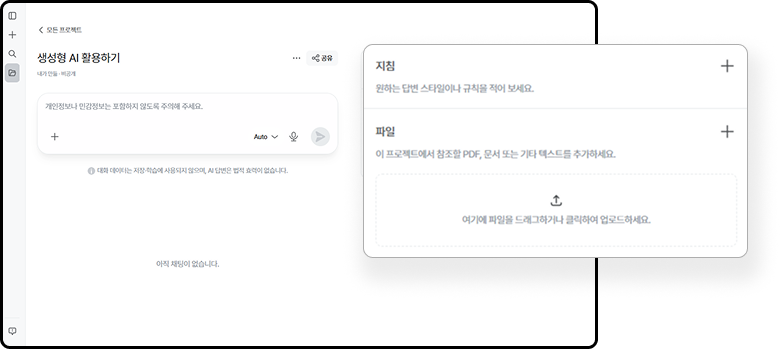

- 프로젝트에 들어가면 왼쪽엔 채팅 영역, 오른쪽엔 **[지침]** 과 **[파일]** 등록 영역이 있어요.
- **[지침]** — AI의 역할, 답변 방식, 준수사항 등을 설정 (프로젝트 내 대화에 공통 적용)
- **[파일]** — 참조할 PDF, 문서, 기타 텍스트를 드래그하거나 클릭해서 업로드

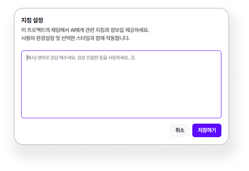

- **[지침]** 옆 **[+]** 를 눌러 **[지침 설정]** 창을 열어 보세요.
- 원하는 답변 스타일이나 규칙(예: *영어로 응답해 주세요*, *항상 친절한 톤을 사용해 주세요*)을 자유롭게 적고 **[저장하기]** 를 누르면 반영돼요.

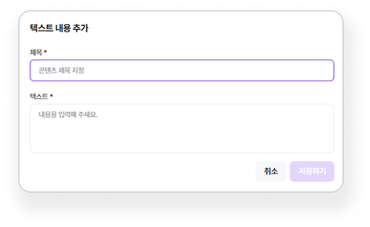

- 파일 대신 **텍스트로 참고 정보를 등록**하고 싶다면 **[텍스트 내용 추가]** 창에서 제목과 본문을 직접 입력해 저장할 수 있어요.

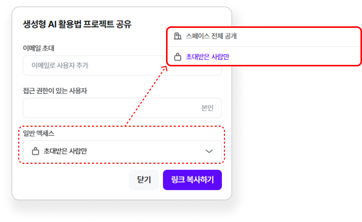

- 만들어진 프로젝트는 **이메일 초대** 또는 **링크 복사**로 공유할 수 있어요.
- **[일반 액세스]** 에서 **[스페이스 전체 공개]** 또는 **[초대받은 사람만]** 중 선택하여 접근 범위를 지정할 수 있어요.

## **■** 템플릿

!!! note
    ***템플릿*** 이란? 타임리가 제공하는 AI 도구입니다. 주어진 빈 칸이나 목록에 원하는 [프롬프트]를 입력하면 더 편리하게 결과를 얻을 수 있어요!

    ✅ AI와 친하지 않다면, ***만들어져있는 템플릿*** 이용해 효율적으로 사용

    ✅ AI와 친숙한데 특정 프롬프트를 자주 사용한다면, ***직접 템플릿을 만들어*** 시간 단축 가능

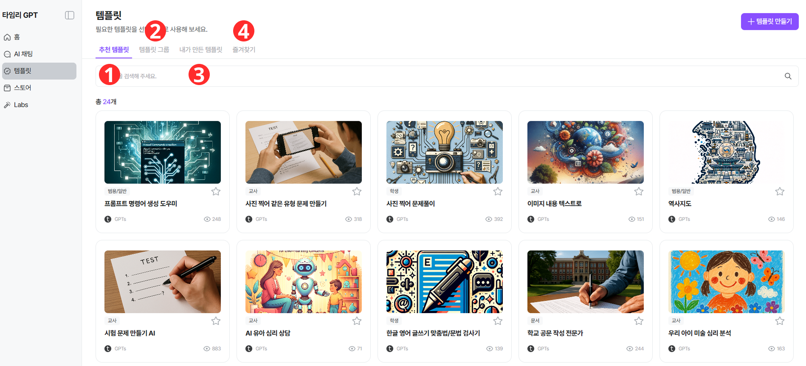

1. 관리자가 설정한 추천 템플릿을 볼 수 있어요
2. 그룹별 추천 템플릿을 볼 수 있어요
3. 내가 복제하거나/직접 제작한 템플릿을 볼 수 있어요
4. 내가 즐겨찾기 해 둔 템플릿을 볼 수 있어요

!!! note
    ***AI 채팅에서 나눈 대화, 내가 사용한/만든 템플릿은 관리자도 볼 수 없어요***

## **■** 스토어

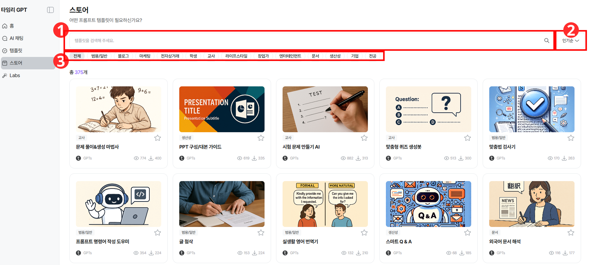

1. 원하는 템플릿이 있는 지 검색해보세요
2. 최신/인기/조회순으로 정렬이 되요
3. 어떤 템플릿이 있는 지 모를 땐, 카테고리를 클릭해보세요!

## Q. 크레딧을 다 썼어요!

A. 관리자가 월 요금제 제한량을 변경해 줄 수 있어요. 관리자에게 요청해주세요! 

!!! note
    이전으로

    시작하기

!!! note
    다음으로

    템플릿 더 알아보기
