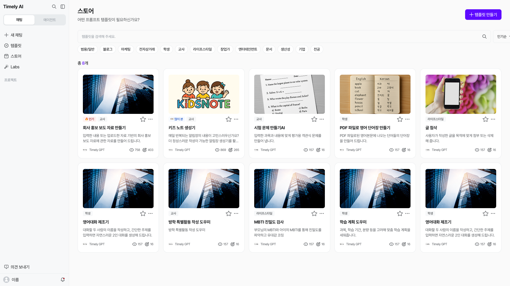

# 스토어 {#_1}

스토어에서는 필요한 템플릿을 검색하거나 카테고리별로 찾아볼 수 있어요. 왼쪽 사이드바의 **[스토어]**에서 열어요.

## 템플릿 검색 {#_2}

1. 상단 검색창에 찾고 싶은 템플릿 이름이나 검색어를 입력해요.
2. 카테고리에서 **블로그·마케팅·학생·교사·문서·생산성** 등 필요한 분야를 선택해요.
3. 템플릿의 제목과 설명을 살펴보고 사용할 항목을 선택해요.

## 목록 정렬 {#sort-templates}

정렬 메뉴에서 **인기순·최신순·조회순** 중 원하는 기준을 선택해 템플릿을 찾아요.

| 정렬 | 이용할 때 |
| --- | --- |
| **인기순** | 인기 있는 템플릿부터 살펴볼 때 |
| **최신순** | 새로 올라온 템플릿부터 확인할 때 |
| **조회순** | 많이 조회된 템플릿부터 살펴볼 때 |

## 템플릿 이용 {#store-use}

원하는 템플릿을 열면 템플릿 사용 화면에서 필요한 항목을 입력하고 **[결과 생성하기]**를 누를 수 있어요.

- **[복제]:** 원본을 바탕으로 수정할 템플릿을 만들어요.
- **[지정]:** 그룹을 선택해 템플릿을 함께 사용해요.
- **[채팅]:** 생성한 결과에 관해 대화를 이어가요.

사용·복제·그룹 지정의 자세한 화면은 왼쪽 **템플릿/챗봇** 안내에서 확인할 수 있어요.

## 템플릿 만들기 {#store-create}

스토어 오른쪽 위의 **[+ 템플릿 만들기]**를 누르면 새 항목 만들기를 시작할 수 있어요. 유형 선택 후 주제와 프롬프트를 구성하는 방법은 **템플릿/챗봇** 안내를 참고해 주세요.

직접 만들거나 수정한 템플릿은 기본적으로 나만 볼 수 있어요. 다른 사용자와 함께 사용하려면 **[지정]**으로 그룹에 공유해요.

