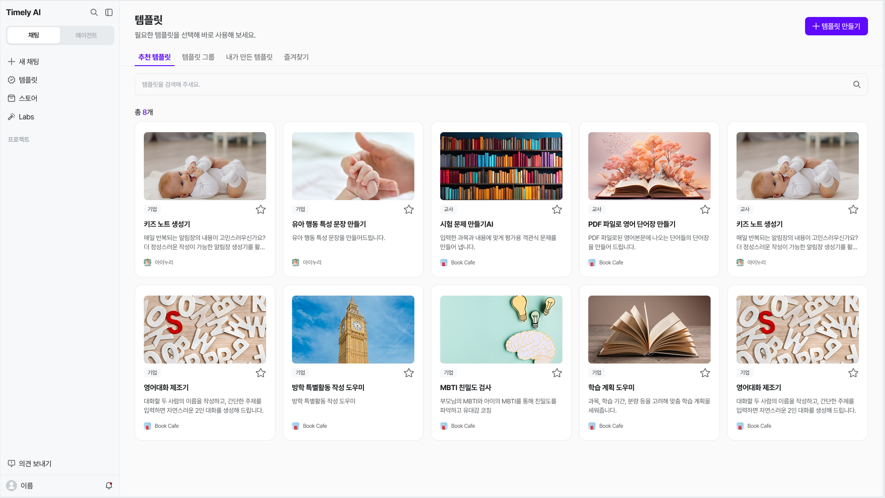
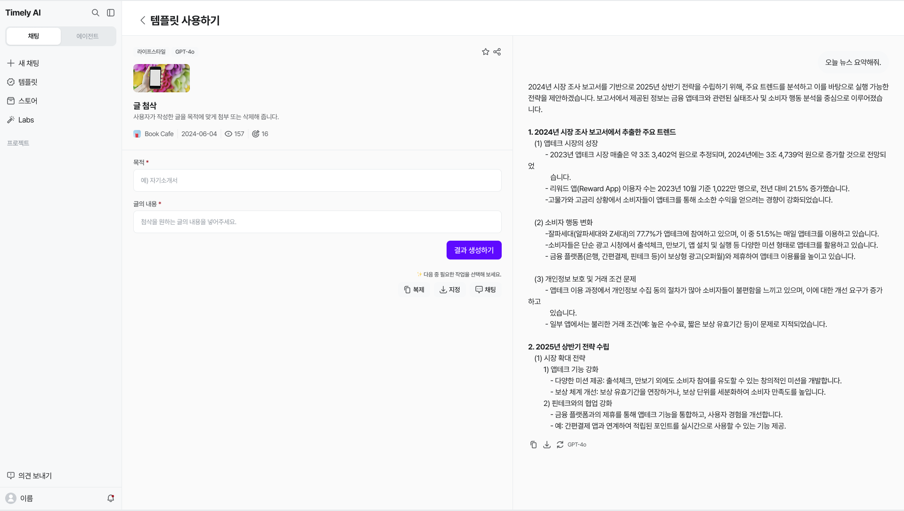
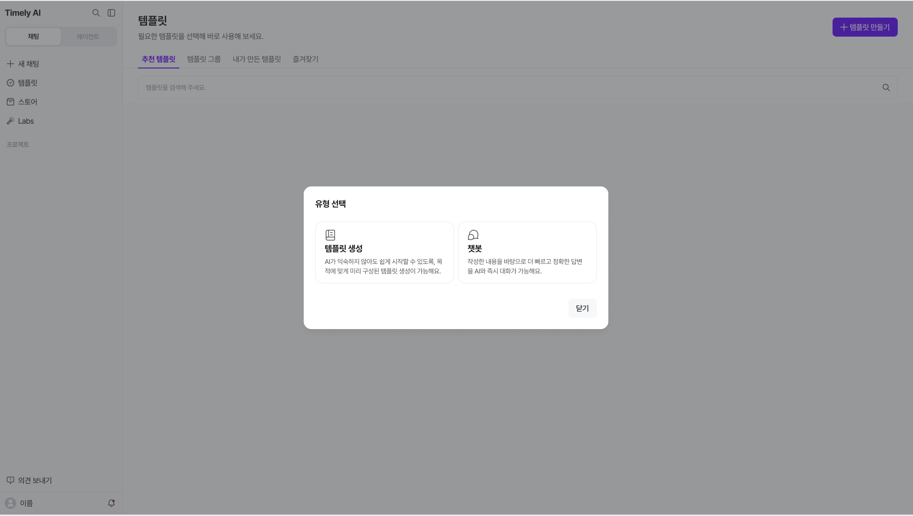
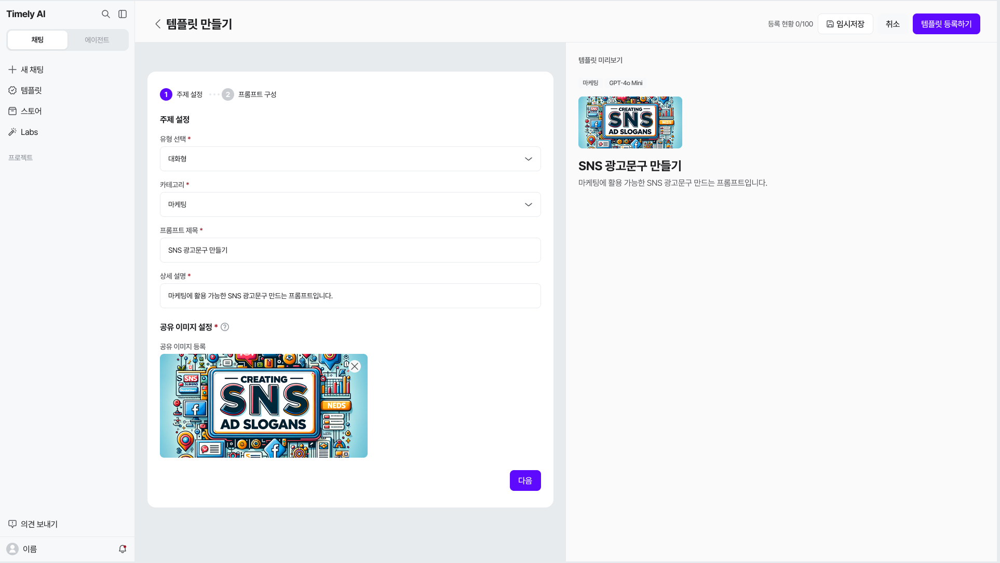
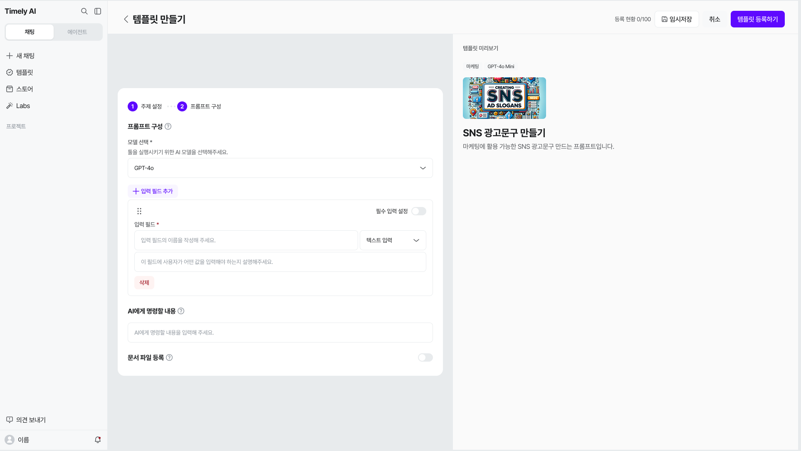
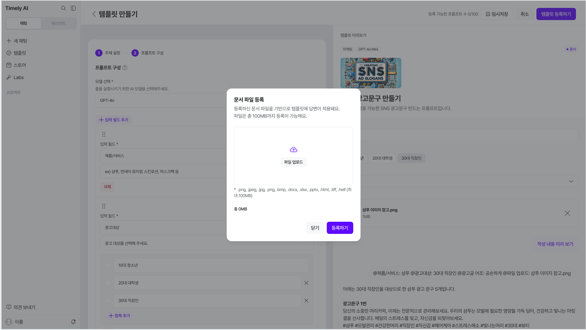
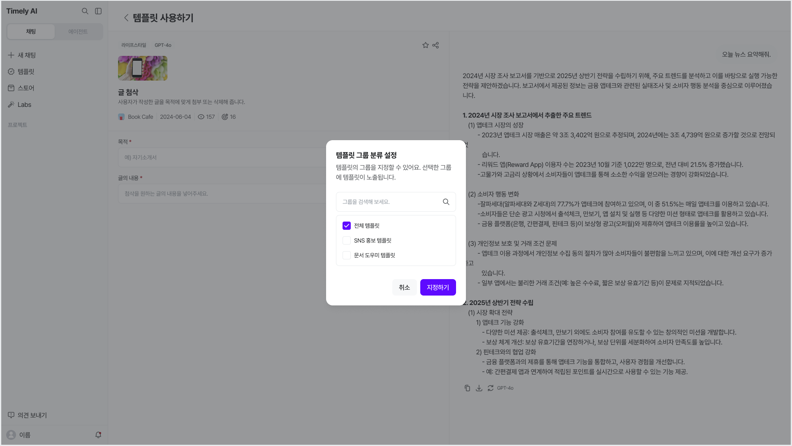
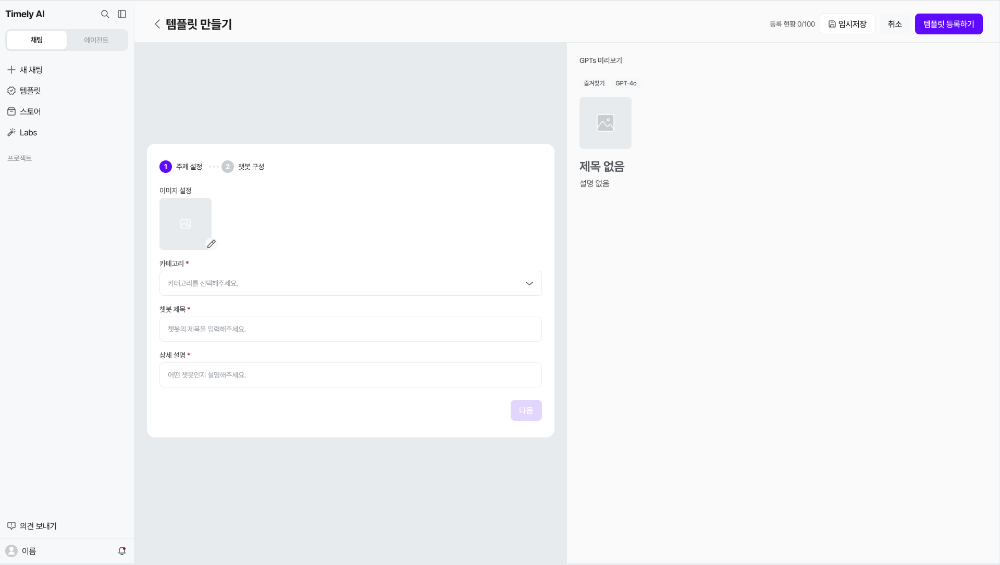
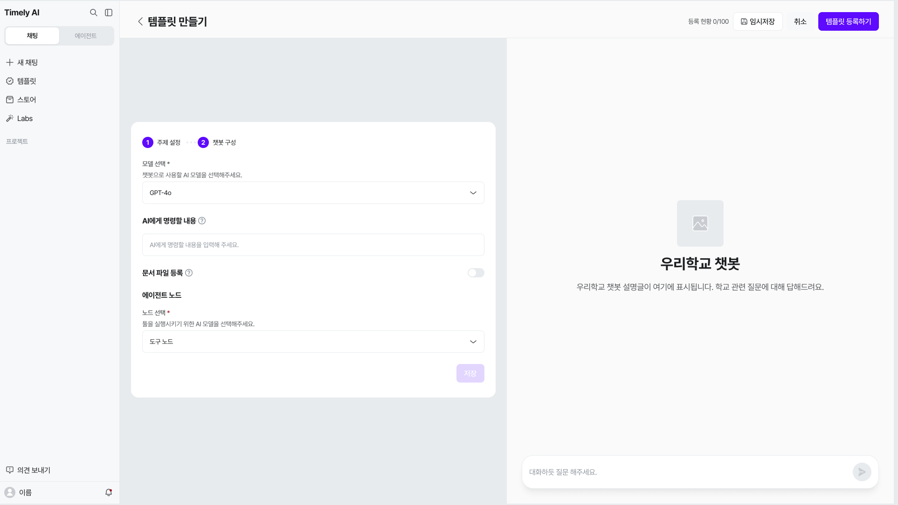
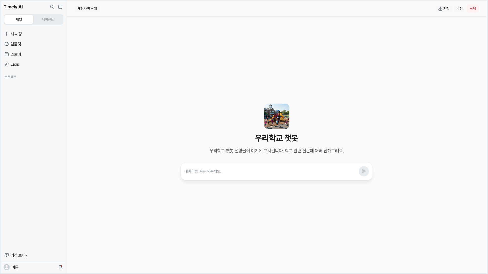

# 템플릿/챗봇 {#_1}

**템플릿**은 입력 양식을 채워 결과를 생성하는 도구이고, **챗봇**은 설정한 지침을 바탕으로 대화하는 도구예요.

## 템플릿 사용 {#_2}

왼쪽 **[템플릿]**에서 원하는 항목을 찾아 열어요. 목록에서는 템플릿과 챗봇을 구분해 확인할 수 있어요.

| 탭 | 확인할 내용 |
| --- | --- |
| **추천 템플릿** | 추천된 템플릿 |
| **템플릿 그룹** | 그룹별로 분류된 템플릿 |
| **내가 만든 템플릿** | 직접 만들거나 복제한 템플릿 |
| **즐겨찾기** | 즐겨찾기로 등록한 템플릿 |

검색창에 이름이나 검색어를 입력해 찾을 수도 있어요. 아직 항목이 없으면 해당 탭에 빈 목록 안내가 표시돼요.

### 결과 생성 {#template-result}

1. 사용할 템플릿을 선택해요. 스토어의 템플릿 카드에서도 사용 화면을 열 수 있어요.
2. 별표가 표시된 필수 입력란을 채워요. 입력 항목은 템플릿마다 달라요.
3. **[결과 생성하기]**를 누르고 결과를 확인해요. 다시 생성하면 답변이 달라질 수 있어요.

아래 화면은 입력란, 결과 영역, 후속 작업 버튼의 위치를 보여주는 예시예요.

- **[복제]:** 원본을 바탕으로 별도의 템플릿을 만들어 수정할 때 사용해요.
- **[지정]:** 함께 사용할 그룹을 선택해 템플릿을 공유해요.
- **[채팅]:** 결과에 관해 대화를 이어갈 때 사용해요.
- **즐겨찾기:** 상단의 즐겨찾기 버튼으로 등록 상태를 관리해요. 등록된 화면에는 **[즐겨찾기 해제하기]**가 표시돼요.

**이미지 추가 예정 — 같은 입력의 생성 결과와 채팅 연결**

**추가할 화면:** 동일한 템플릿의 입력값과 그에 맞는 결과, [채팅]을 누른 뒤의 대화 화면. 제공된 시안은 입력 양식과 예시 답변의 주제가 달라 조작 위치 참고용으로 사용했어요. 실제 전달되는 내용과 [최근]에 표시되는 대화도 확인해 주세요.

### 문서 처리 {#template-document-status}

문서를 사용하는 템플릿에서는 변환·분석 상태를 확인해 주세요. **진행중·실패·완료** 표시와 안내 문구를 구분해서 확인해요.

**문서 분석 완료는 템플릿 결과 생성 완료와 달라요.** “문서 분석이 완료되었습니다” 안내가 나오면 필요한 입력란을 채운 뒤 **[결과 생성하기]**를 눌러요.

## 복제·수정 {#_3}

1. 템플릿 사용 화면에서 **[복제]**를 선택하고 복제를 진행해요.
2. 복제본은 **[내가 만든 템플릿]**에서 찾아요.
3. 카드의 **더보기(…) → [수정하기]**로 편집 화면을 열어요.
4. 모델·입력 필드·AI 지침을 수정하고 **[작성 내용 미리 보기]**로 결과를 확인해요.
5. 수정 내용을 저장해요. 원본이 아닌 복제본에 반영돼요.

더보기 메뉴의 **[삭제하기]**는 수정과 다른 작업이므로 선택할 항목을 확인해 주세요.

**이미지 추가 예정 — 복제부터 수정 반영까지**

**추가할 화면:** [복제]를 누른 뒤의 확인 창과 내가 만든 템플릿 목록, 카드 더보기의 [수정하기], 수정 반영 버튼 및 완료 화면을 순서대로 캡처해 주세요. 시안의 편집 화면만으로 복제·수정 완료 상태를 확인할 수 없어 보완이 필요해요.

## 템플릿 만들기 {#_4}

화면 상단의 **[+ 템플릿 만들기]**를 누르고, **[유형 선택]**에서 **[템플릿 생성]**을 선택해요. 챗봇을 만들려면 같은 창에서 **[챗봇]**을 선택해요.

### 주제 설정 {#template-topic}

1. **[카테고리]**, **[프롬프트 제목]**, **[상세 설명]**을 입력해요.
2. **[공유 이미지 설정]**에서 이미지를 등록해요. 링크를 공유할 때 미리보기로 표시되는 이미지예요.
3. **[다음]**을 눌러 프롬프트 구성으로 이동해요.

### 프롬프트 구성 {#template-config}

1. **[모델 선택]**에서 사용할 모델을 정해요.
2. **[입력 필드 추가]**로 사용자가 채울 양식을 구성해요. 텍스트 입력, 다중 선택, 드롭다운, 파일 업로드 등 필요한 유형을 선택하고 필수 여부를 설정해요.
3. **[AI에게 명령할 내용]**에 역할과 답변 조건을 작성해요. 입력 필드를 참조해 요청 내용을 구성할 수 있어요.
4. 필요하면 **[이미지 생성]**, **[문서 파일 등록]**을 설정해요.
5. 오른쪽 **[템플릿 미리보기]**에서 입력 양식을 살펴보고 **[작성 내용 미리 보기]**로 확인해요.

**입력 필드**는 사용자가 주제·대상 등을 적는 칸이고, **AI에게 명령할 내용**은 그 정보를 활용해 어떤 결과를 만들지 설명하는 지침이에요.

### 참고 문서 {#template-files}

**[문서 파일 등록]**을 켜고 **[파일 등록]**을 선택해요. 등록 창에서 **[파일 업로드]**로 자료를 선택하고 목록과 총 용량을 확인한 뒤 **[등록하기]**를 눌러요.

개인정보나 민감정보를 제거한 문서만 등록해 주세요.

**확인 예정 — 문서 등록 조건**

**확인할 내용:** 제공된 시안에는 ‘총 100MB’와 ‘총 100MB(PDF)’ 안내가 혼재하고 파일 형식 표기도 서로 맞지 않아요. 실제 문서 등록 창의 허용 형식과 총 용량 안내를 확인해 주세요. 화면에 표시된 예시 파일 용량을 업로드 한도로 안내하지 않아요.

### 등록 {#template-register}

작성을 이어가려면 **[임시저장]**, 등록하려면 **[템플릿 등록하기]**를 이용해요. 등록 후에는 **[내가 만든 템플릿]**에서 항목을 확인해요.

**이미지 추가 예정 — 등록 완료**

**추가할 화면:** 미리보기 결과와 [템플릿 등록하기]를 누른 뒤의 완료 안내, 목록에서 등록한 항목을 다시 연 화면. 등록 가능 개수는 화면에 표시된 현황을 참고하되, 모든 사용자에게 같은 한도가 적용된다고 단정하지 않아요.

## 그룹 공유 {#_5}

직접 만들거나 복제·수정한 템플릿은 기본적으로 나만 볼 수 있어요. 다른 사용자와 함께 사용하려면 그룹을 지정해 공유해요.

1. 템플릿 사용 화면에서 **[지정]**을 눌러요.
2. **[템플릿 그룹 분류 설정]**에서 그룹을 검색하거나 체크박스로 선택해요.
3. **[지정하기]**를 눌러요. 선택한 그룹에 템플릿이 표시돼요.
4. **[템플릿 그룹]** 탭에서 분류된 항목을 확인해요.

선택한 그룹에 템플릿이 표시되어 함께 사용할 수 있어요. 공유할 내용과 대상 그룹을 확인한 뒤 지정해 주세요.

## 챗봇 {#chatbots}

### 챗봇 만들기 {#chatbot-create}

**[+ 템플릿 만들기] → [유형 선택] → [챗봇]**으로 시작해요.

1. **[주제 설정]**에서 카테고리, 챗봇 제목, 상세 설명을 입력해요.
2. **[이미지 설정]**에서 이미지를 설정하고 **[다음]**으로 이동해요.

3. **[챗봇 구성]**에서 사용할 모델과 AI의 역할·답변 방식을 정하는 **[AI에게 명령할 내용]**을 설정해요.
4. 필요한 도구와 참고 문서를 설정하고 오른쪽 **[GPTs 미리보기]**를 확인해요.
5. 설정한 내용을 저장하고 챗봇을 등록해요.

**확인 예정 — 챗봇 저장·등록과 노드 설정**

**추가할 화면:** 챗봇 구성의 [저장]과 상단 [템플릿 등록하기]가 각각 처리하는 내용, 등록 완료 화면을 캡처해 주세요. [에이전트 노드]의 [노드 선택]은 목록과 실제 사용 흐름을 추가로 확인해야 해요.

### 챗봇 대화 {#chatbot-chat}

목록에서 **[챗봇]**으로 전환하고 사용할 챗봇을 선택하면 대화 화면으로 이동해요. 원하는 내용을 입력하거나 챗봇이 묻는 질문에 답하면서 결과를 만들어요.

답변을 고치고 싶다면 채팅으로 수정할 내용을 이어서 요청해요. 문서 작성·요약·반복 응답 등 목적에 맞춰 사용할 수 있어요.

챗봇 화면의 **[채팅 내역 삭제]**와 **[삭제]**는 서로 다른 메뉴예요. 삭제 대상과 확인 안내를 먼저 확인해 주세요.

**이미지 추가 예정 — 챗봇 답변과 관리 메뉴**

**추가할 화면:** 챗봇에 예시 질문을 보낸 뒤 받은 답변, [저장]·[수정]·[삭제] 및 [채팅 내역 삭제]의 실제 안내 화면. 현재 제공된 대화 화면은 질문 전 상태이며 저장 위치와 삭제 범위는 추가 확인이 필요해요.

### 챗봇 공유 {#chatbot-share}

만든 챗봇도 템플릿과 같이 **[지정] → 그룹 선택 → [지정하기]**로 다른 사용자와 공유할 수 있어요. 지정한 그룹에서 함께 사용할 챗봇을 확인해요.

**이미지 추가 예정 — 챗봇 그룹 공유**

**추가할 화면:** 개편된 챗봇 화면의 [지정] 버튼 위치, 그룹 선택 창, 지정 후 해당 그룹에 표시된 챗봇. 공유 기능은 사용가이드로 확인했으며, 여기에는 최신 화면 캡처를 추가해 주세요.

