# 템플릿 더 알아보기

!!! note "목차"

    템플릿 사용하기

    스토어 템플릿 수정하기

    템플릿 만들기

    제작한 템플릿 공유하기

---

!!! note "❓"

    ***템플릿*** 이란? 타임리가 제공하는 AI 도구입니다. 주어진 빈 칸이나 목록에 원하는 [프롬프트]를 입력하면 더 편리하게 결과를 얻을 수 있어요!

    ✅ AI가 익숙하지 않은 사용자도 ***템플릿을 이용해 효율적으로 활용***

    ✅ 자주 사용하는 ***프롬프트를 템플릿으로 만들어*** 작업 시간 단축

## **1. 템플릿 사용하기**

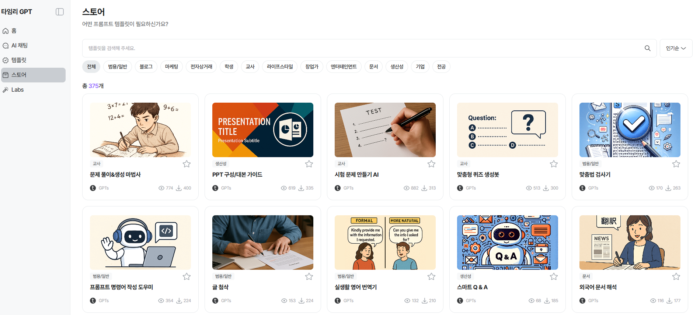

타임리에서 이미 제작한 템플릿을 [스토어]에서 만날 수 있어요.

원하는 템플릿이 보이면 클릭!

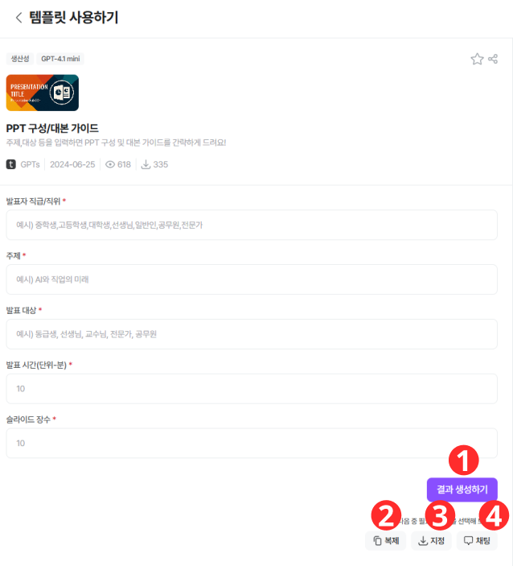

1. 원하는 템플릿의 각 프롬프트를 입력한 후, 버튼을 누르면 결과가 나와요. (누를 때마다 결과가 달라져요)
2. 일부 프롬프트나 LLM모델 등 수정을 하고 싶다면 클릭 (👇자세한 방법은 ***2번***에서 만나요👇)
3. 그룹 추천 프롬프트에 넣고 싶으면 클릭
4. AI 채팅방에서 답변을 받은 뒤 추가 작업을 원하면 클릭

## **2. 스토어의 템플릿 수정하기**

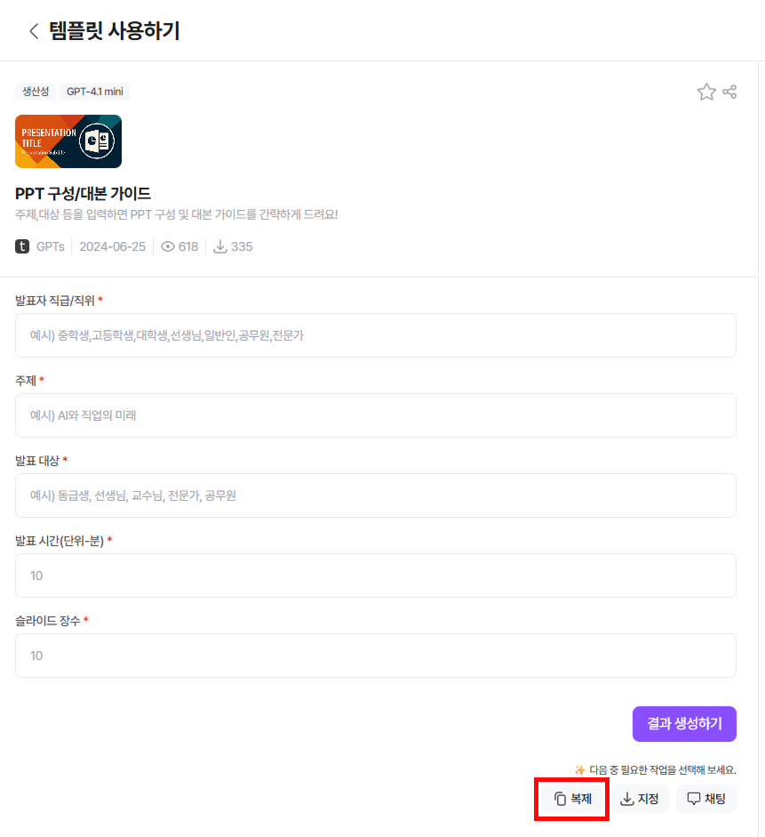

[스토어]의 템플릿 중, 명령어나 LLM 모델 등을 변경하고 싶다면 [복제]클릭

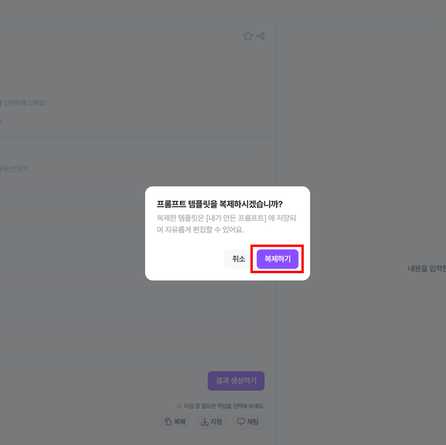

복제 된 템플릿은 [템플릿]-[내가 만든 템플릿]의 가장 앞에서 만날 수 있어요

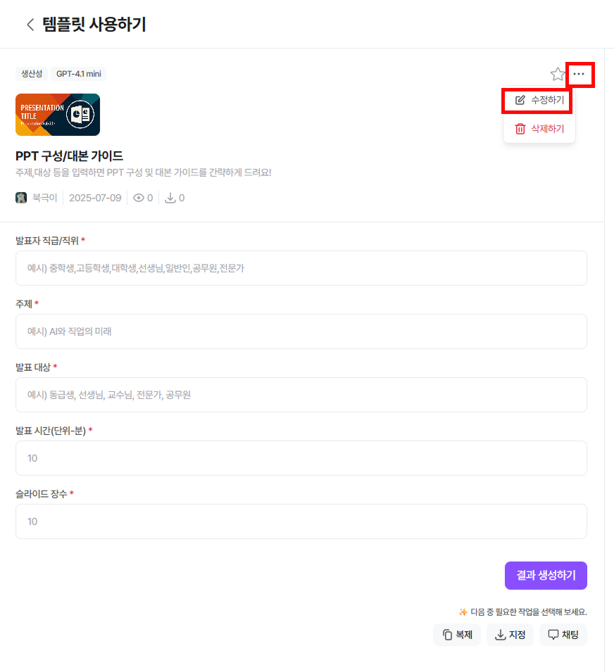

[…]-[수정하기] 클릭

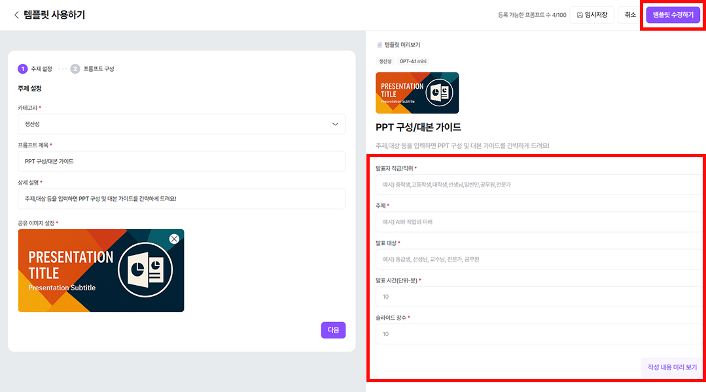

- 원하는 방향으로 수정 완료 후, 예시 프롬프트를 입력해 [작성 내용 미리 보기] 클릭
- 결과가 마음에 들면, 우상단 [템플릿 수정하기] 클릭하면 완료 ★

!!! danger "도움말:"

    **입력 필드란?** 사용자가 입력할 [프롬프트]를 입력하는 공간이에요. 입력하는 내용에 따라 답변이 변경됩니다.

    **AI에게 명령할 내용이란?** 입력 필드에 따라 AI가 어떤 답변을 생성해야 할지 구체적이고 정확한 문장으로 명령해야 해요.

    예시) 너는 OOOO 전문가야 ~~~~

## **3. 내가 직접 템플릿 만들기**

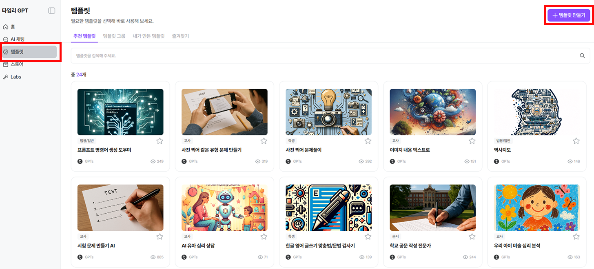

직접 템플릿을 만들고 싶다면, [템플릿]-[템플릿 만들기] 클릭

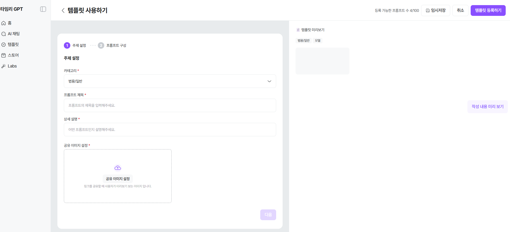

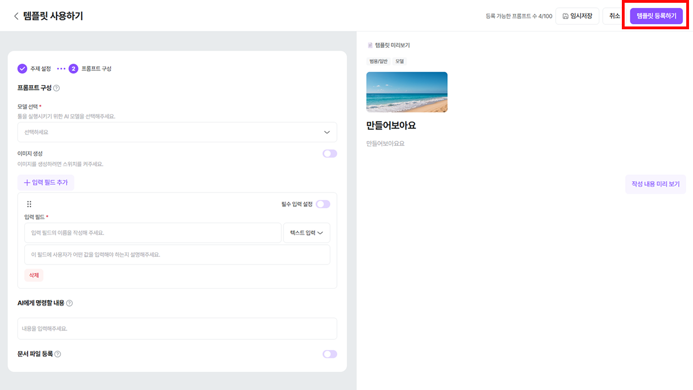

LLM 모델 설정과 입력 필드값, 명령어 등을 입력 후, [템플릿 등록하기] 누르면 완료

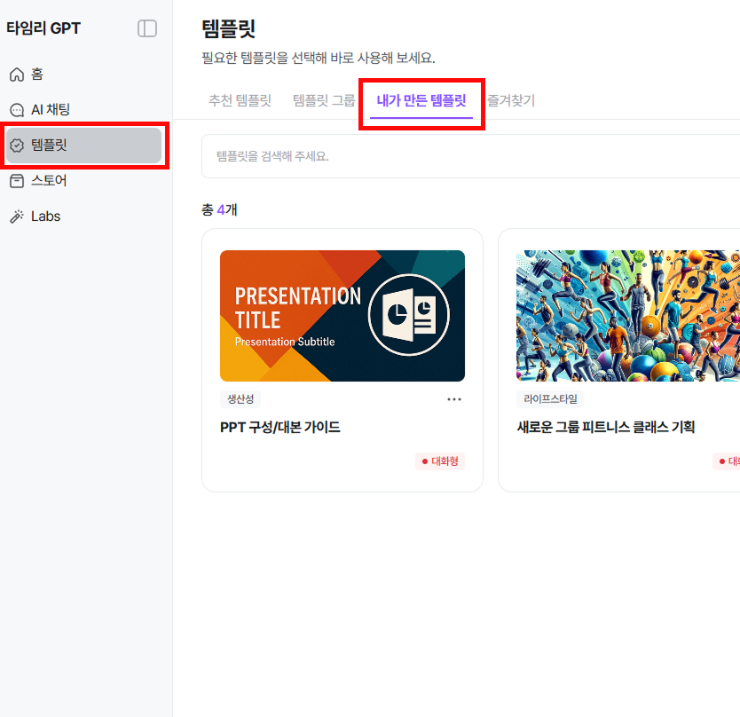

제작한 템플릿은 [템플릿]-[내가 만든 템플릿]의 가장 앞에서 만날 수 있어요

!!! note "📢"

    ***내가 사용한/만든 템플릿은 나만 볼 수 있어요***

## **3-2. 내가 수정한/만든 템플릿 공유하기(템플릿 지정)**

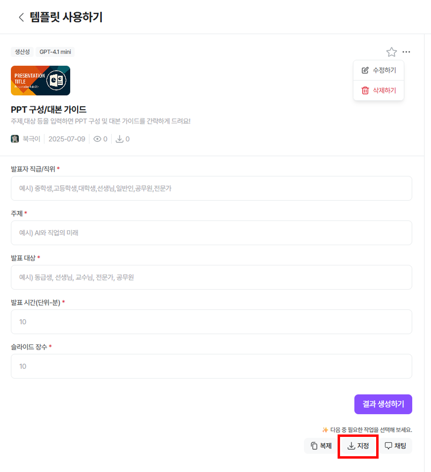

내가 수정한/만든 템플릿을 다른 사람과 공유하고 싶다면, [지정] 클릭

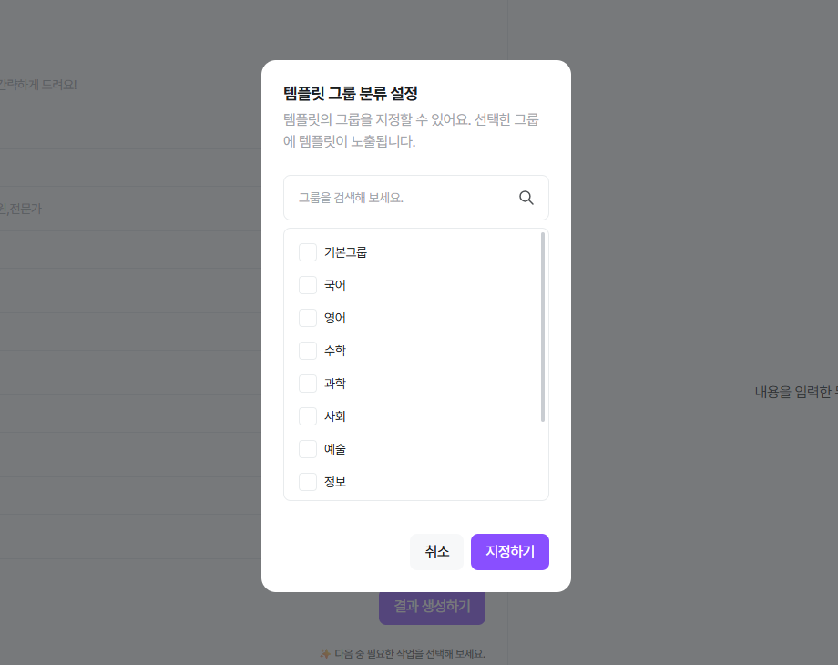

보여지고 싶은 그룹 클릭 후, [지정하기] 클릭

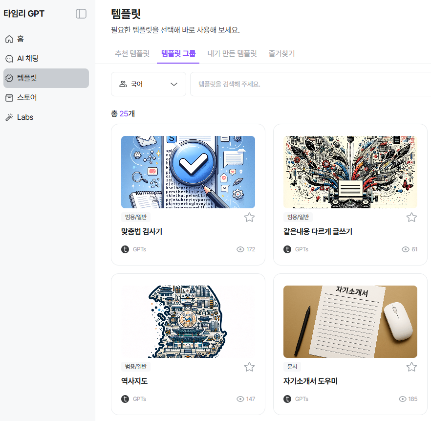

[템플릿]-[템플릿 그룹]에서 볼 수 있어요

!!! note "⏪"

    이전으로

    서비스 활용하기

!!! note "⏩"

    다음으로

    Labs 더 알아보기
