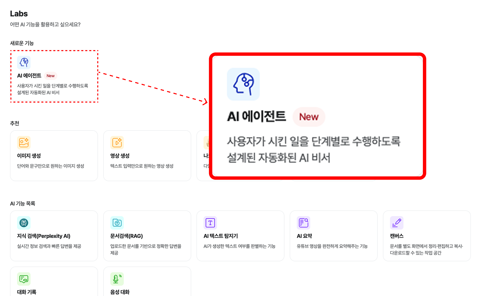
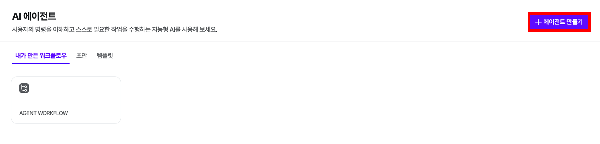
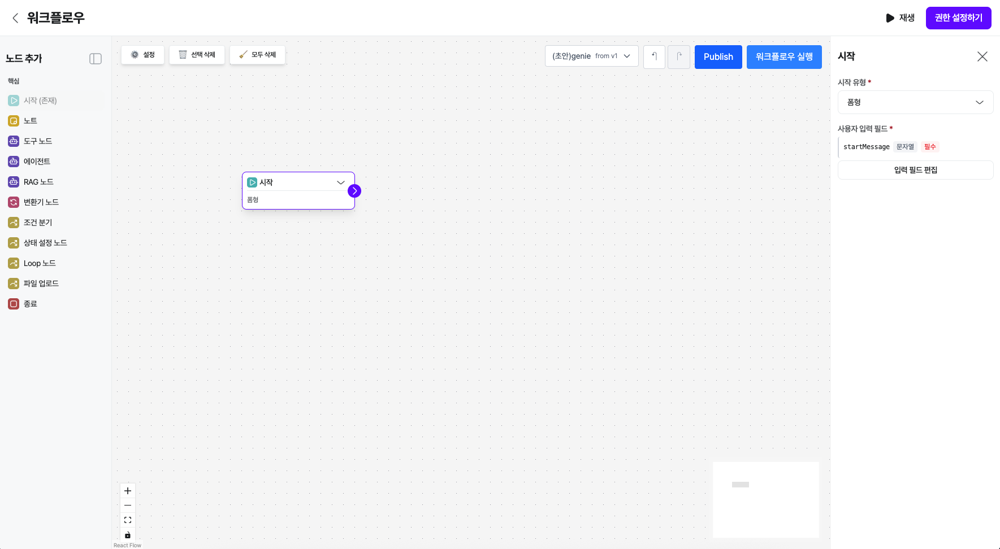
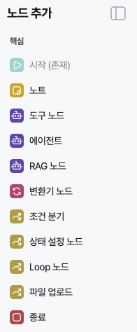
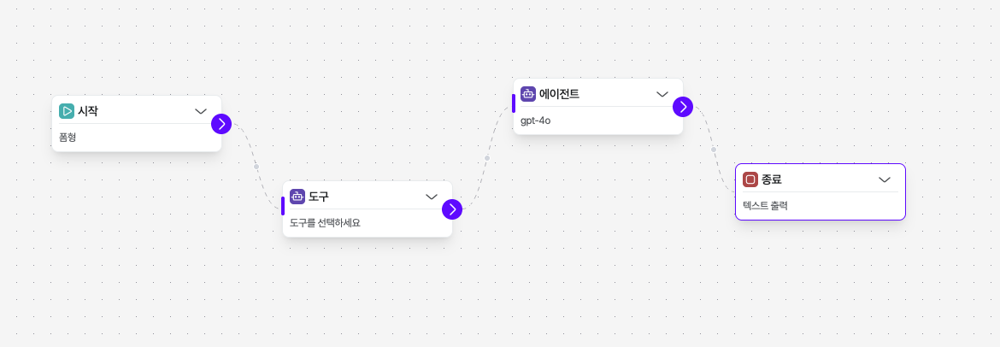
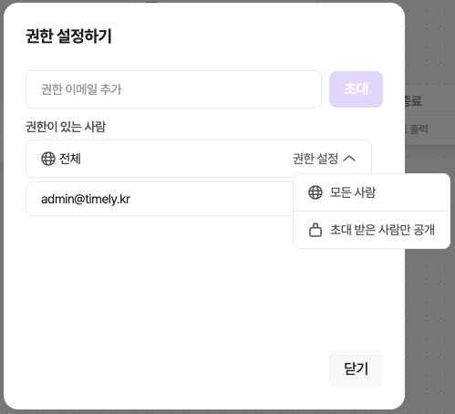

# 타임리 AI 에이전트


!!! note "❓"

    **AI Agent** 란?  **시각적 인터페이스를 통해 에이전트 워크플로우**를 구성하여, 스스로 필요한 작업을 설계할 수 있는 공간입니다.

    시각적 캔버스로써, 여러 단계로 구성된 에이전트 워크플로우를 구축할 수 있어요!

    💡 설계가 완료된 에이전트는 타임리에서 직접 실행 및 배포가 가능해요!

    🔓 **현재 제공되고 있는 AI 에이전트는 시험 운영 중인 Beta 버전입니다.
          기능이 변경되거나 일부 데이터가 초기화 될 수 있습니다.**




## 1. 에이전트 만들기



AI 에이전트에서 [에이전트 만들기]를 통해 나만의 에이전트를 만들 수 있어요.



에이전트를 구축하는 과정은 크게 다음 세 단계에요.

1. **Labs-AI 에이전트 → ‘에이전트 만들기’ 클릭**
2. **Agent Builder**에서 워크플로우를 설계해요!
이 때, 에이전트의 구조와 동장 방식, LLM 모델과 도구 등을 정의할 수 있어요.
3. 만든 워크플로우를 실행해서 확인해 볼 수 있어요.
4. 워크플로우 **발행 (Publish)** 할 수 있어요. 기존에 발행된 워크플로우 내역은 계속 확인할 수 있어요!

## 2. 노드

**노드**는 에이전트를 구성하는 핵심요소에요!
타임리 AI 에이전트에서는 **[시작 노드]** 로 워크플로우가 시작돼요.



각 노드별로 모델을 선택하거나 출력 형태, 입력값 바인딩을 설정하는 등 설계에 따른 커스텀이 가능해요.



Agent Builder에서 노드를 추가하고 연결하여 워크플로우를 구성해요.

노드 간 연결은 타입이 지정된 엣지(edge)로 표현되며, 각 노드를 클릭하면 입력/출력 값을 설정해요.

단계 간 데이터 전달 규칙을 확인하고, 이후 단계가 필요한 속성을 정확히 받을 수 있도록 구성할 수 있어요.

## 핵심 노드

워크플로우를 만들기 위한 가장 기본적인 구성 요소입니다. 모든 워크플로우에는 시작 노드가 필요합니다.

### Start

??? question "워크플로우의 시작점이자 입력값을 정의하는 노드입니다. 이 노드는 사용자 입력을 두 가지 형식으로 받을 수 있습니다."

    - **채팅 형식:** 사용자가 대화창에 직접 입력하는 텍스트입니다. 이 경우, 입력된 텍스트 내용은 `userMessage` 라는 변수로 자동 노출되어 워크플로우 전체에서 사용됩니다.
    - **폼 형식:** 미리 정의된 양식(Form)을 통해 구조화된 데이터를 입력받을 때 사용됩니다.


### LLM

- 이 노드는 대규모 언어 모델(LLM)을 워크플로우에 연결하는 역할을 합니다.
- 노드 생성 화면에서 채팅모델 설정, 지침, 필요한 도구를 정의할 수 있으며, 모델의 출력 형태를 지정할 수 있습니다.
- 사용할 채팅 모델은 별도의 페이지에서 미리 생성한 후, 이 노드에서 선택하여 워크플로우에 적용합니다.

### End

- 워크플로우의 실행을 끝내는 지점을 명시적으로 정의합니다.
- 사용자가 보게될 출력 형식을 정할 수 있습니다.

---

## 도구 및 데이터 노드

이 노드들은 AI 에이전트에게 외부 데이터 검색능력을 부여하거나, 워크플로우 내에서 데이터를 관리하고 조작하는 역할을 합니다.

### 도구 노드

사용자 정의 도구, MCP 또는 TimelyGPT 에서 제공하는 빌트인 도구를 실행하는데 사용됩니다. AI 에이전트가 외부 서비스의 기능을 사용하도록 연결해 줍니다.

### RAG 노드

벡터 검색 기능을 워크플로우에 연결하여, 벡터 저장소에서 필요한 정보를 검색하고 가져옵니다. LLM이 더 정확한 답변을 생성하도록 돕는 데 사용됩니다.

- 참고: 사용할 벡터 저장소는 별도의 페이지에서 미리 생성한 후, 이 노드에서 선택하여 적용합니다.

### 변환기 노드

이전 노드의 출력 데이터를 다음 노드의 입력 형식에 맞춰 변환합니다. 변환 요청 사항을 자연어로 적으면 AI가 데이터를 자동으로 변환합니다.

- 예시: "result 필드를 추출하여 문자열로 변환", "JSON을 평문으로 변환"

### 상태 설정 노드

워크플로우 내의 전역 상태를 관리합니다.

??? question "**값 설정 (기본):**"

    - **입력값 선택:** 이전 노드의 출력값을 선택합니다.
    - **State 키:** 자동으로 설정(입력 키 사용)되거나, 직접 키를 추가하여 선택할 수 있습니다.
    - **값 변환:** 필요시 JavaScript 문법을 사용하여 값을 변환할 수 있습니다.

??? question "**키 추가 (옵션):**"

    - 키만 추가하면 기본값으로 초기화됩니다.
    - 키를 추가하고 값을 설정하면 해당 키에 값이 저장됩니다.
    - 데이터 타입(string, number 등)을 지정할 수 있습니다.

??? question "**키 이름 규칙:**"

    - 영문 대소문자, 숫자, 언더스코어(`_`)만 사용 가능합니다.
    - 숫자로 시작하거나 공백을 포함할 수 없습니다.


## 로직 노드

워크플로우의 실행 흐름을 제어하는 규칙을 정의합니다.

### 조건 분기 노드

조건을 평가하여 다음 노드를 선택적으로 실행합니다. 설정된 조건에 따라 워크플로우의 실행 경로를 나눕니다.

- 평가 방식: 위에서부터 순서대로 조건을 평가하며, 첫 번째로 `true`인 조건의 출력 핸들로 이동합니다. (모두 `false`일 경우 `else` 경로로 이동)
??? question "사용 가능한 변수:"

    - `nodeName.keyPath`: 이전 노드의 출력 값 (예: `시작.startMessage`, `RAG.documents`, `LLM.result`)
    - `state.keyPath`: 전역 상태 값

- CEL(Common Expression Language) 표현식 예시:

```tsx
시작.startMessage.length > 0
RAG.score >= 80
LLM.count > 0 && LLM.isValid
Tool.status == "success" || Tool.retry < 3
시작.score >= 90 ? true : RAG.bonus > 10
시작.items.filter(x, x.price > 100
```

### Loop 노드

특정 조건이 충족될 때까지 노드들의 집합을 반복 실행합니다.

??? question "사용 방법:"

    1. Loop 노드를 추가하고 외부에서 Loop 입력 핸들로 연결합니다.
    2. **Loop 내부 시작**에서 반복할 첫 번째 노드를 연결합니다.
    3. 내부 노드들을 순서대로 연결하고, 마지막 노드를 **Loop 내부 끝**에 연결합니다.
    4. **Loop Exit / MaxReached** 핸들을 반복 종료 후 실행할 다음 노드에 연결합니다.
    5. Exit 조건 및 최대 반복 횟수를 설정합니다.

- 종료 조건 예시 (CEL):

```tsx
state.counter >= 10

state.isComplete === true

state.errorCount > 3

state.items.size() === 0

START.value > 100
```

??? question "**출력 핸들:**"

    - **초록색**: 종료 조건 충족 (정상 종료)
    - **빨간색**: 최대 반복 횟수 도달 (강제 종료)

- **주의사항:** Loop 내부 노드는 매 반복마다 실행됩니다. 무한 루프 방지를 위해 `State 노드`를 활용하여 반복 횟수를 추적하거나 명확한 종료 조건을 설정하세요.

## 3. 발행(Publish)

Agent Builder는 작업 내용을 자동 저장할 수 있어요!

워크플로우가 완성되면 **발행(publish)**하여 새로운 메이전 버전을 생성할 수 있고, 스냅샵 형태로 보관돼요.

API 호출 시 특정 버전을 표기할 수도 있어요.



발행할 워크플로우의 공개범위를 설정할 수 있어요!

!!! note "👉"

    스페이스 설정하기
