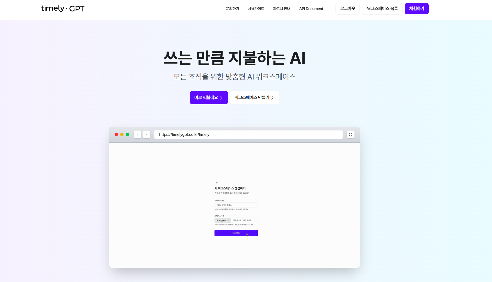
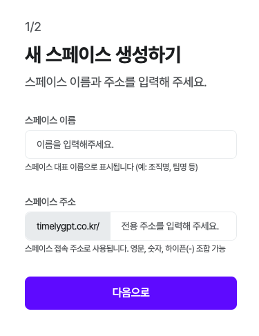
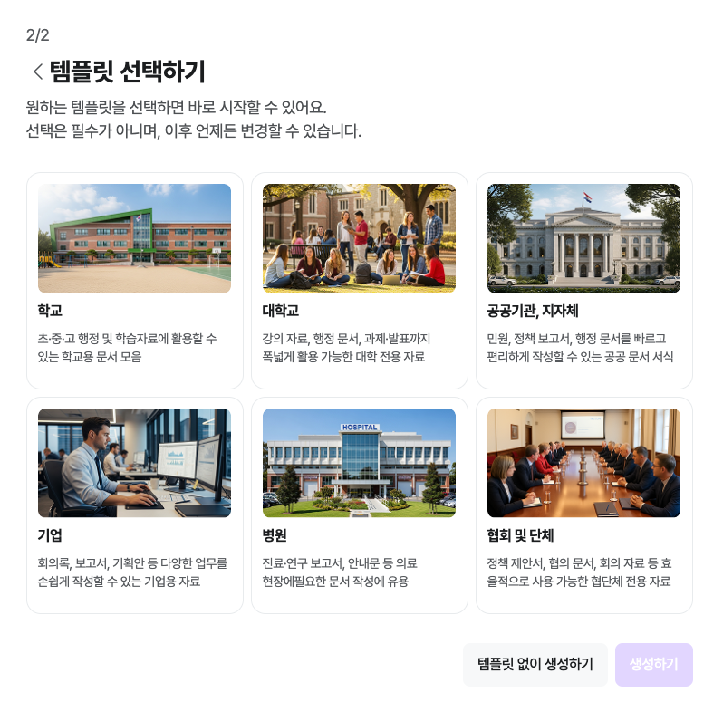
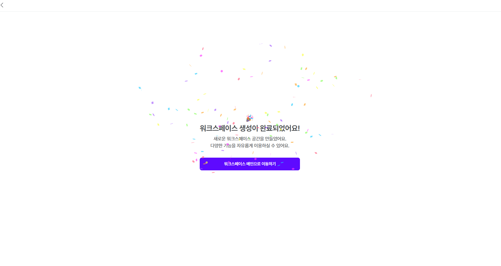

# 워크스페이스 만들기

## 1. 워크스페이스 만들기

타임리 GPT 홈페이지 접속

https://timelygpt.co.kr/main

**[워크스페이스 만들기]** 선택

[스페이스 이름]을 적은 후, 스페이스 전용주소를 입력해주세요.

사용할 스페이스의 성격에 맞춰 기본스페이스 템플릿을 선택해줘요.

원하는 템플릿이 없을 경우, [템플릿 없이 생성하기]를 눌러 다음 단계로 넘어갈 수 있어요.

생성이 완료 된 스페이스에서 어드민으로 이용을 시작해요!

!!! note "👉"

    스페이스 설정하기
